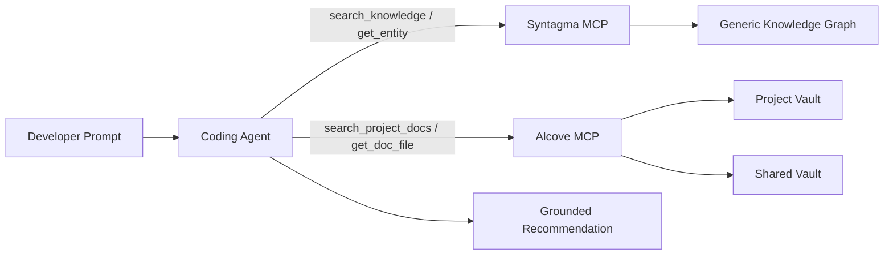
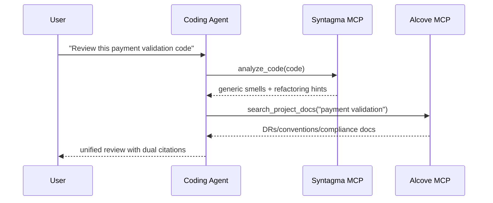
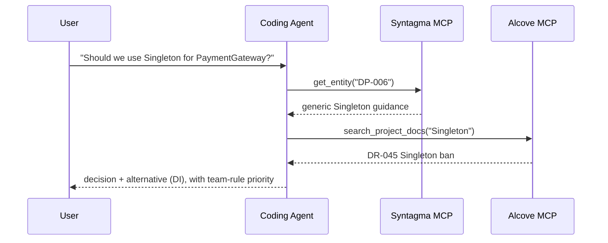
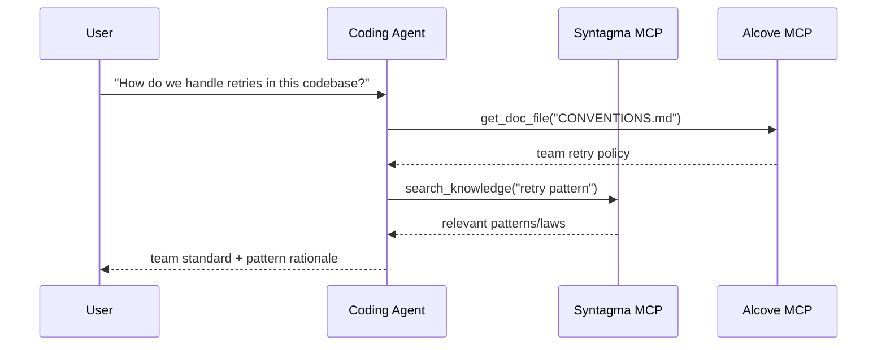

# Alcove + Syntagma Integration Guide

> Agent-first guide: combine generic software engineering knowledge (Syntagma) with team-specific domain knowledge (Alcove) through MCP and natural-language workflows.

## Overview

**Syntagma** provides universal knowledge (GoF patterns, refactorings, laws) as a read-only knowledge graph.  
**Alcove** indexes your team's living documentation (decisions, architecture, coding standards).

When used together through MCP, coding agents can:
- Apply generic best practices (Syntagma)
- Respect team-specific constraints (Alcove)
- Cite both sources in recommendations

### Decision Priority

When Syntagma and Alcove conflict, **Alcove wins** for final implementation guidance.
- **Syntagma**: reference knowledge (general patterns/laws/smells)
- **Alcove**: team mandate (project/org-specific constraints)

---

## Architecture (Coding Agent View)



The agent should **not** preload all docs. It should retrieve only the documents/entities required for the active prompt.

---

## Agent-First Usage (Natural Language -> MCP -> Answer)

These patterns are the recommended default for Cursor/Codex/Claude-style coding agents.

1. User asks in natural language.
2. Agent retrieves team context from Alcove (`search_project_docs`, `get_doc_file`).
3. Agent retrieves generic engineering guidance from Syntagma.
4. Agent resolves conflicts (team rules override generic advice).
5. Agent returns a response with dual citations.

---

## Alcove Vault Concepts

### Project Vault
**Location**: `<docs_root>/<project>/` (for example `~/.alcove/docs/payment-api/`)  
**Scope**: Single codebase  
**Content**: Architecture decisions, tech stack, domain glossary

**Example** (`~/.alcove/docs/payment-api/DECISION.md`):
```markdown
# DECISION.md
## DR-001: Payment Validation Strategy (2024-04-15)
- All card numbers MUST be validated using CardValidator
- Reason: FSS regulation §12.3 requires PCI DSS Level 1 compliance
- Related: Syntagma DP-023 (Strategy Pattern)

## DR-002: No Direct LLM Calls in Production
- External AI APIs prohibited in payment processing flow
- Approved: Internal tools only (Claude Code, local models)
```

### Shared Vault
**Location**: `<vaults_root>/<org-name>/` (commonly `~/.alcove/vaults/<org-name>/`)  
**Scope**: Organization-wide  
**Content**: Cross-cutting concerns, regulatory requirements, shared patterns

**Example** (`~/.alcove/vaults/osn-finance/FSS_COMPLIANCE.md`):
```markdown
# FSS_COMPLIANCE.md
## Card Number Handling
- ALWAYS mask in logs: `****-****-****-1234`
- NEVER store raw PAN in application logs
- Syntagma reference: SMELL-42 (Information Exposure)

## Testing
- Use synthetic cards only: `4111-1111-1111-1111`
- Real customer data in tests = FSS violation
```

---

## Usage Patterns

### Pattern 1: Code Review with Dual Context (Primary)

**User Request**:
```
"Review this payment validation code"
```

**Agent Workflow**:
```python
# Step 1: Detect generic smells (Syntagma)
smells = await syntagma.analyze_code(code)
# → SMELL-01: Long Method (15+ lines)
# → SMELL-08: Missing Error Handling

# Step 2: Check team rules (Alcove)
decisions = await alcove.search_project_docs("payment validation")
# → DR-001: Must use CardValidator
# → FSS_COMPLIANCE.md: Mask card numbers

# Step 3: Synthesize feedback
return f"""
Issues found:
1. Long Method (Syntagma SMELL-01)
   → Extract card validation to separate method
   
2. Missing CardValidator (Team DR-001)
   → Use Strategy Pattern (Syntagma DP-023)
   
3. Card number logged without masking (FSS_COMPLIANCE.md)
   → Apply masking utility (see CONVENTIONS.md)
"""
```



### Pattern 2: Architecture Decision Support

**User Request**:
```
"Should we use Singleton for PaymentGateway?"
```

**Agent Workflow**:
```python
# Syntagma: Generic pattern knowledge
pattern = await syntagma.get_entity("DP-006")  # Singleton
# → "Use for globally unique resources, but beware of testability issues"

# Alcove: Team history
past_decisions = await alcove.search_project_docs("Singleton")
# → DR-045: "Banned Singleton in service layer (testing nightmare)"

# Synthesized Answer:
return f"""
Syntagma says: Singleton works for global resources (DP-006)
Team history: DR-045 banned it in services (2023-08)

Recommendation: Use Dependency Injection instead
- Syntagma DP-018 (Dependency Injection) explains how
- See ARCHITECTURE.md §3.2 for team's DI container setup
"""
```



### Pattern 3: Onboarding / "How do we do X here?"

**User Request**:
```
"How do we handle retries in this codebase?"
```

**Agent Workflow**:
```python
# Alcove: Team conventions
conventions = await alcove.get_doc_file("CONVENTIONS.md")
# → "Use exponential backoff with max 3 retries (see RetryPolicy util)"

# Syntagma: Related patterns
patterns = await syntagma.search_knowledge("retry pattern")
# → DP-023: Strategy Pattern
# → LAW-012: Fail Fast principle

return f"""
Team standard (CONVENTIONS.md):
- Use RetryPolicy utility (src/common/retry.py)
- Max 3 attempts with exponential backoff

Related concepts:
- Syntagma DP-023: Strategy Pattern (pluggable retry logic)
- Syntagma LAW-012: Fail Fast (don't retry on invalid input)

Example:
  policy = RetryPolicy(max_attempts=3, backoff="exponential")
  result = await policy.execute(api_call)
"""
```



---

## Setup Instructions (Minimal, for Agent Enablement)

### 1. Initialize Alcove for Your Project

```bash
cd /path/to/your/project
alcove setup

# Create core documents
cat > .alcove/DECISION.md <<EOF
# Architectural Decision Records

## Template
- **ID**: DR-XXX
- **Date**: YYYY-MM-DD
- **Context**: What problem are we solving?
- **Decision**: What did we decide?
- **Consequences**: Trade-offs
- **Syntagma Refs**: Related entities (optional)
EOF

cat > .alcove/ARCHITECTURE.md <<EOF
# System Architecture

## Domain Model
- Payment: Card validation, fraud detection
- Settlement: Batch processing, reconciliation

## Key Patterns (link to Syntagma)
- Payment validation: Strategy (DP-023)
- API gateway: Facade (DP-007)
EOF
```

### 2. Create Shared Vault (Optional)

For organization-wide standards:

```bash
mkdir -p ~/.alcove/vaults/my-org
cat > ~/.alcove/vaults/my-org/SECURITY.md <<EOF
# Security Standards

## PII Handling
- Never log credit card numbers (Syntagma SMELL-42)
- Use DataMasker utility for all PII

## Approved Libraries
- cryptography >= 41.0
- bcrypt >= 4.0
EOF

# Register external directory as vault (e.g. Obsidian vault)
alcove vault link my-org ~/.alcove/vaults/my-org
```

### 3. Configure MCP Servers (Required for Coding Agents)

In `~/.claude/claude_desktop_config.json`:

```json
{
  "mcpServers": {
    "syntagma": {
      "command": "uvx",
      "args": ["syntagma-mcp"]
    },
    "alcove": {
      "command": "alcove",
      "args": []
    }
  }
}
```

For Cursor/Codex/other MCP-capable coding agents, register both MCP servers in each tool's MCP config and keep the same server names (`syntagma`, `alcove`) so prompts and skills stay portable.

### 4. Document Linking Convention

Reference Syntagma entities in Alcove docs:

```markdown
## DR-042: Use Repository Pattern for Data Access

**Decision**: All database access goes through Repository interface

**Rationale**:
- Testability: Mock repositories in unit tests
- Syntagma DP-018 (Dependency Injection) + DP-007 (Facade)

**Implementation**:
See `src/repositories/` for examples
```

---

## Best Practices

### 0. Prefer Agent Retrieval over Manual CLI Steps

Use CLI mostly for initial setup/maintenance. During coding work, prefer natural-language prompting that triggers MCP calls.

**Preferred**
- "Review this module with our team conventions"
- "Refactor this service following DR-112 and related Syntagma laws"
- "Check if this implementation conflicts with Alcove decisions"

**Avoid as default workflow**
- Manual grep/copy-paste of large docs into prompt
- Re-explaining architecture constraints every session

### 1. **Explicit Citations**

Always link Alcove decisions to Syntagma entities when applicable:

```markdown
❌ Bad:
"Use Strategy Pattern for payment validation"

✅ Good:
"Use Strategy Pattern (Syntagma DP-023) for payment validation.
See DR-001 for team-specific CardValidator implementation."
```

### 2. **Keep Alcove Docs Lean**

Don't duplicate Syntagma content. Reference it:

```markdown
❌ Bad (duplicating Syntagma):
## Observer Pattern
The Observer pattern defines a one-to-many dependency...
[500 words explaining Observer]

✅ Good (referencing Syntagma):
## Event Bus Implementation (DR-078)
- Pattern: Observer (Syntagma DP-012)
- Our twist: Use Redis Pub/Sub instead of in-memory
- Trade-off: Network latency for horizontal scalability
```

### 3. **Update on Breaking Changes**

When team conventions override Syntagma advice:

```markdown
## DR-091: Singleton Ban Exception (2024-04-20)

**Context**: Syntagma DP-006 says Singleton is OK for config

**Our Rule**: NEVER use Singleton, even for config

**Reason**: Config hot-reload requirement (DR-015)

**Alternative**: Use ConfigProvider with DI (see src/config/)
```

### 4. **Vault Organization**

```
Project Docs (<docs_root>/<project>/)
├── DECISION.md        # ADRs with Syntagma refs
├── ARCHITECTURE.md    # System design, pattern usage
├── CONVENTIONS.md     # Coding standards
├── DOMAIN.md          # Business glossary
└── DEPLOYMENT.md      # Ops runbooks

Shared Vault (<vaults_root>/<org>/)
├── SECURITY.md        # Cross-project security rules
├── COMPLIANCE.md      # Regulatory requirements (FSS, GDPR)
└── PATTERNS.md        # Organization-approved pattern subset
```

---

## Advanced: Syntagma → Alcove Feedback Loop

### Track Pattern Usage with Prometheus Metrics

Instrument your code to expose Syntagma entity usage as Prometheus metrics:

```python
# In your codebase
from prometheus_client import Counter

pattern_usage = Counter(
    'syntagma_pattern_applied_total',
    'Syntagma pattern application count',
    ['entity_id', 'entity_type', 'context']
)

def apply_retry_logic():
    # Track Strategy pattern usage
    pattern_usage.labels(
        entity_id='DP-023',
        entity_type='pattern',
        context='payment_retry'
    ).inc()
    
    # Your retry logic using Strategy Pattern
    pass
```

### Visualize in Grafana

Create a dashboard to monitor pattern adoption:

```promql
# Most used patterns (last 30d)
topk(10, 
  increase(syntagma_pattern_applied_total[30d])
)

# Pattern usage by context
sum by (entity_id, context) (
  rate(syntagma_pattern_applied_total[7d])
)

# Alert on deprecated pattern usage
sum(rate(syntagma_pattern_applied_total{entity_id="DP-006"}[5m])) > 0
# Alert: "Singleton pattern used (banned per DR-091)"
```

### Generate Usage Reports

Quarterly review via Prometheus query:

```bash
# Query Prometheus
curl -G 'http://localhost:9090/api/v1/query' \
  --data-urlencode 'query=topk(10, increase(syntagma_pattern_applied_total[90d]))' \
  | jq -r '.data.result[] | "\(.metric.entity_id): \(.value[1])"'

# Output:
# DP-023: 847
# DP-018: 612
# DP-007: 301
```

Update Alcove docs based on actual usage:

```markdown
## Most Used Patterns (2024 Q2) - via Grafana

1. **Strategy (DP-023)**: 847 uses
   - Primary: payment_retry (412), discount_calc (201)
   - See: DECISION.md DR-001 (payment validation)

2. **Dependency Injection (DP-018)**: 612 uses
   - Standard across all services
   - See: ARCHITECTURE.md §3 for container setup

3. **Facade (DP-007)**: 301 uses
   - Context: external_api (289), legacy_adapter (12)
```

---

## Troubleshooting

### Issue: Agent Cites Outdated Alcove Doc

**Cause**: Alcove index not refreshed after doc update

**Fix**:
```bash
alcove rebuild
```

### Issue: Syntagma and Alcove Conflict

**Example**: Syntagma says "Singleton OK", team doc says "Singleton banned"

**Resolution Pattern**:
1. Agent surfaces both sources
2. Explains the contradiction
3. Defers to team doc (Alcove) for final answer

```
Agent: "There's a conflict here:
- Syntagma DP-006: Singleton is acceptable for global config
- Your DR-091: Singleton banned (hot-reload requirement)

I'll follow your team rule (DR-091). Use ConfigProvider instead."
```

### Issue: Agent Uses CLI-Only Explanation Instead of Coding-Agent Flow

**Symptom**: Responses focus on shell commands rather than how the coding agent should fetch and reason.

**Fix**:
1. Ask with intent + context target:
   - "Use Alcove docs + Syntagma entities to review this code"
2. Request explicit dual citation:
   - "Cite DR/ARCH doc and Syntagma ID in your answer"
3. Ask for conflict resolution policy:
   - "If sources conflict, prioritize team docs"

---

## Example: Complete Workflow

**Scenario**: Developer asks "How should I structure the new payment webhook handler?"

### Agent's Internal Process

```python
# 1. Search Syntagma for generic patterns
patterns = await syntagma.search_knowledge("webhook handler")
# → DP-007: Facade (simplify complex subsystems)
# → DP-023: Strategy (pluggable validation)
# → LAW-045: Single Responsibility

# 2. Check team architecture
arch = await alcove.get_doc_file("ARCHITECTURE.md")
# → "All webhooks go through WebhookRouter (src/webhooks/router.py)"

# 3. Check team decisions
decisions = await alcove.search_project_docs("webhook")
# → DR-112: "Webhook handlers must be idempotent (payment retries)"

# 4. Check conventions
conv = await alcove.get_doc_file("CONVENTIONS.md")
# → "Use @webhook_handler decorator for automatic logging/retry"
```

### Agent's Response

```markdown
## Payment Webhook Handler Structure

### Team Standards (Alcove)
1. Register in WebhookRouter (ARCHITECTURE.md §4.2)
2. Make it idempotent (DR-112) - payment gateways retry
3. Use @webhook_handler decorator (CONVENTIONS.md)

### Recommended Patterns (Syntagma)
- **Facade (DP-007)**: Hide payment provider complexity
- **Strategy (DP-023)**: Pluggable per-provider validation
- **SRP (LAW-045)**: One handler = one webhook type

### Code Template
\`\`\`python
from src.webhooks.router import webhook_handler
from src.payments import PaymentFacade  # DP-007

@webhook_handler(provider="stripe", idempotent=True)  # DR-112
async def handle_payment_success(payload: dict):
    # Single responsibility: process payment (LAW-045)
    facade = PaymentFacade()
    return await facade.confirm_payment(payload["payment_id"])
\`\`\`

See:
- ARCHITECTURE.md §4.2 for WebhookRouter setup
- src/webhooks/stripe_handler.py for reference implementation
- Syntagma DP-007 for Facade pattern details
```

---

## Summary

| Aspect | Syntagma | Alcove |
|--------|----------|--------|
| **Scope** | Universal software engineering knowledge | Team/org-specific rules |
| **Content** | 22 patterns, 66 refactorings, 56 laws, 14 smells | ADRs, architecture, conventions, domain |
| **Mutability** | Read-only (periodic updates) | Living docs (daily updates) |
| **Granularity** | Abstract principles | Concrete implementations |
| **Authority** | Reference/suggestion | Team mandate |

**Decision Priority**: Alcove > Syntagma (team rules override generic advice)

**Citation Style**: Always link both sources when applicable
- `"Use Strategy (Syntagma DP-023) per team DR-001"`
- Not: `"Use Strategy"` (missing context)

**Maintenance**: 
- Syntagma: No action required (upstream handles updates)
- Alcove: Keep docs current with codebase changes
