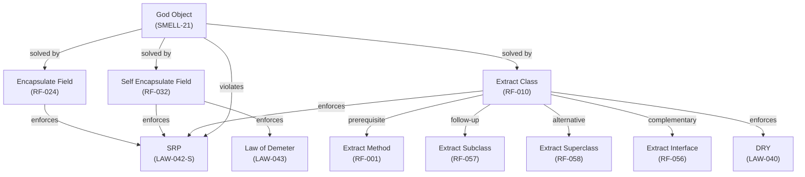

# Knowledge Graph Traversal Example: SRP → Extract Class

> Demonstrates Syntagma MCP tools for navigating the software engineering knowledge graph: finding paths between concepts, exploring neighborhoods, and understanding how laws, smells, and refactorings relate. Includes a real tooling bug discovered during the session.

## Scenario

Given a codebase suffering from **God Object**, an engineer wants to trace the relationship from the **Single Responsibility Principle** to the **Extract Class** refactoring — understanding why and how the refactoring enforces the law.

## Tools Used

| Tool | Purpose |
|------|---------|
| `search_knowledge` | Locate entities by natural language query |
| `get_entity` | Retrieve detailed metadata for a specific node |
| `get_neighbors` | Explore all edges connected to a node |
| `find_path` | Find shortest path between two entities |

## Step-by-step Walkthrough

### 1. Locate God Object in the graph

```
search_knowledge(query="God Object smell", entity_type="smell")
```

Result: **SMELL-21** (God Object), category `bloater`.

### 2. Get its neighbors — what solves it and what it violates

```
get_neighbors(entity_id="SMELL-21", relation_type="solved_by")
get_neighbors(entity_id="SMELL-21", relation_type="violates")
```

| Relation | Entity | ID |
|----------|--------|----|
| solved_by | Encapsulate Field | RF-024 |
| solved_by | Self Encapsulate Field | RF-032 |
| violates | Single Responsibility Principle | LAW-042-S |

### 3. Resolve "Extract Class" to its graph ID

`find_path` requires exact IDs, so we search first:

```
search_knowledge(query="Extract Class refactoring", entity_type="refactoring")
```

Result: **RF-010** (Extract Class), category `moving_features`.

### 4. Find the path from SRP to Extract Class

```
find_path(from_id="LAW-042-S", to_id="RF-010")
```

**Result:** `No path found between 'LAW-042-S' and 'RF-010'.`

### 5. Verify the edge actually exists

```
get_neighbors(entity_id="LAW-042-S")
get_neighbors(entity_id="RF-010")
```

RF-010's neighbors include **LAW-042-S** directly — the edge exists. This revealed a **bug in `find_path`**: the traversal algorithm missed a direct edge that `get_neighbors` confirms is present.

### 6. Map the full neighborhood of Extract Class

```
get_neighbors(entity_id="RF-010")
```

| Direction | Entity | Type | Relationship |
|-----------|--------|------|-------------|
| solves | Large Class (SMELL-04) | Smell | Primary target |
| solves | God Object (SMELL-21) | Smell | Primary target |
| solves | Temporary Field (SMELL-08) | Smell | Secondary |
| enforces | SRP (LAW-042-S) | Law | Direct |
| enforces | DRY (LAW-040) | Law | Indirect |
| relates to | Extract Method (RF-001) | Refactoring | Prerequisite |
| relates to | Extract Interface (RF-056) | Refactoring | Complementary |
| relates to | Extract Subclass (RF-057) | Refactoring | Follow-up |
| relates to | Extract Superclass (RF-058) | Refactoring | Alternative |

---

## Knowledge Graph Diagram



---

## Findings

### The refactoring sequence for God Object

1. **Encapsulate Field** (RF-024) — Hide internal state, create seams for extraction
2. **Extract Method** (RF-001) — Identify cohesive method groups before splitting
3. **Extract Class** (RF-010) — Split responsibilities into separate classes
4. **Extract Subclass** (RF-057) — Optional: promote to inheritance if semantics fit

### Tooling issue discovered

`find_path` failed to find the direct edge `(LAW-042-S) → (RF-010)` despite both `get_neighbors` calls confirming it exists. This suggests a bug in the graph traversal implementation — possibly an edge-type filter or directionality issue in the BFS/DFS algorithm.

---

## Key Takeaways

1. **Always verify `find_path` results with `get_neighbors`** — pathfinding may miss edges due to implementation bugs or edge-type filtering.
2. **The knowledge graph is richer than direct connections** — Extract Class relates to 4 other refactorings, 3 smells, and 2 laws. Exploring the full neighborhood reveals refactoring sequences and alternatives.
3. **SRP is the central law for God Object** — every refactoring that solves God Object enforces SRP, making it the invariant to optimize for.
4. **Refactorings form sequences, not isolated fixes** — Extract Method → Extract Class → Extract Subclass is a common progression for decomposing bloated classes.
