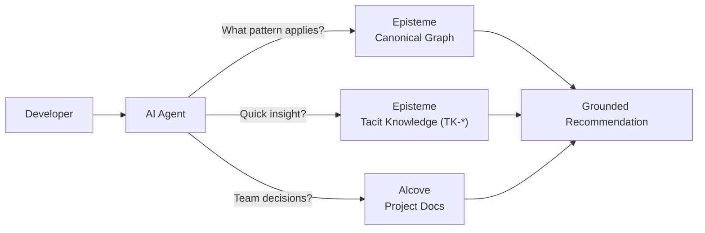

<p align="center">

</p>

<p align="center"><sub>Episteme (συνταγμα) — Griechisch fuer "organisiertes System" oder "Unterscheidungsvermoegen"</sub></p>

<p align="center">Ein offline-first, einzelbinary-Wissensgraph, der Entwurfsmuster, Refactoring-Techniken und Software-Prinzipien durch semantische Beziehungen verbindet.<br><b>Erstentwickelt fuer KI-Agenten</b> — integrieren Sie Software-Engineering-Expertise direkt in Claude Code, Cursor und andere MCP-kompatible Werkzeuge.</p>

<p align="center">Geschrieben in Rust · Einzelnes Binary · Vollstaendig offline</p>

---

<p align="center">
    <a href="https://github.com/epicsagas/Episteme/actions"></a>
    <a href="https://www.rust-lang.org/"></a>
    <a href="https://crates.io/crates/episteme"></a>
    <a href="LICENSE"></a>
    <a href="https://buymeacoffee.com/epicsaga"></a>
</p>

<p align="center">
  <a href="../../README.md">English</a> |
  <a href="../ja/">日本語</a> |
  <a href="../ko/">한국어</a> |
  Deutsch |
  <a href="../fr/">Français</a> |
  <a href="../zh-CN/">简体中文</a> |
  <a href="../zh-TW/">繁體中文</a> |
  <a href="../pt/">Português</a> |
  <a href="../es/">Español</a> |
  <a href="../hi/">हिन्दी</a>
</p>

---

<picture>
  <source media="(prefers-color-scheme: dark)" srcset="../assets/features.png">
  
</picture>

---

## Schnellstart

### Claude Code

```
/plugin marketplace add epicsagas/plugins
/plugin install episteme@epicsagas
```

Der Plugin-Hook installiert das `epis`-Binary automatisch. **Bevor Sie eine neue Sitzung starten**, führen Sie diesen Befehl einmalig im Terminal aus:

```bash
epis install   # Wissensgraph-Daten von GitHub Releases herunterladen
```

`epis install` initialisiert die Wissensgraph-Datenbank und startet den HTTP-API-Server auf Port 58302. Starten Sie danach eine neue Claude Code-Sitzung und Sie sind startklar.

Aktualisieren: `/plugin update episteme@epicsagas`

### Codex CLI

```bash
codex plugin marketplace add epicsagas/plugins
```

Der Plugin-Hook installiert das `epis`-Binary automatisch. **Bevor Sie eine neue Sitzung starten**, führen Sie diesen Befehl einmalig im Terminal aus:

```bash
epis install   # Wissensgraph-Daten von GitHub Releases herunterladen
```

`epis install` initialisiert die Wissensgraph-Datenbank und startet den HTTP-API-Server auf Port 58302. Nach dem Start einer neuen Sitzung ist alles sofort verfügbar.

Aktualisieren: `codex plugin update episteme@epicsagas`

### Andere Tools

```bash
epis install cursor       # Cursor IDE
epis install opencode     # OpenCode
epis install cline        # Cline
epis install --all        # Alle unterstützten Tools
```

### Manuelle Installation

| Methode | Befehl |
|---------|--------|
| **Homebrew** | `brew install epicsagas/tap/episteme` |
| **Shell-Skript** | `curl --proto '=https' --tlsv1.2 -LsSf https://github.com/epicsagas/Episteme/releases/latest/download/episteme-installer.sh \| sh` |
| **PowerShell** | `irm https://github.com/epicsagas/Episteme/releases/latest/download/episteme-installer.ps1 \| iex` |
| **cargo** | `cargo binstall episteme` ⚡ oder `cargo install episteme` |
| **Docker** | Siehe [Option 3](#option-3-docker-kein-rust-erforderlich) |

### Überprüfen

```bash
epis --version
epis stats
```

Oder direkt in Claude Code / Codex CLI:

```
/episteme verify
```

### In 30 Sekunden ausprobieren

**Option A — CLI:** Auf jede Datei in Ihrem Projekt anwenden.

```bash
epis analyze src/domain/engine.rs
```

```
✓ 2 smells detected in src/domain/engine.rs

  SMELL-07 (Large Class) — RefactoringRanker, 743 lines
  → RF-018 Extract Class          priority 0.89  effort: medium
  → RF-001 Extract Method         priority 0.76  effort: small
  → Violates: LAW-001 Single Responsibility Principle

  SMELL-01 (Long Method) — rank_refactorings(), 58 lines
  → RF-001 Extract Method         priority 0.92  effort: small
  → Violates: LAW-001 SRP, LAW-004 DRY
```

**Option B — Claude Code:** Oeffnen Sie eine beliebige Datei in Ihrem Projekt und fragen Sie natuerlich.

```
Find code smells in this project and suggest refactorings.
```

Episteme wird automatisch aktiviert — keine besondere Syntax erforderlich. Es beschreibt Ihr Problem im Wissensgraph und liefert bewertete, zitierfaehige Ergebnisse.

---

## Warum Episteme?

LLMs wissen bereits, was das Strategie-Muster ist. Sie koennen SOLID-Prinzipien rezitieren, GoF-Muster auflisten und Code Smells erklaeren. Warum existiert also dieses Projekt?

**Die Luecke liegt nicht im Wissen — sondern im strukturierten, vernetzten Denken.**

Wenn Sie ein LLM fragen "wie repariere ich ein God Object?", erhalten Sie eine angemessene Antwort. Aber die Antwort aendert sich zwischen Gespraechen, es fehlt an Rueckverfolgbarkeit, und sie verbindet das Problem nicht mit seinen Ursachen oder downstream-Auswirkungen. Episteme verwandelt isolierte Fakten in einen begehbaren Graphen, in dem jede Empfehlung begruendet, zitierfaehig und mit der breiteren Entwurfslandschaft verbunden ist.

### Worin unterscheidet sich dies von einem gut formulierten LLM-Prompt?

| | Gut formulierter LLM-Prompt | Episteme + LLM |
|---|---|---|
| Proaktive Erkennung | Nur wenn der Benutzer die richtige Frage stellt | Wird automatisch bei Problembeschreibungen aktiviert |
| Token-Effizienz | Lange Erklaerungen + mehrere Nachfrage-Runden | Ein Werkzeugaufruf liefert ein strukturiertes Ergebnis |
| Beziehungs-Traversierung | Hoechstens ein Hop, oft halluziniert | Multi-Hop-Graph-Traversierung, verifiziert |
| Querverweise | Manuell, fehleranfaellig | Automatisiert ueber 201 semantische Beziehungen |
| Konsistenz | Variiert zwischen Gespraechem | Jedes Mal die gleiche strukturierte Antwort |
| Zitierfaehigkeit | "Ich denke, Sie sollten Extract Class verwenden" | "Extract Class (RF-018), Prioritaet 0.89" |
| Offline / Air-gapped | Benoetigt Internet fuer beste Ergebnisse | Vollstaendig lokal, einzelnes Binary |

### Wann ist das nuetzlich?

<details>
<summary><b>1. Wenn Ihr KI-Agent Probleme proaktiv erkennen soll, anstatt auf Fragen zu warten</b></summary>

Die MCP-Integration wird automatisch bei Problembeschreibungen aktiviert. Wenn ein Benutzer sagt "diese Klasse macht zu viel", muss der Agent nicht wissen, dass er nach God Object fragen soll — Episteme ordnet die Beschwerde `SMELL-03` zu, zeigt bewertete Refactorings an und verfolgt die Verletzung bis zu den Grundprinzipien zurueck. Dies verwandelt eine vage Beschwerde in einen strukturierten Behebungsplan.
</details>

<details>
<summary><b>2. Wenn Sie den Token-Verbrauch reduzieren moechten — statt ihn fuer Erklaerungen zu verschwenden</b></summary>

Ohne Episteme beantwortet ein LLM "wie repariere ich ein God Object?" indem es den Smell erklaert, Refactorings auflistet, SOLID-Prinzipien beschreibt und jede Option durchgeht — hunderte von Token pro Antwort. Mit Episteme liefert ein einziger MCP-Werkzeugaufruf `SMELL-03 → RF-018 (0.89) → LAW-001`. Die gleiche Expertise zu einem Bruchteil des Token-Budgets.
</details>

<details>
<summary><b>3. Wenn Sie Code-Analyse brauchen, die mit der Behebung verbunden ist — nicht nur Erkennung</b></summary>

Werkzeuge wie SonarQube erkennen Smells. LLMs koennen Muster vorschlagen. Episteme macht beides und verbindet sie: Long Method erkennen → zu den verletzten Prinzipien zurueckverfolgen → die Refactorings bewerten, die es loesen → zeigen, welche Muster diese Refactorings durchsetzen.
</details>

<details>
<summary><b>4. Wenn isoliertes Musterwissen nicht ausreicht — Sie brauchen die Beziehungen</b></summary>

Zu wissen, was Extract Method macht, ist Grundvoraussetzung. Zu wissen, dass es Long Method (SMELL-01) *loest*, welches Single Responsibility (LAW-001) *verletzt*, welches vom Facade-Pattern (DP-012) *durchgesetzt* wird — das ist eine Denk-Kette, die ein LLM nicht zuverlaessig selbst konstruieren kann. Epistemes 201 semantische Beziehungen ermoeglichen es KI-Agenten, diese Pfade deterministisch zu traversieren.
</details>

<details>
<summary><b>5. Wenn Sie Architekturentscheidungen treffen und Beweise brauchen, keine Meinungen</b></summary>

"Soll ich Microservices verwenden?" — Episteme verbindet die Frage mit Conways Gesetz (LAW-017), SRP (LAW-001) und dem Strangler-Fig-Muster (DP-026) und zeigt dann, wie sie zusammenhaengen. Entscheidungen werden auf Engineering-Prinzipien zurueckfuehrbar, nicht auf Blogbeitraege.
</details>

<details>
<summary><b>6. Wenn Sie konsistente, zitierfaehige Engineering-Beratung brauchen — keine halluzinierten Empfehlungen</b></summary>

Jedes Ergebnis verweist auf explizite Entitaets-IDs (`DP-005`, `RF-001`, `LAW-021`). Empfehlungen kommen mit Prioritaetsbewertungen und Schaetzungen fuer den Aufwand. Die gleiche Abfrage liefert immer die gleiche strukturierte Antwort.
</details>

<details>
<summary><b>7. Wenn Sie in einer air-gapped oder beschraenkten Netzwerkumgebung arbeiten</b></summary>

Episteme laeuft vollstaendig offline: einzelnes Binary, lokale SQLite-Datenbank, lokale Embeddings ueber fastembed (ONNX Runtime). Keine Telemetrie, kein Phone-Home, keine externen API-Aufrufe. Ihr Code und Ihre Analyseergebnisse verlassen niemals Ihren Rechner.
</details>

---

## Funktionen

| | Funktion | Warum es wichtig ist |
|--|----------|---------------------|
| 🧠 | **22 GoF-Entwurfsmuster** | Vollständiger Katalog mit Praxisbeispielen |
| 🔧 | **66 Refactoring-Techniken** | Fowlers Katalog mit Codebeispielen |
| ⚖️ | **56 Software-Gesetze & Prinzipien** | SOLID, Conways Gesetz, CAP-Theorem u.a. |
| 👃 | **17 Code-Smell-Typen** | Long Method, God Object, Feature Envy u.a. ¹ |
| 🔗 | **201 semantische Beziehungen** | „löst", „erzwingt", „verletzt", „hängt zusammen mit" |
| 🤖 | **9 MCP-Tools + 4 Agenten** | Hochwertige KI-Agenten-Interaktion mit Agenten-Übergaben |
| 🌐 | **HTTP-API-Server** | REST-API auf Port 58302, wird bei der Installation automatisch gestartet |
| 🌍 | **10 Sprachunterstützung** | Python (AST), Java, TypeScript, Go, Rust, C++, C#, PHP, Ruby, Kotlin |
| 📊 | **Deterministische Analyse** | AST-basiertes Python + Regex-Multilanguage, jedes Mal gleiches Ergebnis |
| 🏷️ | **Zitierbares Wissen** | Jeder Fund verweist auf explizite Entitäts-IDs (`RF-001`, `LAW-021`) |
| 🌐 | **REST-API (17 Endpunkte)** | Auth, Rate-Limiting, Health-Probes, Prometheus-Metriken |
| 📦 | **Einzelne Binärdatei** | Keine Runtime, plattformübergreifend (macOS, Linux, Windows) |
| 🔌 | **Lokale Embeddings** | fastembed (ONNX Runtime), konfigurationsfreie semantische Suche |
| 🐳 | **Docker-Support** | Mehrstufiger Build mit Health-Checks |

> ¹ Duplicate Code (SMELL-13) und Shotgun Surgery (SMELL-09) erfordern Mehrdatei-Kontext und werden im Einzeldatei-Modus übersprungen.

---

## Installation

### Option 1: cargo-binstall (Empfohlen)

```bash
cargo binstall episteme    # laedt vorgefertigtes Binary — keine Kompilierung
epis install cursor        # laedt Daten + startet API-Server + installiert Agenten
```

Falls cargo-binstall fehlt: `cargo install cargo-binstall`

> Nach `epis install` startet der HTTP-API-Server automatisch auf Port 58302. MCP ist weiterhin verfuegbar -- siehe `registry/mcp.json` fuer die manuelle Einrichtung.

### Option 2: Aus dem Quellcode

```bash
git clone https://github.com/epicsagas/Episteme.git
cd Episteme && cargo build --release
```

Fuehren Sie dann das Binary fuer Ihre Plattform aus:

| Plattform | Befehl |
|----------|---------|
| **macOS / Linux** | `./target/release/epis install --local cursor` |
| **Windows** | `.\target\release\episteme.exe install --local cursor` |

### Option 3: Docker (Kein Rust erforderlich)

```bash
docker-compose up -d
```

Fuegen Sie dies zu Ihrer MCP-Konfigurationsdatei hinzu:

| Werkzeug | Pfad zur Konfigurationsdatei |
|------|-----------------|
| Claude Code | `~/.claude.json` |
| Cursor | `.cursor/mcp.json` |
| VS Code (Copilot) | `.vscode/mcp.json` |

```json
{
  "mcpServers": {
    "episteme": {
      "command": "docker",
      "args": ["exec", "-i", "episteme-api", "episteme", "mcp"]
    }
  }
}
```

### Option 4: Vorgefertigte Binaries (Kein Rust erforderlich)

Laden Sie das neueste Binary fuer Ihre Plattform von [GitHub Releases](https://github.com/epicsagas/Episteme/releases) herunter:

| Plattform | Datei |
|----------|------|
| **macOS** (Apple Silicon) | `episteme-aarch64-apple-darwin.tar.xz` |
| **Linux** (x86_64) | `episteme-x86_64-unknown-linux-gnu.tar.xz` |
| **Linux** (ARM64) | `episteme-aarch64-unknown-linux-gnu.tar.xz` |
| **Windows** (x86_64) | `episteme-x86_64-pc-windows-msvc.zip` |

```bash
# macOS / Linux
tar xzf episteme-*.tar.gz
sudo mv episteme /usr/local/bin/

# Windows — ZIP entpacken und episteme.exe zum PATH hinzufuegen
```

Dann installieren:
```bash
epis install cursor
```

### Ueberpruefen

```bash
epis --version
epis stats
epis explore "strategy pattern"    # den Wissensgraph erkunden
```

Oder direkt in Claude Code / Codex CLI:

```
/episteme verify
```

---

## HTTP-API-Endpunkte

> Episteme laeuft als dauerhaft aktiver HTTP-API-Server auf Port 58302. Skills und Agenten verwenden `curl http://localhost:58302/...` anstelle von MCP-Tools. MCP ist weiterhin fuer die manuelle Einrichtung verfuegbar -- siehe `registry/mcp.json`.

### API-Endpunkte

#### Wissensgraph

| Methode | Endpunkt | Zweck |
|---------|----------|-------|
| **GET** | `/health` | Zustandspruefung |
| **GET** | `/search?q=...` | Wissensgraph durchsuchen |
| **GET** | `/graph/{id}` | Entitaet nach ID abrufen |
| **GET** | `/graph/{id}/neighbors` | Verwandte Entitaeten abrufen |
| **POST** | `/graph/path` | Pfad zwischen zwei Entitaeten finden |

#### Code-Analyse

| Methode | Endpunkt | Zweck |
|---------|----------|-------|
| **POST** | `/analyze` | Code-Smells erkennen |
| **POST** | `/refactor` | Refactoring-Vorschlaege |

#### Implizites Wissen

| Methode | Endpunkt | Zweck |
|---------|----------|-------|
| **POST** | `/insights` | Team-Einblick erfassen |

### 9 MCP-Werkzeuge (Legacy)

#### Kanonisches Wissen (6 Werkzeuge)

| Werkzeug | Zweck | Anwendungsbeispiel |
|------|---------|-------------|
| **`search_knowledge`** | Semantische Suche ueber alle Entitaeten | "Muster fuer Retry-Logik finden" |
| **`get_entity`** | Details einer bestimmten Entitaet nach ID | "Strategy Pattern (DP-023) erklaeren" |
| **`get_neighbors`** | Verwandte Entitaeten erkunden | "Welche Refactorings loesen Long Method?" |
| **`find_path`** | Verbindung zwischen zwei Entitaeten finden | "Wie haengt SRP mit Extract Class zusammen?" |
| **`analyze_code`** | Code-Smells via Regex/AST erkennen | "Diesen Zahlungsvalidierungscode pruefen" |
| **`suggest_refactorings`** | Bewertete Refactoring-Vorschlaege | "Was sollte ich in dieser Klasse refactoren?" |

#### Implizites Wissen (3 Werkzeuge)

| Werkzeug | Zweck | Anwendungsbeispiel |
|------|---------|-------------|
| **`add_insight`** | Teamentscheidungen und Lessons Learned erfassen | "Event-getrieben statt Polling aus Gruenden X gewaehlt" |
| **`search_insights`** | Frueheres Teamwissen durchsuchen | "Was haben wir zur Auth-Middleware entschieden?" |
| **`confirm_links`** | Automatisch erkannte Links zu kanonischen Entitaeten validieren | Bestaetigen, dass TK-001 mit SMELL-03 verknuepft ist |

Episteme speichert implizites Wissen in einer separaten Datenbank (`~/.episteme/user_knowledge.db`) und fuegt es zur Laufzeit ueber eine Composite-Schicht mit dem kanonischen Graphen zusammen. Team-Einblicke werden automatisch mit Mustern, Gesetzen und Smells verknuepft — Erfahrung wird zu durchsuchbarem Wissen.

Siehe [Architektur des impliziten Wissens](./tacit-knowledge.md) fuer das vollstaendige Design.

### 4 Spezialisierte Agenten (Vernetztes System)

Agenten arbeiten zusammen — jede Analyse endet mit **Naechste Schritte**-Optionen, die an andere Agenten uebergeben werden.

| Agent | Wann zu verwenden | Hauptfaehigkeit | Uebergibt an |
|-------|-------------|----------------|--------------|
| **`code-reviewer`** | Code Smells, SOLID-Verletzungen | Kausalitaetsanalyse (Ursache → downstream-Symptome) | advisor, architecture-analyst, refactoring-expert |
| **`episteme-advisor`** | Engineering-Entscheidungen, Trade-offs | Multi-Entitaets-Trade-off-Ketten mit Aktionsplaenen | code-reviewer, architecture-analyst, researcher |
| **`episteme-researcher`** | Wissensgraph-Erkundung | Verbindungskarten zwischen Mustern, Prinzipien, Smells | advisor, code-reviewer |
| **`architecture-analyst`** | Architekturbewertung anhand von Prinzipien | Compliance-Bewertung mit risikogewichteter Einschaetzung | advisor, code-reviewer, researcher |

**Workflow-Beispiel**: `code-reviewer` erkennt God Object → verfolgt Kausalitaet zu 3 downstream-Smells → bietet "RF-018 anwenden" (→ refactoring-expert) oder "Ursache vertiefen" (→ episteme-advisor) oder "Architekturpruefung" (→ architecture-analyst).

[Vollstaendiger MCP-Integrationsleitfaden](./mcp-integration-guide.md)

---

## CLI-Verwendung

```bash
# Code auf Smells analysieren
epis analyze my_code.py --language python --json
episteme infer my_code.py

# Den Wissensgraph erkunden
epis explore "strategy pattern"
epis graph path DP-005 RF-001   # z.B. Factory Method → Extract Method

# Den RAG-Index erstellen
epis build

# Server starten
epis api              # REST API auf :58302
episteme mcp --http       # MCP-Server auf :43175 (Legacy)
episteme web --port 8080  # Web-UI (interaktiver Graph-Explorer)

# Distributions-Paketierung
episteme dist --out-dir release/
```

---

## Dokumentation

| Dokument | Beschreibung |
|----------|-------------|
| [Schnellstart](./QUICKSTART.md) | Schritt-fuer-Schritt-Einrichtung, erster Start, Fehlerbehebung |
| [MCP-Integrationsleitfaden](./mcp-integration-guide.md) | Werkzeugreferenz, Agenten-Beispiele, Konversationsablaeufe |
| [Architektur des impliziten Wissens](./tacit-knowledge.md) | Zwei-Datenbanken-Design, Insight-Lebenszyklus, Schema |
| [Alcove-Oekosystemvergleich](./alcove-ecosystem.md) | Speichermodelle, Suchfunktionen, Use-Case-Matrix |
| [Alcove-Integrationsleitfaden](./alcove-integration.md) | Dual-Context-Workflows, Einrichtung, Best Practices |
| [API-Referenz](./api.md) | REST-Endpunkte, Authentifizierung, Beispiele |
| [Distribution](./distribution.md) | Release-Paketierung und Bereitstellung |
| [Evaluierungssystem](../evaluation.md) | Suchqualitaets-Benchmarks, FP-Reduktion, Composite-Score |
| [Entwicklung & Mitwirken](./DEVELOPMENT.md) | Architektur, wie man beitraegt |
| [Aenderungsprotokoll](./CHANGELOG.md) | Release-Historie und Versionshinweise |

---

## Embedding-Modelle

Episteme verwendet lokale Embeddings für die semantische Suche — keine externe API erforderlich.

### Standard: MultilingualE5Small (enthalten)

`epis install` liefert eine **vorgefertigte Datenbank** mit 913 bereits eingebetteten Chunks unter Verwendung von **MultilingualE5Small** (384 Dimensionen, ONNX Runtime). Das bedeutet:

- **Kein Indexing erforderlich** nach der Installation — die Suche funktioniert sofort
- **Vollständig offline** — das Modell läuft lokal via fastembed (ONNX Runtime)
- **Mehrsprachig** — unterstützt Englisch, Koreanisch, Japanisch, Chinesisch und über 90 weitere Sprachen

### Benutzerdefiniertes Modell verwenden

Um zu einem anderen lokalen Modell zu wechseln, setzen Sie die Umgebungsvariable und bauen Sie den Index neu:

```bash
# Bevorzugtes Modell festlegen
export EPISTEME_EMBEDDING_MODEL=AllMiniLML6V2

# Index mit dem neuen Modell neu erstellen
epis build --rebuild
```

Verfügbare lokale Modelle (ONNX, kein API-Schlüssel erforderlich):

| Modell | Dimensionen | Geeignet für |
|--------|-------------|--------------|
| `MultilingualE5Small` (Standard) | 384 | Mehrsprachig, ausgewogenes Verhältnis Geschwindigkeit/Qualität |
| `AllMiniLML6V2` | 384 | Englisch-fokussiert, schnell |
| `BGEBaseEN` | 768 | Englisch, höhere Qualität |

Die vollständige Liste finden Sie unter [Unterstützte Embedding-Modelle](https://github.com/epicsagas/llm-kernel/blob/main/EMBEDDING_MODELS.md).

### OpenAI-Embeddings verwenden

```bash
# OpenAI-Provider aktivieren
export EPISTEME_OPENAI_API_KEY=sk-...
export EPISTEME_EMBEDDING_MODEL_PROVIDER=openai
export EPISTEME_OPENAI_EMBED_MODEL=text-embedding-3-small

# Mit OpenAI neu bauen
epis build --rebuild
```

Erfordert das Feature-Flag `openai-embeddings` zur Kompilierzeit.

> **Hinweis:** Nach dem Modellwechsel müssen Sie zwingend `epis build --rebuild` ausführen, um die Embeddings neu zu generieren. Die Datenbank speichert, welches Modell verwendet wurde, und gibt eine Warnung aus, wenn ein Modell nicht übereinstimmt.

## Konfiguration

### Umgebungsvariablen

```bash
# Datenverzeichnisse
EPISTEME_DATA_DIR=~/.episteme/data
EPISTEME_DB_PATH=~/.episteme/db/episteme.db

# API-Server
EPISTEME_API_HOST=0.0.0.0
EPISTEME_API_PORT=58302
EPISTEME_API_KEY=your-secret-key

# MCP-Server
EPISTEME_MCP_HOST=127.0.0.1
EPISTEME_MCP_PORT=43175
```

---

## Fehlerbehebung

**`episteme`-Befehl nach der Installation nicht gefunden**

| Plattform | Loesung |
|----------|-----|
| **macOS / Linux** | `export PATH="$HOME/.cargo/bin:$PATH"` — zu `~/.bashrc` oder `~/.zshrc` hinzufuegen fuer dauerhafte Wirkung |
| **Windows** | `%USERPROFILE%\.cargo\bin` zum System-PATH hinzufuegen oder ein neues Terminal oeffnen |

**MCP-Werkzeuge erscheinen nicht in Claude Code / Cursor**

Der HTTP-API-Server startet automatisch auf Port 58302 nach `epis install`. Skills verwenden `curl http://localhost:58302/...` zur Interaktion mit Episteme. MCP ist weiterhin fuer die manuelle Einrichtung verfuegbar -- siehe `registry/mcp.json`.

**Port bereits in Verwendung**
```bash
epis api --port 58303   # einen anderen Port verwenden
```

**Langsamer erster Start**

Episteme erstellt beim ersten Start einen lokalen Embedding-Index. Dies dauert 30-60 Sekunden und ist ein einmaliger Aufwand. Nachfolgende Starts erfolgen sofort.

**Kompilierungsfehler bei `cargo install`**

Stellen Sie sicher, dass Rust 1.95+ installiert ist:
```bash
rustup update stable
rustup show   # aktive Toolchain bestaetigen
```

> Weitere Hilfe: [QUICKSTART.md Fehlerbehebungsabschnitt](../../QUICKSTART.md#troubleshooting) · [Issue eroeffnen](https://github.com/epicsagas/Episteme/issues)

---

## Ökosystem: Alcove-Integration

Episteme verfügt über zwei Ebenen zur Wissenserfassung: den **kanonischen Graphen** (universelle Muster, Gesetze, Code-Smells) und die **implizite Wissensebene** (TK-* — Team-Erkenntnisse, automatisch mit kanonischen Entitäten verknüpft). Für eine umfassendere Projektdokumentation — Architekturentscheidungen, Coding-Konventionen, Onboarding-Leitfäden, Technical-Depot-Register — ist **[Alcove](https://github.com/epicsagas/alcove)** das empfohlene Begleitwerkzeug.



### Episteme vs. Alcove — Wann welches Werkzeug verwenden?

| Szenario | Werkzeug | Begründung |
|----------|----------|------------|
| Code-Smells in einem Modul erkennen | **Episteme** `analyze_code` | Regex/AST-Erkennung + priorisierte Refactoring-Vorschläge |
| Kurzfristige Erkenntnis festhalten („wir stoßen hier immer auf N+1") | **Episteme** `add_insight` | Automatische Verknüpfung mit relevanten kanonischen Entitäten (SMELL-*, LAW-*) |
| Beziehung zwischen SRP und Extract Class finden | **Episteme** `find_path` | Multi-Hop-Graphdurchquerung über Entitätstypen hinweg |
| Dokumentation für ein neues Projekt starten | **Alcove** `init_project` | 7 Kernvorlagen (PRD, ARCHITECTURE, DECISIONS, ...) werden automatisch erstellt |
| Formale Architekturentscheidung (ADR) dokumentieren | **Alcove** DECISIONS.md | Strukturiertes ADR-Format mit Kontext, Optionen, Konsequenzen |
| Prüfen, ob Dokumentation veraltet ist oder defekte Links enthält | **Alcove** `lint_project` | Erkennt WIP/TODO/DEPRECATED-Marker, verwaiste Dateien, veraltete Datumsangaben |
| Namenskonventionen oder Pflichtabschnitte durchsetzen | **Alcove** `validate_docs` | Richtlinienbasierte Validierung mit pass/warn/fail |
| Obsidian-Notizen für Agenten-Zugriff importieren | **Alcove** `promote_document` | Symlink-Vaults + BM25/Vektor-Indizierung |
| Eine Empfehlung auf Prinzipien und Teamregeln gleichzeitig stützen | **Beide** | Universelles Wissen + teamspezifische Einschränkungen |

### Implizites Wissen (TK-*) vs. Alcove-Dokumentation

Die implizite Wissensebene von Episteme ist für **kurze, augenblickliche Erkenntnisse** konzipiert, die automatisch mit dem Wissensgraphen verknüpft werden — „Wir haben uns für Event-Driven statt Polling entschieden, weil X", automatisch verknüpft mit DP-018 (Observer) und LAW-012 (Fail Fast). Alcove hingegen verwaltet **strukturierte, langlebige Dokumentation** — vollständige ADRs mit Abschnitten, Architekturdiagrammen, Coding-Standards und Onboarding-Checklisten.

| | Episteme TK-* | Alcove |
|---|---|---|
| **Granularität** | Atomarer Freitext-Eintrag | Strukturiertes Mehrabschnitts-Dokument |
| **Automatische Verknüpfung** | Schlüsselworterkennung → kanonische Entitäten | Wikilinks zwischen Dokumenten |
| **Lebenszyklus** | Erstellen + Suchen | Vollständiges CRUD + Validieren + Linten + Auditieren + Backup |
| **Suche** | FTS5-Schlüsselwortsuche | BM25 + Vektor-Hybridsuche (CJK-Unterstützung) |
| **Optimal für** | Schnelle Beobachtungen, gewonnene Erkenntnisse | Formale Entscheidungen, Projektgerüst, Dokumentationsgovernance |

Alcove verwaltet 3 Dokumentationsebenen (7 Kerndateien + 19 ergänzende Dateien + 15 öffentliche Dateien), bietet eine BM25 + Vektor-Hybridsuche mit CJK-Unterstützung und integriert Obsidian-Vaults. Es umfasst richtlinienbasierte Validierung, semantisches Linten (defekte Links, veraltete Marker, verwaiste Dateien) und git-basierte Backups.

**Vollständige Analyse**: [Alcove-Ökosystem-Vergleich](../../alcove-ecosystem.md) — Speichermodelle, Suchfähigkeiten, Funktionsumfang und Use-Case-Entweder-Oder-Matrix.

**Nutzungsmuster**: [Alcove-Integrationsleitfaden](../../alcove-integration.md) — Agenten-Workflows, Code-Review mit dualem Kontext und Einrichtungsanleitung.

---

## Roadmap

**Veröffentlicht**
- [x] `epis install` — Einmaliges Daten-Setup über GitHub Releases
- [x] Homebrew tap (`epicsagas/tap/episteme`) — macOS Apple Silicon + Linux (x86_64 + ARM64)
- [x] Claude Code & Codex CLI Plugin-Marketplace-Unterstützung
- [x] README-Übersetzungen — 9 Sprachen (ko, ja, zh-CN, zh-TW, de, fr, es, pt, hi)
- [x] **Plattformübergreifende Builds** — macOS, Linux, Windows (mit DirectML-GPU-Beschleunigung)

**Geplant**
- [ ] **Benutzerdefinierte Entitäten** — Team-spezifische Muster/Smells hinzufügen
- [ ] **Mehrsprachige Metadaten** — Entitätstitel und Zusammenfassungen in CJK-Sprachen
- [ ] **Interaktive Tutorials** — Anwendungsinterne geführte Touren für MCP-Werkzeuge
- [ ] **Team-Metriken** — Aggregierte Musternutzung über die Organisation hinweg

---

## Mitwirken

Beitraege sind willkommen! Siehe [DEVELOPMENT.md](./DEVELOPMENT.md) fuer die Architekturuebersicht und den Leitfaden zum Mitwirken.

```bash
# Tests ausfuehren
cargo test

# Linten
cargo clippy -- -D warnings

# Formatieren
cargo fmt

# Evaluationssuite ausfuhren (Suchqualitat, Smell-Detektion, Graph-Traversierung)
python3 benchmarks/eval_runner.py full
```

Siehe [Evaluierungssystem](../evaluation.md) fur Details.

Fragen? [Diskussion eroeffnen](https://github.com/epicsagas/Episteme/discussions) oder [Issue melden](https://github.com/epicsagas/Episteme/issues).

---

## Lizenz

Apache 2.0 — siehe [LICENSE](../../LICENSE) fuer Details.
