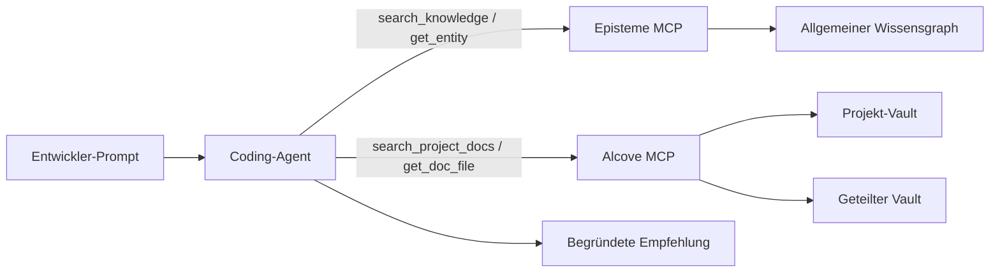
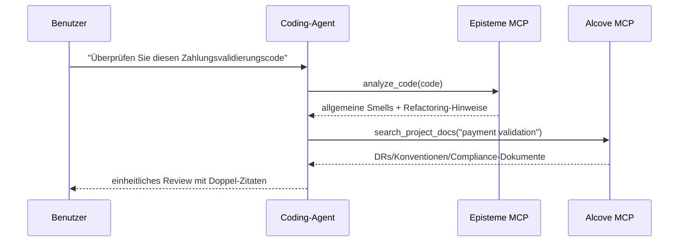
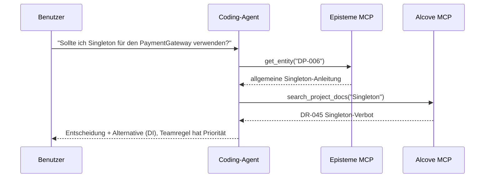
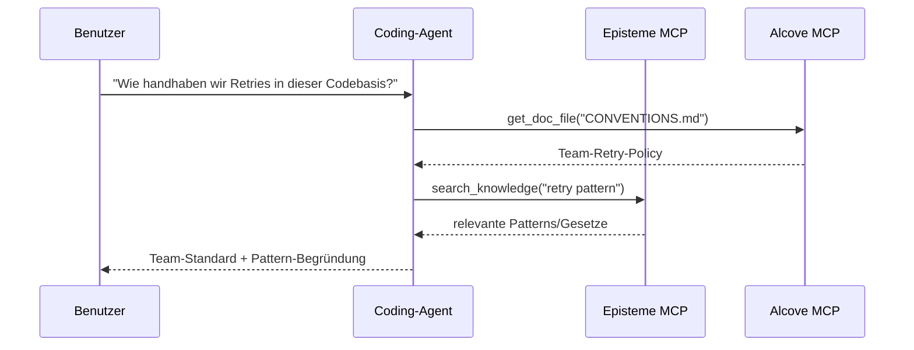

# Alcove + Episteme Integrationsleitfaden

> Agenten-First-Leitfaden: Allgemeines Software-Engineering-Wissen (Episteme) mit teamspezifischem Domänenwissen (Alcove) über MCP und natürlichsprachliche Workflows kombinieren.

## Übersicht

**Episteme** stellt universelles Wissen (GoF-Patterns, Refactorings, Gesetze) als schreibgeschützten Wissensgraph bereit.
**Alcove** indiziert die lebende Dokumentation Ihres Teams (Entscheidungen, Architektur, Coding-Standards).

Wenn beide über MCP gemeinsam verwendet werden, können Coding-Agenten:
- Allgemeine Best Practices anwenden (Episteme)
- Teamspezifische Einschränkungen beachten (Alcove)
- Beide Quellen in Empfehlungen zitieren

### Entscheidungspriorität

Wenn Episteme und Alcove im Konflikt stehen, hat **Alcove Vorrang** als finale Implementierungsanleitung.
- **Episteme**: Referenzwissen (allgemeine Patterns/Gesetze/Smells)
- **Alcove**: Teammandat (projekt-/organisationspezifische Einschränkungen)

---

## Architektur (Sicht des Coding-Agenten)



Der Agent sollte **nicht** alle Dokumente vorab laden. Er sollte nur die für den aktiven Prompt benötigten Dokumente/Entitäten abrufen.

---

## Agenten-First-Verwendung (Natürliche Sprache → MCP → Antwort)

Diese Patterns sind der empfohlene Standard für Cursor/Codex/Claude-artige Coding-Agenten.

1. Benutzer stellt eine Frage in natürlicher Sprache.
2. Agent ruft Teamkontext aus Alcove ab (`search_project_docs`, `get_doc_file`).
3. Agent ruft allgemeine Engineering-Anleitung aus Episteme ab.
4. Agent löst Konflikte (Teamregeln haben Vorrang vor allgemeinen Ratschlägen).
5. Agent gibt eine Antwort mit Doppel-Zitaten zurück.

---

## Alcove-Vault-Konzepte

### Projekt-Vault
**Speicherort**: `<docs_root>/<project>/` (z. B. `~/.alcove/docs/payment-api/`)
**Gültigkeitsbereich**: Einzelne Codebasis
**Inhalt**: Architekturentscheidungen, Tech-Stack, Domänenglossar

**Beispiel** (`~/.alcove/docs/payment-api/DECISION.md`):
```markdown
# DECISION.md
## DR-001: Payment Validation Strategy (2024-04-15)
- All card numbers MUST be validated using CardValidator
- Reason: FSS regulation §12.3 requires PCI DSS Level 1 compliance
- Related: Episteme DP-023 (Strategy Pattern)

## DR-002: No Direct LLM Calls in Production
- External AI APIs prohibited in payment processing flow
- Approved: Internal tools only (Claude Code, local models)
```

### Geteilter Vault
**Speicherort**: `<vaults_root>/<org-name>/` (üblicherweise `~/.alcove/vaults/<org-name>/`)
**Gültigkeitsbereich**: Organisationsweit
**Inhalt**: Querschnittsthemen, regulatorische Anforderungen, gemeinsame Patterns

**Beispiel** (`~/.alcove/vaults/osn-finance/FSS_COMPLIANCE.md`):
```markdown
# FSS_COMPLIANCE.md
## Card Number Handling
- ALWAYS mask in logs: `****-****-****-1234`
- NEVER store raw PAN in application logs
- Episteme reference: SMELL-42 (Information Exposure)

## Testing
- Use synthetic cards only: `4111-1111-1111-1111`
- Real customer data in tests = FSS violation
```

---

## Verwendungsmuster

### Muster 1: Code-Review mit Doppelkontext (Primär)

**Benutzeranfrage**:
```
"Überprüfen Sie diesen Zahlungsvalidierungscode"
```

**Agenten-Workflow**:
```python
# Schritt 1: Allgemeine Smells erkennen (Episteme)
smells = await episteme.analyze_code(code)
# → SMELL-01: Long Method (15+ Zeilen)
# → SMELL-08: Missing Error Handling

# Schritt 2: Teamregeln prüfen (Alcove)
decisions = await alcove.search_project_docs("payment validation")
# → DR-001: Muss CardValidator verwenden
# → FSS_COMPLIANCE.md: Kartennummern maskieren

# Schritt 3: Feedback synthetisieren
return f"""
Gefundene Probleme:
1. Long Method (Episteme SMELL-01)
   → Kartenvalidierung in separate Methode extrahieren

2. Fehlender CardValidator (Team DR-001)
   → Strategy Pattern verwenden (Episteme DP-023)

3. Kartennummer ohne Maskierung geloggt (FSS_COMPLIANCE.md)
   → Maskierungs-Dienstprogramm anwenden (siehe CONVENTIONS.md)
"""
```



### Muster 2: Architekturentscheidungsunterstützung

**Benutzeranfrage**:
```
"Sollte ich Singleton für den PaymentGateway verwenden?"
```

**Agenten-Workflow**:
```python
# Episteme: Allgemeines Pattern-Wissen
pattern = await episteme.get_entity("DP-006")  # Singleton
# → "Für global eindeutige Ressourcen verwendbar, aber Testbarkeitsprobleme beachten"

# Alcove: Team-Historie
past_decisions = await alcove.search_project_docs("Singleton")
# → DR-045: "Singleton in Service-Schicht verboten (Testing-Albtraum)"

# Synthetisierte Antwort:
return f"""
Episteme sagt: Singleton funktioniert für globale Ressourcen (DP-006)
Team-Historie: DR-045 hat es in Services verboten (2023-08)

Empfehlung: Stattdessen Dependency Injection verwenden
- Episteme DP-018 (Dependency Injection) erklärt wie
- Siehe ARCHITECTURE.md §3.2 für das DI-Container-Setup des Teams
"""
```



### Muster 3: Onboarding / "Wie machen wir X hier?"

**Benutzeranfrage**:
```
"Wie handhaben wir Retries in dieser Codebasis?"
```

**Agenten-Workflow**:
```python
# Alcove: Team-Konventionen
conventions = await alcove.get_doc_file("CONVENTIONS.md")
# → "Exponentielles Backoff mit max. 3 Retries verwenden (siehe RetryPolicy-Dienstprogramm)"

# Episteme: Verwandte Patterns
patterns = await episteme.search_knowledge("retry pattern")
# → DP-023: Strategy Pattern
# → LAW-012: Fail Fast Principle

return f"""
Team-Standard (CONVENTIONS.md):
- RetryPolicy-Dienstprogramm verwenden (src/common/retry.py)
- Max. 3 Versuche mit exponentiellem Backoff

Verwandte Konzepte:
- Episteme DP-023: Strategy Pattern (steckbare Retry-Logik)
- Episteme LAW-012: Fail Fast (nicht bei ungültiger Eingabe erneut versuchen)

Beispiel:
  policy = RetryPolicy(max_attempts=3, backoff="exponential")
  result = await policy.execute(api_call)
"""
```



---

## Einrichtungsanleitung (Minimal, zur Agenten-Aktivierung)

### 1. Alcove für Ihr Projekt initialisieren

```bash
cd /path/to/your/project
alcove setup

# Core-Dokumente erstellen
cat > .alcove/DECISION.md <<EOF
# Architectural Decision Records

## Template
- **ID**: DR-XXX
- **Date**: YYYY-MM-DD
- **Context**: What problem are we solving?
- **Decision**: What did we decide?
- **Consequences**: Trade-offs
- **Episteme Refs**: Related entities (optional)
EOF

cat > .alcove/ARCHITECTURE.md <<EOF
# System Architecture

## Domain Model
- Payment: Card validation, fraud detection
- Settlement: Batch processing, reconciliation

## Key Patterns (link to Episteme)
- Payment validation: Strategy (DP-023)
- API gateway: Facade (DP-007)
EOF
```

### 2. Geteilten Vault erstellen (Optional)

Für organisationsweite Standards:

```bash
mkdir -p ~/.alcove/vaults/my-org
cat > ~/.alcove/vaults/my-org/SECURITY.md <<EOF
# Security Standards

## PII Handling
- Never log credit card numbers (Episteme SMELL-42)
- Use DataMasker utility for all PII

## Approved Libraries
- cryptography >= 41.0
- bcrypt >= 4.0
EOF

# Externes Verzeichnis als Vault registrieren (z. B. Obsidian-Vault)
alcove vault link my-org ~/.alcove/vaults/my-org
```

### 3. MCP-Server konfigurieren (Erforderlich für Coding-Agenten)

In `~/.claude/claude_desktop_config.json`:

```json
{
  "mcpServers": {
    "episteme": {
      "command": "epis",
      "args": ["mcp"]
    },
    "alcove": {
      "command": "alcove",
      "args": []
    }
  }
}
```

Für Cursor/Codex/andere MCP-fähige Coding-Agenten: Registrieren Sie beide MCP-Server in der MCP-Konfiguration jedes Tools und behalten Sie dieselben Servernamen (`episteme`, `alcove`) bei, damit Prompts und Skills portabel bleiben.

### 4. Dokumentverlinkungs-Konvention

Episteme-Entitäten in Alcove-Dokumenten referenzieren:

```markdown
## DR-042: Use Repository Pattern for Data Access

**Decision**: All database access goes through Repository interface

**Rationale**:
- Testability: Mock repositories in unit tests
- Episteme DP-018 (Dependency Injection) + DP-007 (Facade)

**Implementation**:
See `src/repositories/` for examples
```

---

## Best Practices

### 0. Agenten-Abruf gegenüber manuellen CLI-Schritten bevorzugen

CLI hauptsächlich für die Ersteinrichtung/Wartung verwenden. Während der Codierungsarbeit natürlichsprachliche Prompts bevorzugen, die MCP-Aufrufe auslösen.

**Bevorzugt**
- "Dieses Modul nach unseren Teamkonventionen überprüfen"
- "Diesen Service gemäß DR-112 und verwandten Episteme-Gesetzen refactoren"
- "Prüfen, ob diese Implementierung mit Alcove-Entscheidungen kollidiert"

**Als Standard-Workflow vermeiden**
- Manuelles grep/Kopieren großer Dokumente in den Prompt
- Architektur-Einschränkungen in jeder Sitzung neu erklären

### 1. **Explizite Zitate**

Alcove-Entscheidungen immer mit Episteme-Entitäten verknüpfen, wenn zutreffend:

```markdown
❌ Schlecht:
"Strategy Pattern für die Zahlungsvalidierung verwenden"

✅ Gut:
"Strategy Pattern (Episteme DP-023) für die Zahlungsvalidierung verwenden.
Siehe DR-001 für die teamspezifische CardValidator-Implementierung."
```

### 2. **Alcove-Dokumente schlank halten**

Episteme-Inhalte nicht duplizieren. Stattdessen referenzieren:

```markdown
❌ Schlecht (Episteme duplizierend):
## Observer Pattern
Das Observer Pattern definiert eine 1:n-Abhängigkeit...
[500 Wörter Erklärung des Observer]

✅ Gut (Episteme referenzierend):
## Event Bus Implementierung (DR-078)
- Pattern: Observer (Episteme DP-012)
- Unsere Abwandlung: Redis Pub/Sub statt In-Memory
- Trade-off: Netzwerklatenz für horizontale Skalierbarkeit
```

### 3. **Bei Breaking Changes aktualisieren**

Wenn Teamkonventionen Episteme-Ratschläge übersteuern:

```markdown
## DR-091: Singleton-Verbotsausnahme (2024-04-20)

**Kontext**: Episteme DP-006 sagt Singleton ist für Konfiguration OK

**Unsere Regel**: NIE Singleton verwenden, auch nicht für Konfiguration

**Grund**: Konfiguration-Hot-Reload-Anforderung (DR-015)

**Alternative**: ConfigProvider mit DI verwenden (siehe src/config/)
```

### 4. **Vault-Organisation**

```
Projektdokumente (<docs_root>/<project>/)
├── DECISION.md        # ADRs mit Episteme-Referenzen
├── ARCHITECTURE.md    # Systemdesign, Pattern-Verwendung
├── CONVENTIONS.md     # Coding-Standards
├── DOMAIN.md          # Business-Glossar
└── DEPLOYMENT.md      # Ops-Runbooks

Geteilter Vault (<vaults_root>/<org>/)
├── SECURITY.md        # Projektübergreifende Sicherheitsregeln
├── COMPLIANCE.md      # Regulatorische Anforderungen (FSS, GDPR)
└── PATTERNS.md        # Organisationsgenehmigtes Pattern-Subset
```

---

## Fortgeschritten: Episteme → Alcove Feedback-Schleife

### Pattern-Nutzung mit Prometheus-Metriken verfolgen

Instrumentieren Sie Ihren Code, um die Episteme-Entitätsnutzung als Prometheus-Metriken offenzulegen:

```python
# In Ihrer Codebasis
from prometheus_client import Counter

pattern_usage = Counter(
    'episteme_pattern_applied_total',
    'Episteme pattern application count',
    ['entity_id', 'entity_type', 'context']
)

def apply_retry_logic():
    # Strategy Pattern-Nutzung verfolgen
    pattern_usage.labels(
        entity_id='DP-023',
        entity_type='pattern',
        context='payment_retry'
    ).inc()

    # Ihre Retry-Logik mit Strategy Pattern
    pass
```

### In Grafana visualisieren

Dashboard zur Überwachung der Pattern-Adoption erstellen:

```promql
# Meistverwendete Patterns (letzte 30 Tage)
topk(10,
  increase(episteme_pattern_applied_total[30d])
)

# Pattern-Nutzung nach Kontext
sum by (entity_id, context) (
  rate(episteme_pattern_applied_total[7d])
)

# Alarm bei veraltetem Pattern-Gebrauch
sum(rate(episteme_pattern_applied_total{entity_id="DP-006"}[5m])) > 0
# Alarm: "Singleton Pattern verwendet (laut DR-091 verboten)"
```

### Nutzungsberichte erstellen

Quartalsüberprüfung via Prometheus-Abfrage:

```bash
# Prometheus abfragen
curl -G 'http://localhost:9090/api/v1/query' \
  --data-urlencode 'query=topk(10, increase(episteme_pattern_applied_total[90d]))' \
  | jq -r '.data.result[] | "\(.metric.entity_id): \(.value[1])"'

# Ausgabe:
# DP-023: 847
# DP-018: 612
# DP-007: 301
```

Alcove-Dokumente basierend auf tatsächlicher Nutzung aktualisieren:

```markdown
## Meistverwendete Patterns (2024 Q2) — via Grafana

1. **Strategy (DP-023)**: 847 Verwendungen
   - Haupteinsatz: payment_retry (412), discount_calc (201)
   - Siehe: DECISION.md DR-001 (Zahlungsvalidierung)

2. **Dependency Injection (DP-018)**: 612 Verwendungen
   - Standard für alle Services
   - Siehe: ARCHITECTURE.md §3 für Container-Setup

3. **Facade (DP-007)**: 301 Verwendungen
   - Kontext: external_api (289), legacy_adapter (12)
```

---

## Fehlerbehebung

### Problem: Agent zitiert veraltetes Alcove-Dokument

**Ursache**: Alcove-Index nach Dokumentaktualisierung nicht aktualisiert

**Lösung**:
```bash
alcove rebuild
```

### Problem: Episteme und Alcove im Konflikt

**Beispiel**: Episteme sagt "Singleton OK", Team-Dokument sagt "Singleton verboten"

**Lösungsmuster**:
1. Agent stellt beide Quellen dar
2. Erklärt den Widerspruch
3. Bezieht sich auf das Team-Dokument (Alcove) als finale Antwort

```
Agent: "Hier liegt ein Konflikt vor:
- Episteme DP-006: Singleton ist für globale Konfiguration akzeptabel
- Ihr DR-091: Singleton verboten (Hot-Reload-Anforderung)

Ich folge Ihrer Teamregel (DR-091). Verwenden Sie stattdessen ConfigProvider."
```

### Problem: Agent verwendet nur-CLI-Erklärung statt Coding-Agenten-Workflow

**Symptom**: Antworten konzentrieren sich auf Shell-Befehle statt darauf, wie der Coding-Agent abrufen und schlussfolgern sollte.

**Lösung**:
1. Mit Absicht + Kontextziel fragen:
   - "Alcove-Dokumente + Episteme-Entitäten verwenden, um diesen Code zu überprüfen"
2. Explizite Doppel-Zitate anfordern:
   - "DR/ARCH-Dokument und Episteme-ID in der Antwort zitieren"
3. Konfliktlösungs-Richtlinie anfordern:
   - "Bei Quellenkonflikten Team-Dokumente priorisieren"

---

## Beispiel: Vollständiger Workflow

**Szenario**: Entwickler fragt "Wie sollte ich den neuen Payment-Webhook-Handler strukturieren?"

### Interner Prozess des Agenten

```python
# 1. Episteme nach allgemeinen Patterns durchsuchen
patterns = await episteme.search_knowledge("webhook handler")
# → DP-007: Facade (komplexe Subsysteme vereinfachen)
# → DP-023: Strategy (steckbare Validierung)
# → LAW-045: Single Responsibility

# 2. Team-Architektur prüfen
arch = await alcove.get_doc_file("ARCHITECTURE.md")
# → "Alle Webhooks laufen über WebhookRouter (src/webhooks/router.py)"

# 3. Team-Entscheidungen prüfen
decisions = await alcove.search_project_docs("webhook")
# → DR-112: "Webhook-Handler müssen idempotent sein (Payment-Retries)"

# 4. Konventionen prüfen
conv = await alcove.get_doc_file("CONVENTIONS.md")
# → "@webhook_handler-Dekorator für automatisches Logging/Retry verwenden"
```

### Antwort des Agenten

```markdown
## Payment-Webhook-Handler-Struktur

### Team-Standards (Alcove)
1. In WebhookRouter registrieren (ARCHITECTURE.md §4.2)
2. Idempotent machen (DR-112) - Payment-Gateways versuchen es erneut
3. @webhook_handler-Dekorator verwenden (CONVENTIONS.md)

### Empfohlene Patterns (Episteme)
- **Facade (DP-007)**: Komplexität des Payment-Providers verbergen
- **Strategy (DP-023)**: Steckbare pro-Provider-Validierung
- **SRP (LAW-045)**: Ein Handler = ein Webhook-Typ

### Code-Vorlage
\`\`\`python
from src.webhooks.router import webhook_handler
from src.payments import PaymentFacade  # DP-007

@webhook_handler(provider="stripe", idempotent=True)  # DR-112
async def handle_payment_success(payload: dict):
    # Single Responsibility: Payment verarbeiten (LAW-045)
    facade = PaymentFacade()
    return await facade.confirm_payment(payload["payment_id"])
\`\`\`

Siehe:
- ARCHITECTURE.md §4.2 für WebhookRouter-Setup
- src/webhooks/stripe_handler.py für Referenzimplementierung
- Episteme DP-007 für Facade Pattern-Details
```

---

## Zusammenfassung

| Aspekt | Episteme | Alcove |
|--------|----------|--------|
| **Gültigkeitsbereich** | Universelles Software-Engineering-Wissen | Team-/Organisationsspezifische Regeln |
| **Inhalt** | 22 Patterns, 66 Refactorings, 56 Gesetze, 14 Smells | ADRs, Architektur, Konventionen, Domäne |
| **Mutabilität** | Schreibgeschützt (periodische Updates) | Lebende Dokumente (tägliche Updates) |
| **Granularität** | Abstrakte Prinzipien | Konkrete Implementierungen |
| **Autorität** | Referenz/Vorschlag | Teammandat |

**Entscheidungspriorität**: Alcove > Episteme (Teamregeln haben Vorrang vor allgemeinen Ratschlägen)

**Zitierweise**: Beide Quellen immer verknüpfen, wenn zutreffend
- `"Strategy verwenden (Episteme DP-023) gemäß Team DR-001"`
- Nicht: `"Strategy verwenden"` (fehlender Kontext)

**Wartung**:
- Episteme: Keine Aktion erforderlich (Upstream übernimmt Updates)
- Alcove: Dokumente mit Codebase-Änderungen aktuell halten
