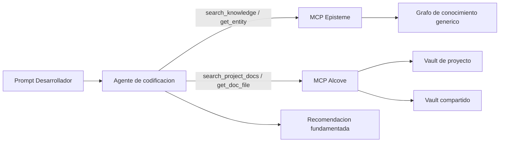
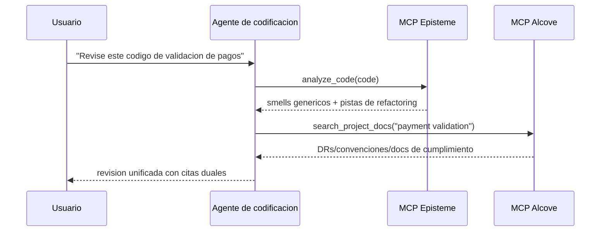
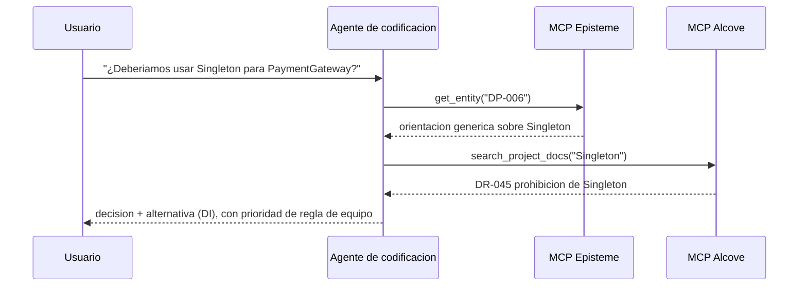
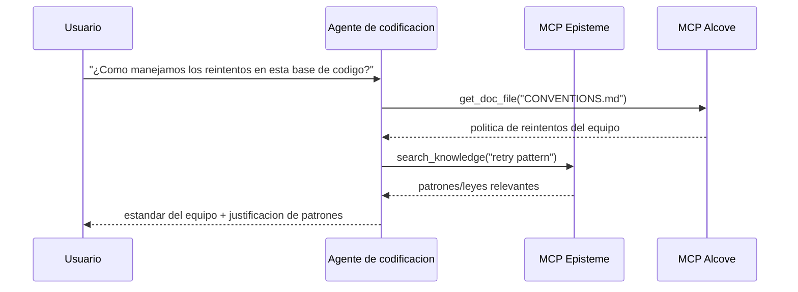

# Guia de integracion Alcove + Episteme

> Guia orientada a agentes: combinar conocimiento generico de ingenieria de software (Episteme) con conocimiento de dominio especifico del equipo (Alcove) a traves de MCP y flujos de lenguaje natural.

## Vista general

**Episteme** proporciona conocimiento universal (patrones GoF, refactorizaciones, leyes) como un grafo de conocimiento de solo lectura.
**Alcove** indexa la documentacion viva de su equipo (decisiones, arquitectura, estandares de codificacion).

Cuando se usan juntos via MCP, los agentes de codificacion pueden:
- Aplicar mejores practicas genericas (Episteme)
- Respetar las restricciones especificas del equipo (Alcove)
- Citar ambas fuentes en sus recomendaciones

### Prioridad de decision

Cuando Episteme y Alcove entran en conflicto, **Alcove tiene prioridad** para la orientacion final de implementacion.
- **Episteme**: conocimiento de referencia (patrones/leyes/smells generales)
- **Alcove**: mandato de equipo (restricciones especificas del proyecto/organizacion)

---

## Arquitectura (vista del Agente de codificacion)



El agente **no** debe precargar todos los documentos. Debe recuperar unicamente los documentos/entidades requeridos para el prompt activo.

---

## Uso orientado a agentes (Lenguaje natural -> MCP -> Respuesta)

Estos patrones son el defecto recomendado para agentes de codificacion tipo Cursor/Codex/Claude.

1. El usuario pregunta en lenguaje natural.
2. El agente recupera el contexto del equipo desde Alcove (`search_project_docs`, `get_doc_file`).
3. El agente recupera orientacion de ingenieria generica desde Episteme.
4. El agente resuelve conflictos (las reglas del equipo prevalecen sobre el consejo generico).
5. El agente retorna una respuesta con citas duales.

---

## Conceptos de vaults Alcove

### Vault de proyecto
**Ubicacion**: `<docs_root>/<project>/` (por ejemplo `~/.alcove/docs/payment-api/`)
**Alcance**: Base de codigo unica
**Contenido**: Decisiones de arquitectura, stack tecnologico, glosario de dominio

**Ejemplo** (`~/.alcove/docs/payment-api/DECISION.md`):
```markdown
# DECISION.md
## DR-001: Estrategia de validacion de pagos (2024-04-15)
- Todos los numeros de tarjeta DEBEN ser validados usando CardValidator
- Razon: La regulacion FSS §12.3 requiere cumplimiento PCI DSS Nivel 1
- Relacionado: Episteme DP-023 (Patron Strategy)

## DR-002: Sin llamadas LLM directas en produccion
- APIs IA externas prohibidas en el flujo de procesamiento de pagos
- Aprobado: Solo herramientas internas (Claude Code, modelos locales)
```

### Vault compartido
**Ubicacion**: `<vaults_root>/<org-name>/` (comunmente `~/.alcove/vaults/<org-name>/`)
**Alcance**: Toda la organizacion
**Contenido**: Preocupaciones transversales, requisitos regulatorios, patrones compartidos

**Ejemplo** (`~/.alcove/vaults/osn-finance/FSS_COMPLIANCE.md`):
```markdown
# FSS_COMPLIANCE.md
## Manejo de numeros de tarjeta
- SIEMPRE enmascarar en logs: `****-****-****-1234`
- NUNCA almacenar PAN sin formato en logs de aplicacion
- Referencia Episteme: SMELL-42 (Information Exposure)

## Pruebas
- Usar solo tarjetas sinteticas: `4111-1111-1111-1111`
- Datos reales de clientes en pruebas = violacion FSS
```

---

## Patrones de uso

### Patron 1: Revision de codigo con contexto dual (Principal)

**Solicitud del usuario**:
```
"Revise este codigo de validacion de pagos"
```

**Flujo del agente**:
```python
# Paso 1: Detectar smells genericos (Episteme)
smells = await episteme.analyze_code(code)
# → SMELL-01: Long Method (15+ lineas)
# → SMELL-08: Missing Error Handling

# Paso 2: Verificar reglas del equipo (Alcove)
decisions = await alcove.search_project_docs("payment validation")
# → DR-001: Debe usar CardValidator
# → FSS_COMPLIANCE.md: Enmascarar numeros de tarjeta

# Paso 3: Sintetizar retroalimentacion
return f"""
Problemas encontrados:
1. Long Method (Episteme SMELL-01)
   → Extraer validacion de tarjeta a metodo separado

2. CardValidator faltante (Equipo DR-001)
   → Usar Patron Strategy (Episteme DP-023)

3. Numero de tarjeta registrado sin enmascarar (FSS_COMPLIANCE.md)
   → Aplicar utilidad de enmascaramiento (ver CONVENTIONS.md)
"""
```



### Patron 2: Soporte a decision arquitectonica

**Solicitud del usuario**:
```
"¿Deberiamos usar Singleton para PaymentGateway?"
```

**Flujo del agente**:
```python
# Episteme: Conocimiento generico de patrones
pattern = await episteme.get_entity("DP-006")  # Singleton
# → "Usar para recursos globalmente unicos, pero cuidado con problemas de testabilidad"

# Alcove: Historial del equipo
past_decisions = await alcove.search_project_docs("Singleton")
# → DR-045: "Singleton prohibido en capa de servicios (pesadilla de testing)"

# Respuesta sintetizada:
return f"""
Episteme dice: Singleton funciona para recursos globales (DP-006)
Historial del equipo: DR-045 lo prohibio en servicios (2023-08)

Recomendacion: Usar Inyeccion de Dependencias en su lugar
- Episteme DP-018 (Inyeccion de Dependencias) explica como
- Ver ARCHITECTURE.md §3.2 para la configuracion del contenedor DI del equipo
"""
```



### Patron 3: Onboarding / « ¿Como hacemos X aqui? »

**Solicitud del usuario**:
```
"¿Como manejamos los reintentos en esta base de codigo?"
```

**Flujo del agente**:
```python
# Alcove: Convenciones del equipo
conventions = await alcove.get_doc_file("CONVENTIONS.md")
# → "Usar backoff exponencial con maximo 3 reintentos (ver utilidad RetryPolicy)"

# Episteme: Patrones relacionados
patterns = await episteme.search_knowledge("retry pattern")
# → DP-023: Patron Strategy
# → LAW-012: Principio Fail Fast

return f"""
Estandar del equipo (CONVENTIONS.md):
- Usar la utilidad RetryPolicy (src/common/retry.py)
- Maximo 3 intentos con backoff exponencial

Conceptos relacionados:
- Episteme DP-023: Patron Strategy (logica de reintento enchufable)
- Episteme LAW-012: Fail Fast (no reintentar en entrada invalida)

Ejemplo:
  policy = RetryPolicy(max_attempts=3, backoff="exponential")
  result = await policy.execute(api_call)
"""
```



---

## Instrucciones de configuracion (Minimal, para activacion del agente)

### 1. Inicializar Alcove para su proyecto

```bash
cd /ruta/a/su/proyecto
alcove setup

# Crear documentos principales
cat > .alcove/DECISION.md <<EOF
# Registro de decisiones arquitectonicas

## Plantilla
- **ID**: DR-XXX
- **Fecha**: AAAA-MM-DD
- **Contexto**: ¿Que problema estamos resolviendo?
- **Decision**: ¿Que decidimos?
- **Consecuencias**: Compromisos
- **Refs Episteme**: Entidades relacionadas (opcional)
EOF

cat > .alcove/ARCHITECTURE.md <<EOF
# Arquitectura del sistema

## Modelo de dominio
- Payment: Validacion de tarjeta, deteccion de fraude
- Settlement: Procesamiento por lotes, conciliacion

## Patrones clave (enlace a Episteme)
- Validacion de pagos: Strategy (DP-023)
- Gateway API: Facade (DP-007)
EOF
```

### 2. Crear Vault compartido (Opcional)

Para estandares organizacionales:

```bash
mkdir -p ~/.alcove/vaults/mi-org
cat > ~/.alcove/vaults/mi-org/SECURITY.md <<EOF
# Estandares de seguridad

## Manejo de PII
- Nunca registrar numeros de tarjeta de credito (Episteme SMELL-42)
- Usar utilidad DataMasker para todos los PII

## Bibliotecas aprobadas
- cryptography >= 41.0
- bcrypt >= 4.0
EOF

# Registrar directorio externo como vault (ej: vault Obsidian)
alcove vault link mi-org ~/.alcove/vaults/mi-org
```

### 3. Configurar servidores MCP (Requerido para agentes de codificacion)

En `~/.claude/claude_desktop_config.json`:

```json
{
  "mcpServers": {
    "episteme": {
      "command": "epis",
      "args": ["mcp"]
    },
    "alcove": {
      "command": "alcove",
      "args": []
    }
  }
}
```

Para Cursor/Codex/otros agentes de codificacion compatibles con MCP, registre ambos servidores MCP en la configuracion MCP de cada herramienta y mantenga los mismos nombres de servidor (`episteme`, `alcove`) para que los prompts y skills permanezcan portables.

### 4. Convencion de enlace de documentacion

Referenciar entidades Episteme en documentos Alcove:

```markdown
## DR-042: Usar Patron Repository para acceso a datos

**Decision**: Todo acceso a la base de datos pasa por la interfaz Repository

**Justificacion**:
- Testabilidad: Simular repositories en pruebas unitarias
- Episteme DP-018 (Inyeccion de Dependencias) + DP-007 (Facade)

**Implementacion**:
Ver `src/repositories/` para ejemplos
```

---

## Mejores practicas

### 0. Preferir la recuperacion por el agente a los pasos manuales en CLI

Use la CLI principalmente para la configuracion inicial y mantenimiento. Durante el trabajo de codificacion, preferir prompts en lenguaje natural que activen llamadas MCP.

**Preferido**
- "Revise este modulo con nuestras convenciones de equipo"
- "Refactorice este servicio siguiendo DR-112 y las leyes Episteme relacionadas"
- "Verifique si esta implementacion entra en conflicto con las decisiones Alcove"

**Evitar como flujo por defecto**
- Grep/copy-paste manual de documentos grandes en el prompt
- Re-explicar restricciones de arquitectura en cada sesion

### 1. **Citas explicitas**

Siempre vincular las decisiones Alcove a entidades Episteme cuando sea aplicable:

```markdown
❌ Mal:
"Usar el Patron Strategy para validacion de pagos"

✅ Bien:
"Usar el Patron Strategy (Episteme DP-023) para validacion de pagos.
Ver DR-001 para la implementacion especifica de CardValidator del equipo."
```

### 2. **Mantener los documentos Alcove concisos**

No duplicar contenido Episteme. Referenciarlo:

```markdown
❌ Mal (duplicando Episteme):
## Patron Observer
El Patron Observer define una dependencia un-verso-muchos...
[500 palabras explicando Observer]

✅ Bien (referenciando Episteme):
## Implementacion Event Bus (DR-078)
- Patron: Observer (Episteme DP-012)
- Nuestro toque: Usar Redis Pub/Sub en lugar de en memoria
- Compromiso: Latencia de red por escalabilidad horizontal
```

### 3. **Actualizar en cambios disruptivos**

Cuando las convenciones del equipo prevalecen sobre el consejo Episteme:

```markdown
## DR-091: Excepcion a la prohibicion de Singleton (2024-04-20)

**Contexto**: Episteme DP-006 dice que Singleton esta OK para config

**Nuestra regla**: NUNCA usar Singleton, incluso para config

**Razon**: Requisito de hot-reload de config (DR-015)

**Alternativa**: Usar ConfigProvider con DI (ver src/config/)
```

### 4. **Organizacion de vaults**

```
Documentos de proyecto (<docs_root>/<project>/)
├── DECISION.md        # ADRs con refs Episteme
├── ARCHITECTURE.md    # Diseno del sistema, uso de patrones
├── CONVENTIONS.md     # Estandares de codificacion
├── DOMAIN.md          # Glosario de negocio
└── DEPLOYMENT.md      # Runbooks de ops

Vault compartido (<vaults_root>/<org>/)
├── SECURITY.md        # Reglas de seguridad inter-proyectos
├── COMPLIANCE.md      # Requisitos regulatorios (FSS, RGPD)
└── PATTERNS.md        # Subconjunto de patrones aprobados por la organizacion
```

---

## Avanzado: Bucle de retroalimentacion Episteme → Alcove

### Rastrear uso de patrones con metricas Prometheus

Instrumentar su codigo para exponer el uso de entidades Episteme como metricas Prometheus:

```python
# En su base de codigo
from prometheus_client import Counter

pattern_usage = Counter(
    'episteme_pattern_applied_total',
    'Conteo de aplicaciones de patrones Episteme',
    ['entity_id', 'entity_type', 'context']
)

def apply_retry_logic():
    # Rastrear uso del Patron Strategy
    pattern_usage.labels(
        entity_id='DP-023',
        entity_type='pattern',
        context='payment_retry'
    ).inc()

    # Su logica de reintento usando Patron Strategy
    pass
```

### Visualizar en Grafana

Crear un panel para monitorear la adopcion de patrones:

```promql
# Patrones mas usados (ultimos 30 dias)
topk(10,
  increase(episteme_pattern_applied_total[30d])
)

# Uso de patrones por contexto
sum by (entity_id, context) (
  rate(episteme_pattern_applied_total[7d])
)

# Alerta sobre uso de patrones deprecados
sum(rate(episteme_pattern_applied_total{entity_id="DP-006"}[5m])) > 0
# Alerta: "Patron Singleton usado (prohibido segun DR-091)"
```

### Generar informes de uso

Revision trimestral via consulta Prometheus:

```bash
# Consultar Prometheus
curl -G 'http://localhost:9090/api/v1/query' \
  --data-urlencode 'query=topk(10, increase(episteme_pattern_applied_total[90d]))' \
  | jq -r '.data.result[] | "\(.metric.entity_id): \(.value[1])"'

# Salida:
# DP-023: 847
# DP-018: 612
# DP-007: 301
```

Actualizar documentos Alcove basandose en el uso real:

```markdown
## Patrones mas usados (2024 T2) - via Grafana

1. **Strategy (DP-023)**: 847 usos
   - Principal: payment_retry (412), discount_calc (201)
   - Ver: DECISION.md DR-001 (validacion de pagos)

2. **Inyeccion de Dependencias (DP-018)**: 612 usos
   - Estandar en todos los servicios
   - Ver: ARCHITECTURE.md §3 para configuracion del contenedor

3. **Facade (DP-007)**: 301 usos
   - Contexto: external_api (289), legacy_adapter (12)
```

---

## Solucion de problemas

### Problema: El agente cita un documento Alcove desactualizado

**Causa**: Indice Alcove no actualizado despues de la actualizacion del documento

**Solucion**:
```bash
alcove rebuild
```

### Problema: Conflicto entre Episteme y Alcove

**Ejemplo**: Episteme dice « Singleton OK », el documento del equipo dice « Singleton prohibido »

**Patron de resolucion**:
1. El agente presenta ambas fuentes
2. Explica la contradiccion
3. Difiere al documento del equipo (Alcove) para la respuesta final

```
Agente: "Hay un conflicto aqui:
- Episteme DP-006: Singleton es aceptable para config global
- Su DR-091: Singleton prohibido (requisito de hot-reload)

Seguire su regla de equipo (DR-091). Use ConfigProvider en su lugar."
```

### Problema: El agente usa explicaciones solo CLI en lugar del flujo de agente de codificacion

**Sintoma**: Las respuestas se centran en comandos shell en lugar de como el agente de codificacion deberia recuperar y razonar.

**Solucion**:
1. Preguntar con intencion + objetivo de contexto:
   - "Use documentos Alcove + entidades Episteme para revisar este codigo"
2. Solicitar cita dual explicita:
   - "Cite el documento DR/ARCH y el ID Episteme en su respuesta"
3. Solicitar politica de resolucion de conflictos:
   - "Si las fuentes entran en conflicto, priorizar documentos del equipo"

---

## Ejemplo: Flujo de trabajo completo

**Escenario**: Un desarrollador pregunta « ¿Como deberia estructurar el nuevo manejador de webhook de pagos? »

### Proceso interno del agente

```python
# 1. Buscar en Episteme patrones genericos
patterns = await episteme.search_knowledge("webhook handler")
# → DP-007: Facade (simplificar subsistemas complejos)
# → DP-023: Strategy (validacion enchufable)
# → LAW-045: Single Responsibility

# 2. Verificar arquitectura del equipo
arch = await alcove.get_doc_file("ARCHITECTURE.md")
# → "Todos los webhooks pasan por WebhookRouter (src/webhooks/router.py)"

# 3. Verificar decisiones del equipo
decisions = await alcove.search_project_docs("webhook")
# → DR-112: "Los manejadores de webhook deben ser idempotentes (reintentos de pago)"

# 4. Verificar convenciones
conv = await alcove.get_doc_file("CONVENTIONS.md")
# → "Usar decorador @webhook_handler para logging/reintento automatico"
```

### Respuesta del agente

```markdown
## Estructura del manejador de webhook de pagos

### Estandares del equipo (Alcove)
1. Registrar en WebhookRouter (ARCHITECTURE.md §4.2)
2. Hacerlo idempotente (DR-112) - las pasarelas de pago reintentan
3. Usar decorador @webhook_handler (CONVENTIONS.md)

### Patrones recomendados (Episteme)
- **Facade (DP-007)**: Ocultar la complejidad del proveedor de pagos
- **Strategy (DP-023)**: Validacion enchufable por proveedor
- **SRP (LAW-045)**: Un manejador = un tipo de webhook

### Plantilla de codigo
\`\`\`python
from src.webhooks.router import webhook_handler
from src.payments import PaymentFacade  # DP-007

@webhook_handler(provider="stripe", idempotent=True)  # DR-112
async def handle_payment_success(payload: dict):
    # Responsabilidad unica: procesar pago (LAW-045)
    facade = PaymentFacade()
    return await facade.confirm_payment(payload["payment_id"])
\`\`\`

Ver:
- ARCHITECTURE.md §4.2 para configuracion de WebhookRouter
- src/webhooks/stripe_handler.py para implementacion de referencia
- Episteme DP-007 para detalles del Patron Facade
```

---

## Resumen

| Aspecto | Episteme | Alcove |
|---------|----------|--------|
| **Alcance** | Conocimiento universal de ingenieria de software | Reglas especificas del equipo/organizacion |
| **Contenido** | 22 patrones, 66 refactorizaciones, 56 leyes, 14 smells | ADR, arquitectura, convenciones, dominio |
| **Mutabilidad** | Solo lectura (actualizaciones periodicas) | Documentos vivos (actualizaciones diarias) |
| **Granularidad** | Principios abstractos | Implementaciones concretas |
| **Autoridad** | Referencia/sugerencia | Mandato de equipo |

**Prioridad de decision**: Alcove > Episteme (las reglas del equipo prevalecen sobre el consejo generico)

**Estilo de cita**: Siempre enlazar ambas fuentes cuando sea aplicable
- `"Usar Strategy (Episteme DP-023) segun DR-001 del equipo"`
- Y no: `"Usar Strategy"` (contexto faltante)

**Mantenimiento**:
- Episteme: Sin accion requerida (la fuente gestiona las actualizaciones)
- Alcove: Mantener los documentos actualizados con los cambios de la base de codigo
