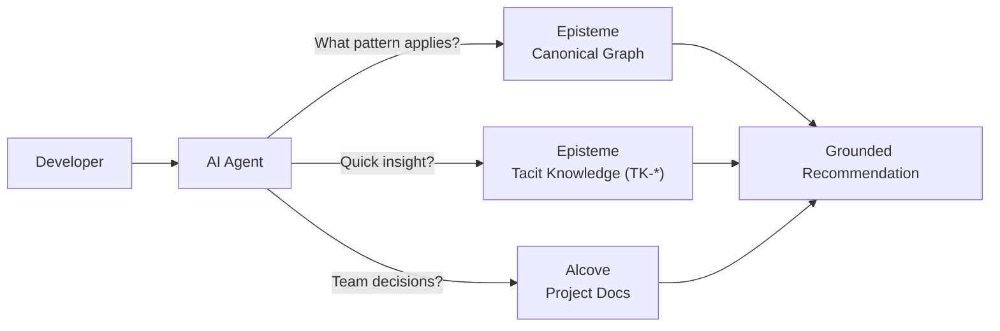

<p align="center">

</p>

<p align="center"><sub>Episteme (συνταγμα) — du grec « systeme organise » ou « discernement »</sub></p>

<p align="center">Un graphe de connaissances hors-ligne, en un seul binaire, qui connecte les motifs de conception, les techniques de refactoring et les lois du logiciel par des relations semantiques.<br><b>Concu d'abord pour les agents IA</b> — integrez l'expertise en genie logiciel directement dans Claude Code, Cursor et autres outils compatibles MCP.</p>

<p align="center">Ecrit en Rust · Binaire unique · Entierement hors-ligne</p>

---

<p align="center">
    <a href="https://github.com/epicsagas/Episteme/actions"></a>
    <a href="https://www.rust-lang.org/"></a>
    <a href="https://crates.io/crates/episteme"></a>
    <a href="LICENSE"></a>
    <a href="https://buymeacoffee.com/epicsaga"></a>
</p>

<p align="center">
  <a href="../../README.md">English</a> |
  <a href="../ja/">日本語</a> |
  <a href="../ko/">한국어</a> |
  <a href="../de/">Deutsch</a> |
  Français |
  <a href="../zh-CN/">简体中文</a> |
  <a href="../zh-TW/">繁體中文</a> |
  <a href="../pt/">Português</a> |
  <a href="../es/">Español</a> |
  <a href="../hi/">हिन्दी</a>
</p>

---

<picture>
  <source media="(prefers-color-scheme: dark)" srcset="../assets/features.png">
  
</picture>

---

## Demarrage rapide

### Claude Code

```
/plugin marketplace add epicsagas/plugins
/plugin install episteme@epicsagas
```

Le hook du plugin installe le binaire `epis` automatiquement. **Avant de démarrer une nouvelle session**, exécutez cette commande une fois dans votre terminal :

```bash
epis install   # Télécharge les données du graphe de connaissances depuis GitHub Releases
```

`epis install` initialise la base de données du graphe de connaissances et démarre le serveur HTTP API sur le port 58302. Démarrez ensuite une nouvelle session Claude Code et c'est prêt.

Mettre à jour : `/plugin update episteme@epicsagas`

### Codex CLI

```bash
codex plugin marketplace add epicsagas/plugins
```

Le hook du plugin installe le binaire `epis` automatiquement. **Avant de démarrer une nouvelle session**, exécutez cette commande une fois dans votre terminal :

```bash
epis install   # Télécharge les données du graphe de connaissances depuis GitHub Releases
```

`epis install` initialise la base de données du graphe de connaissances et démarre le serveur HTTP API sur le port 58302. Démarrez ensuite une nouvelle session et tout est immédiatement disponible.

Mettre à jour : `codex plugin update episteme@epicsagas`

### Autres outils

```bash
epis install cursor       # Cursor IDE
epis install opencode     # OpenCode
epis install cline        # Cline
epis install --all        # Tous les outils supportes
```

### Installation manuelle

| Methode | Commande |
|---------|----------|
| **Homebrew** | `brew install epicsagas/tap/episteme` |
| **Script shell** | `curl --proto '=https' --tlsv1.2 -LsSf https://github.com/epicsagas/Episteme/releases/latest/download/episteme-installer.sh \| sh` |
| **PowerShell** | `irm https://github.com/epicsagas/Episteme/releases/latest/download/episteme-installer.ps1 \| iex` |
| **cargo** | `cargo binstall episteme` ⚡ ou `cargo install episteme` |
| **Docker** | Voir [Option 3](#option-3-docker-rust-non-requis) |

### Verifier

```bash
epis --version
epis stats
```

Ou depuis Claude Code / Codex CLI :

```
/episteme verify
```

### Essayez en 30 secondes

**Option A — CLI :** Pointez vers n'importe quel fichier de votre projet.

```bash
epis analyze src/domain/engine.rs
```

```
✓ 2 smells detected in src/domain/engine.rs

  SMELL-07 (Large Class) — RefactoringRanker, 743 lines
  → RF-018 Extract Class          priority 0.89  effort: medium
  → RF-001 Extract Method         priority 0.76  effort: small
  → Violates: LAW-001 Single Responsibility Principle

  SMELL-01 (Long Method) — rank_refactorings(), 58 lines
  → RF-001 Extract Method         priority 0.92  effort: small
  → Violates: LAW-001 SRP, LAW-004 DRY
```

**Option B — Claude Code :** Ouvrez n'importe quel fichier de votre projet et demandez naturellement.

```
Find code smells in this project and suggest refactorings.
```

Episteme se declenche automatiquement — aucune syntaxe speciale n'est necessaire. Il mappe votre description au graphe de connaissances et renvoie des resultats classes et citables.

---

## Pourquoi Episteme ?

Les LLM connaissent deja le motif Strategy. Ils peuvent reciter les principes SOLID, lister les motifs GoF et expliquer les code smells. Alors pourquoi ce projet existe-t-il ?

**Le manque n'est pas la connaissance — c'est le raisonnement structure et connecte.**

Quand vous demandez a un LLM « comment corriger un God Object ? », il vous donne une reponse raisonnable. Mais cette reponse change entre les conversations, manque de tracabilite et ne connecte pas le probleme a ses causes racines ou a ses consequences en aval. Episteme transforme les faits isoles en un graphe traversable ou chaque recommandation est fondee, citable et connectee au panorama de conception global.

### En quoi cela differe-t-il d'un bon prompt LLM ?

| | Prompt LLM bien elabore | Episteme + LLM |
|---|---|---|
| Detection proactive | Uniquement si l'utilisateur pose la bonne question | Se declenche automatiquement sur les descriptions de problemes |
| Efficacite en tokens | Longues explications + plusieurs tours de suivi | Un appel d'outil renvoie un resultat structure |
| Traversee de relations | Un saut au mieux, souvent hallucine | Traversee de graphe multi-sauts, verifiee |
| References croisees | Manuelles, sujettes aux erreurs | Automatisees via 201 relations semantiques |
| Coherence | Varie entre les conversations | Toujours la meme reponse structuree |
| Citabilite | « Je pense que vous devriez utiliser Extract Class » | « Extract Class (RF-018), priorite 0.89 » |
| Hors-ligne / Reseau coupe | Necessite Internet pour de meilleurs resultats | Entierement local, binaire unique |

### Quand est-ce utile ?

<details>
<summary><b>1. Quand votre agent IA devrait detecter proactivement les problemes, et non attendre qu'on le lui demande</b></summary>

L'integration MCP se declenche automatiquement sur les descriptions de problemes. Quand un utilisateur dit « cette classe fait trop de choses », l'agent n'a pas besoin de savoir poser la question sur le God Object — Episteme mappe la plainte a `SMELL-03`, affiche les refactorings classes et retrace la violation jusqu'aux principes fondamentaux. Cela transforme une plainte vague en un plan de remediation structure.
</details>

<details>
<summary><b>2. Quand vous voulez reduire la consommation de tokens — pas la gaspiller en explications</b></summary>

Sans Episteme, un LLM repond a « comment corriger un God Object ? » en expliquant le smell, en listant les refactorings, en decrivant les principes SOLID et en parcourant chaque option — des centaines de tokens par reponse. Avec Episteme, un seul appel d'outil MCP renvoie `SMELL-03 → RF-018 (0.89) → LAW-001`. La meme expertise pour une fraction du budget de tokens.
</details>

<details>
<summary><b>3. Quand vous avez besoin d'une analyse de code connectee a la remediation — pas seulement a la detection</b></summary>

Des outils comme SonarQube detectent les smells. Les LLM peuvent suggerer des motifs. Episteme fait les deux et les connecte : detecter Long Method → tracer les lois violees → classer les refactorings qui les resolvent → montrer quels motifs renforcent ces refactorings.
</details>

<details>
<summary><b>4. Quand la connaissance isolee des motifs ne suffit pas — vous avez besoin des relations</b></summary>

Savoir ce que fait Extract Method est un prerequis de base. Savoir qu'il *resout* Long Method (SMELL-01), qui *viole* Single Responsibility (LAW-001), qui est *renforce par* le motif Facade (DP-012) — c'est une chaine de raisonnement qu'un LLM ne peut pas construire de maniere fiable par lui-meme. Les 201 relations semantiques de Episteme permettent aux agents IA de traverser ces chemins de maniere deterministe.
</details>

<details>
<summary><b>5. Quand vous prenez des decisions d'architecture et avez besoin de preuves, pas d'opinions</b></summary>

« Dois-je utiliser les microservices ? » — Episteme connecte la question a la Loi de Conway (LAW-017), au SRP (LAW-001) et au motif Strangler Fig (DP-026), puis montre comment ils sont relies. Les decisions deviennent tracables vers des lois d'ingenierie, pas des articles de blog.
</details>

<details>
<summary><b>6. Quand vous avez besoin de conseils d'ingenierie coherents et citables — pas de recommandations hallucinees</b></summary>

Chaque resultat reference des identifiants d'entite explicites (`DP-005`, `RF-001`, `LAW-021`). Les recommandations sont accompagnees de scores de priorite et d'estimations d'effort. La meme requete renvoie toujours la meme reponse structuree.
</details>

<details>
<summary><b>7. Quand vous travaillez dans un environnement deconnecte ou sur un reseau restreint</b></summary>

Episteme fonctionne entierement hors-ligne : binaire unique, base de donnees SQLite locale, embeddings locaux via fastembed (ONNX Runtime). Pas de telemetrie, pas d'appel a un serveur externe, pas d'API externe. Votre code et vos resultats d'analyse ne quittent jamais votre machine.
</details>

---

## Fonctionnalités

| | Fonctionnalité | Pourquoi c'est important |
|--|----------------|--------------------------|
| 🧠 | **22 motifs de conception GoF** | Catalogue complet avec exemples concrets |
| 🔧 | **66 techniques de refactoring** | Catalogue de Fowler avec exemples de code |
| ⚖️ | **56 lois et principes logiciels** | SOLID, loi de Conway, théorème CAP, etc. |
| 👃 | **17 types de code smells** | Long Method, God Object, Feature Envy, etc. ¹ |
| 🔗 | **201 relations sémantiques** | « résout », « impose », « viole », « est lié à » |
| 🤖 | **9 outils MCP + 4 agents** | Interaction agent IA haute fidélité avec transferts inter-agents |
| 🌐 | **Serveur HTTP API** | API REST sur le port 58302, démarré automatiquement à l'installation |
| 🌍 | **Support de 10 langages** | Python (AST), Java, TypeScript, Go, Rust, C++, C#, PHP, Ruby, Kotlin |
| 📊 | **Analyse déterministe** | Python basé AST + regex multilangage, résultat identique à chaque fois |
| 🏷️ | **Connaissances citables** | Chaque découverte est liée à des IDs d'entité explicites (`RF-001`, `LAW-021`) |
| 🌐 | **API REST (17 points d'accès)** | Auth, limitation de débit, sondes de santé, métriques Prometheus |
| 📦 | **Binaire unique** | Pas de runtime, multiplateforme (macOS, Linux, Windows) |
| 🔌 | **Embeddings locaux** | fastembed (ONNX Runtime), recherche sémantique sans configuration |
| 🐳 | **Support Docker** | Build multi-étape avec vérifications de santé |

> ¹ Duplicate Code (SMELL-13) et Shotgun Surgery (SMELL-09) nécessitent un contexte multi-fichiers et sont ignorés en mode mono-fichier.

---

## Installation

### Option 1 : cargo-binstall (Recommandee)

```bash
cargo binstall episteme    # telecharge les binaires precompiles — pas de compilation
epis install cursor        # initialise les donnees + demarre le serveur API + installe les agents
```

Si cargo-binstall n'est pas installe : `cargo install cargo-binstall`

> Après `epis install`, le serveur HTTP API démarre automatiquement sur le port 58302. MCP reste disponible -- voir `registry/mcp.json` pour la configuration manuelle.

### Option 2 : A partir des sources

```bash
git clone https://github.com/epicsagas/Episteme.git
cd Episteme && cargo build --release
```

Puis executez le binaire pour votre plateforme :

| Plateforme | Commande |
|------------|----------|
| **macOS / Linux** | `./target/release/epis install --local cursor` |
| **Windows** | `.\target\release\episteme.exe install --local cursor` |

### Option 3 : Docker (Rust non requis)

```bash
docker-compose up -d
```

Ajoutez a votre fichier de configuration MCP :

| Outil | Chemin du fichier de configuration |
|-------|-----------------------------------|
| Claude Code | `~/.claude.json` |
| Cursor | `.cursor/mcp.json` |
| VS Code (Copilot) | `.vscode/mcp.json` |

```json
{
  "mcpServers": {
    "episteme": {
      "command": "docker",
      "args": ["exec", "-i", "episteme-api", "episteme", "mcp"]
    }
  }
}
```

### Option 4 : Binaires precompiles (Rust non requis)

Telechargez le dernier binaire pour votre plateforme depuis [GitHub Releases](https://github.com/epicsagas/Episteme/releases) :

| Plateforme | Fichier |
|----------|------|
| **macOS** (Apple Silicon) | `episteme-aarch64-apple-darwin.tar.xz` |
| **Linux** (x86_64) | `episteme-x86_64-unknown-linux-gnu.tar.xz` |
| **Linux** (ARM64) | `episteme-aarch64-unknown-linux-gnu.tar.xz` |
| **Windows** (x86_64) | `episteme-x86_64-pc-windows-msvc.zip` |

```bash
# macOS / Linux
tar xzf episteme-*.tar.gz
sudo mv episteme /usr/local/bin/

# Windows — extrayez le zip et ajoutez episteme.exe a votre PATH
```

Puis installez :
```bash
epis install cursor
```

### Verifier

```bash
epis --version
epis stats
epis explore "strategy pattern"    # explorer le graphe de connaissances
```

Ou depuis Claude Code / Codex CLI :

```
/episteme verify
```

---

## Endpoints HTTP API

> Episteme fonctionne comme un serveur HTTP API toujours actif sur le port 58302. Les skills et agents utilisent `curl http://localhost:58302/...` au lieu des outils MCP. MCP reste disponible pour la configuration manuelle -- voir `registry/mcp.json`.

### Endpoints de l'API

#### Graphe de Connaissances

| Méthode | Endpoint | Objectif |
|---------|----------|----------|
| **GET** | `/health` | Vérification de l'état |
| **GET** | `/search?q=...` | Rechercher dans le graphe de connaissances |
| **GET** | `/graph/{id}` | Obtenir une entité par ID |
| **GET** | `/graph/{id}/neighbors` | Obtenir les entités liées |
| **POST** | `/graph/path` | Trouver un chemin entre deux entités |

#### Analyse de Code

| Méthode | Endpoint | Objectif |
|---------|----------|----------|
| **POST** | `/analyze` | Détecter les code smells |
| **POST** | `/refactor` | Suggérer des refactorings |

#### Connaissance Tacite

| Méthode | Endpoint | Objectif |
|---------|----------|----------|
| **POST** | `/insights` | Ajouter un insight d'équipe |

### 9 outils MCP (Legacy)

#### Connaissance canonique (6 outils)

| Outil | Objectif | Exemple d'utilisation |
|------|---------|-------------|
| **`search_knowledge`** | Recherche semantique sur toutes les entites | "Trouver des patterns pour la logique de retry" |
| **`get_entity`** | Obtenir les details d'une entite par ID | "Expliquer le Strategy Pattern (DP-023)" |
| **`get_neighbors`** | Explorer les entites liees | "Quels refactorings resolvent Long Method ?" |
| **`find_path`** | Trouver la connexion entre deux entites | "Comment SRP est-il lie a Extract Class ?" |
| **`analyze_code`** | Detecter les code smells via regex/AST | " Examiner ce code de validation de paiement" |
| **`suggest_refactorings`** | Suggestions de refactoring classees | « Que devrais-je refactorer dans cette classe ? » |

#### Connaissance tacite (3 outils)

| Outil | Objectif | Exemple d'utilisation |
|------|---------|-------------|
| **`add_insight`** | Enregistrer les decisions d'equipe, lecons apprises | "Nous avons choisi event-driven plutot que polling pour X raison" |
| **`search_insights`** | Rechercher les connaissances passees de l'equipe | "Qu'avons-nous decide concernant le middleware d'auth ?" |
| **`confirm_links`** | Valider les liens detectes automatiquement vers les entites canoniques | Confirmer que TK-001 est lie a SMELL-03 |

Episteme stocke la connaissance tacite dans une base de donnees separee (`~/.episteme/user_knowledge.db`) et la fusionne avec le graphe canonique a l'execution via une couche composite. Les perspectives d'equipe sont automatiquement liees aux patterns, lois et smells, transformant l'experience en connaissance traversable.

Voir [Architecture de la connaissance tacite](./tacit-knowledge.md) pour la conception complete.

### 4 Agents specialises (Reseau connecte)

Les agents travaillent ensemble — chaque analyse se termine par des options **Prochaines etapes** qui passent le relais a d'autres agents.

| Agent | Quand l'utiliser | Capacite cle | Passe le relais a |
|-------|-----------------|-------------|-------------------|
| **`code-reviewer`** | Code smells, violations SOLID | Analyse de causalite (cause racine → symptomes en aval) | advisor, architecture-analyst, refactoring-expert |
| **`episteme-advisor`** | Decisions d'ingenierie, compromis | Chaines de compromis multi-entites avec plans d'action | code-reviewer, architecture-analyst, researcher |
| **`episteme-researcher`** | Exploration du graphe de connaissances | Cartes de connexions entre motifs, lois, smells | advisor, code-reviewer |
| **`architecture-analyst`** | Evaluation d'architecture par rapport aux lois | Score de conformite avec evaluation ponderee par les risques | advisor, code-reviewer, researcher |

**Exemple de flux de travail** : `code-reviewer` detecte un God Object → trace la causalite vers 3 smells en aval → offre « Appliquer RF-018 » (→ refactoring-expert) ou « Analyse approfondie de la cause racine » (→ episteme-advisor) ou « Verification d'architecture » (→ architecture-analyst).

[Guide complet d'integration MCP](./mcp-integration-guide.md)

---

## Utilisation CLI

```bash
# Analyser le code pour les smells
epis analyze my_code.py --language python --json
episteme infer my_code.py

# Explorer le graphe de connaissances
epis explore "strategy pattern"
epis graph path DP-005 RF-001   # ex. Factory Method → Extract Method

# Construire l'index RAG
epis build

# Demarrer les serveurs
epis api              # REST API sur :58302
episteme mcp --http       # Serveur MCP sur :43175 (legacy)
episteme web --port 8080  # Interface Web (explorateur de graphe interactif)

# Packaging de distribution
episteme dist --out-dir release/
```

---

## Documentation

| Document | Description |
|----------|-------------|
| [Demarrage rapide](./QUICKSTART.md) | Installation etape par etape, premiere execution, depannage |
| [Guide d'integration MCP](./mcp-integration-guide.md) | Reference des outils, exemples d'agents, flux de conversation |
| [Architecture de la connaissance tacite](./tacit-knowledge.md) | Conception a deux bases, cycle de vie des insights, schema |
| [Comparaison de l'ecosysteme Alcove](./alcove-ecosystem.md) | Modeles de stockage, capacites de recherche, matrice des cas d'usage |
| [Guide d'integration Alcove](./alcove-integration.md) | Flux a double contexte, configuration, bonnes pratiques |
| [Reference API](./api.md) | Points d'acces REST, authentification, exemples |
| [Distribution](./distribution.md) | Packaging de release et deploiement |
| [Systeme d'evaluation](../evaluation.md) | Benchmarks de recherche, reduction des FP, score composite |
| [Developpement et Contribution](./DEVELOPMENT.md) | Architecture, comment contribuer |
| [Journal des modifications](./CHANGELOG.md) | Historique des versions et notes de mise a jour |

---

## Modèles d'embedding

Episteme utilise des embeddings locaux pour la recherche sémantique — aucune API externe n'est requise.

### Par défaut : MultilingualE5Small (inclus)

`epis install` fournit une **base de données préconstruite** avec 913 chunks déjà intégrés à l'aide de **MultilingualE5Small** (384 dimensions, ONNX Runtime). Cela signifie :

- **Aucun indexage nécessaire** après l'installation — la recherche fonctionne immédiatement
- **Entièrement hors-ligne** — le modèle s'exécute localement via fastembed (ONNX Runtime)
- **Multilingue** — prend en charge l'anglais, le coréen, le japonais, le chinois et plus de 90 autres langues

### Utiliser un modèle personnalisé

Pour passer à un autre modèle local, définissez la variable d'environnement et reconstruisez l'index :

```bash
# Définir le modèle souhaité
export EPISTEME_EMBEDDING_MODEL=AllMiniLML6V2

# Reconstruire l'index avec le nouveau modèle
epis build --rebuild
```

Modèles locaux disponibles (ONNX, aucune clé API requise) :

| Modèle | Dimensions | Idéal pour |
|--------|-----------|------------|
| `MultilingualE5Small` (défaut) | 384 | Multilingue, équilibre vitesse/qualité |
| `AllMiniLML6V2` | 384 | Axé anglais, rapide |
| `BGEBaseEN` | 768 | Anglais, qualité supérieure |

Consultez [les modèles d'embedding supportés](https://github.com/epicsagas/llm-kernel/blob/main/EMBEDDING_MODELS.md) pour le catalogue complet.

### Utiliser les embeddings OpenAI

```bash
# Activer le provider OpenAI
export EPISTEME_OPENAI_API_KEY=sk-...
export EPISTEME_EMBEDDING_MODEL_PROVIDER=openai
export EPISTEME_OPENAI_EMBED_MODEL=text-embedding-3-small

# Reconstruire avec OpenAI
epis build --rebuild
```

Nécessite le feature flag `openai-embeddings` à la compilation.

> **Remarque :** Après avoir changé de modèle, vous **devez** exécuter `epis build --rebuild` pour régénérer les embeddings. La base de données enregistre le modèle utilisé et affichera un avertissement en cas de discordance.

## Configuration

### Variables d'environnement

```bash
# Emplacements des donnees
EPISTEME_DATA_DIR=~/.episteme/data
EPISTEME_DB_PATH=~/.episteme/db/episteme.db

# Serveur API
EPISTEME_API_HOST=0.0.0.0
EPISTEME_API_PORT=58302
EPISTEME_API_KEY=your-secret-key

# Serveur MCP
EPISTEME_MCP_HOST=127.0.0.1
EPISTEME_MCP_PORT=43175
```

---

## Depannage

**Commande `episteme` introuvable apres l'installation**

| Plateforme | Solution |
|------------|----------|
| **macOS / Linux** | `export PATH="$HOME/.cargo/bin:$PATH"` — ajoutez a `~/.bashrc` ou `~/.zshrc` pour rendre persistant |
| **Windows** | Ajoutez `%USERPROFILE%\.cargo\bin` au PATH systeme, ou ouvrez un nouveau terminal |

**Les outils MCP n'apparaissent pas dans Claude Code / Cursor**

Le serveur HTTP API démarre automatiquement sur le port 58302 après `epis install`. Les skills utilisent `curl http://localhost:58302/...` pour interagir avec Episteme. MCP reste disponible pour la configuration manuelle -- voir `registry/mcp.json`.

**Port deja utilise**
```bash
epis api --port 58303   # utiliser un port different
```

**Premier demarrage lent**

Episteme construit un index d'embeddings local au premier lancement. Cela prend 30 a 60 secondes et est un cout ponctuel. Les demarrages suivants sont instantanes.

**Erreurs de compilation pendant `cargo install`**

Assurez-vous que Rust 1.95+ est installe :
```bash
rustup update stable
rustup show   # confirmer la toolchain active
```

> Plus d'aide : [Section depannage de QUICKSTART.md](../../QUICKSTART.md#troubleshooting) · [Ouvrir un ticket](https://github.com/epicsagas/Episteme/issues)

---

## Écosystème : Intégration Alcove

Episteme dispose de deux couches pour capturer la connaissance : le **graphe canonique** (patterns universels, lois, code smells) et la **couche de connaissance tacite** (TK-* — insights d'équipe automatiquement liés aux entités canoniques). Pour une documentation projet plus riche — décisions d'architecture, conventions de code, guides d'intégration, registres de dette technique — **[Alcove](https://github.com/epicsagas/alcove)** est le compagnon recommandé.



### Episteme vs Alcove — quand utiliser lequel

| Scénario | Utiliser | Pourquoi |
|----------|----------|----------|
| Détecter des code smells dans un module | **Episteme** `analyze_code` | Détection regex/AST + suggestions de refactoring classées |
| Enregistrer un insight ponctuel (« on tombe toujours sur un N+1 ici ») | **Episteme** `add_insight` | Liaison automatique aux entités canoniques pertinentes (SMELL-*, LAW-*) |
| Trouver la relation entre SRP et Extract Class | **Episteme** `find_path` | Traversée de graphe multi-sauts across les types d'entités |
| Démarrer la documentation pour un nouveau projet | **Alcove** `init_project` | 7 modèles de base (PRD, ARCHITECTURE, DECISIONS, ...) générés automatiquement |
| Enregistrer une décision d'architecture formelle (ADR) | **Alcove** DECISIONS.md | Format ADR structuré avec contexte, options, conséquences |
| Vérifier si la documentation est obsolète ou contient des liens cassés | **Alcove** `lint_project` | Détecte les marqueurs WIP/TODO/DEPRECATED, les fichiers orphelins, les dates périmées |
| Imposer des conventions de nommage ou des sections obligatoires | **Alcove** `validate_docs` | Validation basée sur des règles avec statuts pass/warn/fail |
| Importer des notes Obsidian pour l'accès par l'agent | **Alcove** `promote_document` | Liens symboliques de vaults + indexation BM25/vectorielle |
| Fonder une recommandation sur les principes et les règles d'équipe | **Les deux** | Connaissance universelle + contraintes spécifiques à l'équipe |

### Connaissance tacite (TK-*) vs Documents Alcove

La couche de connaissance tacite d'Episteme est conçue pour les **insights courts et ponctuels** qui se connectent automatiquement au graphe de connaissances — « on a choisi event-driven plutôt que polling parce que X », automatiquement lié à DP-018 (Observer) et LAW-012 (Fail Fast). Alcove gère la **documentation structurée et pérenne** — ADR complets avec sections, diagrammes d'architecture, standards de code, checklists d'intégration.

| | Episteme TK-* | Alcove |
|---|---|---|
| **Granularité** | Insight atomique en texte libre | Document structuré multi-sections |
| **Liaison automatique** | Détection de mots-clés → entités canoniques | Liens wikilinks entre documents |
| **Cycle de vie** | Création + recherche | CRUD complet + validation + lint + audit + sauvegarde |
| **Recherche** | Mots-clés FTS5 | Hybride BM25 + vectorielle (support CJK) |
| **Idéal pour** | Observations rapides, leçons apprises | Décisions formelles, scaffolding de projet, gouvernance documentaire |

Alcove gère 3 niveaux de documentation (7 fichiers de base + 19 fichiers supplémentaires + 15 fichiers publics), offre une recherche hybride BM25 + vectorielle avec support CJK, et s'intègre aux vaults Obsidian. Il inclut la validation par règles, le lint sémantique (liens cassés, marqueurs périmés, orphelins) et des sauvegardes basées sur git.

**Analyse complète** : [Comparaison de l'écosystème Alcove](../../alcove-ecosystem.md) — modèles de stockage, capacités de recherche, complétude des fonctionnalités et matrice de décision par cas d'usage.

**Modes d'utilisation** : [Guide d'intégration Alcove](../../alcove-integration.md) — flux de travail agent, revue de code avec contexte double et instructions de configuration.

---

## Feuille de route

**Publié**
- [x] `epis install` — configuration des données en une seule commande depuis GitHub Releases
- [x] Homebrew tap (`epicsagas/tap/episteme`) — macOS Apple Silicon + Linux (x86_64 + ARM64)
- [x] Support du marketplace de plugins Claude Code & Codex CLI
- [x] Traductions du README — 9 langues (ko, ja, zh-CN, zh-TW, de, fr, es, pt, hi)
- [x] **Builds multiplateformes** — macOS, Linux, Windows (avec accélération GPU DirectML)

**Prévu**
- [ ] **Entités personnalisées** — Ajouter des motifs/smells spécifiques à l'équipe
- [ ] **Métadonnées multilingues** — Titres et résumés des entités en langues CJK
- [ ] **Tutoriels interactifs** — Visites guidées intégrées pour les outils MCP
- [ ] **Métriques d'équipe** — Agréger l'utilisation des motifs au sein de l'organisation

---

## Contribuer

Les contributions sont les bienvenues ! Voir [DEVELOPMENT.md](./DEVELOPMENT.md) pour l'aperçu de l'architecture et le guide de contribution.

```bash
# Executer les tests
cargo test

# Lint
cargo clippy -- -D warnings

# Formatage
cargo fmt

# Executer la suite d'evaluation (qualite de recherche, detection de smells, traverssee de graphe)
python3 benchmarks/eval_runner.py full
```

Voir [Systeme d'evaluation](../evaluation.md) pour plus de details.

Des questions ? [Ouvrir une discussion](https://github.com/epicsagas/Episteme/discussions) ou [creer un ticket](https://github.com/epicsagas/Episteme/issues).

---

## Licence

Apache 2.0 — voir [LICENSE](../../LICENSE) pour plus de details.
