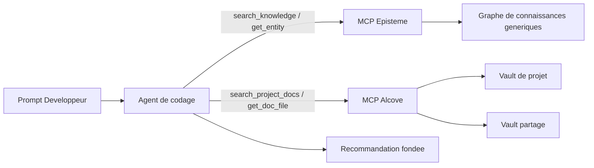
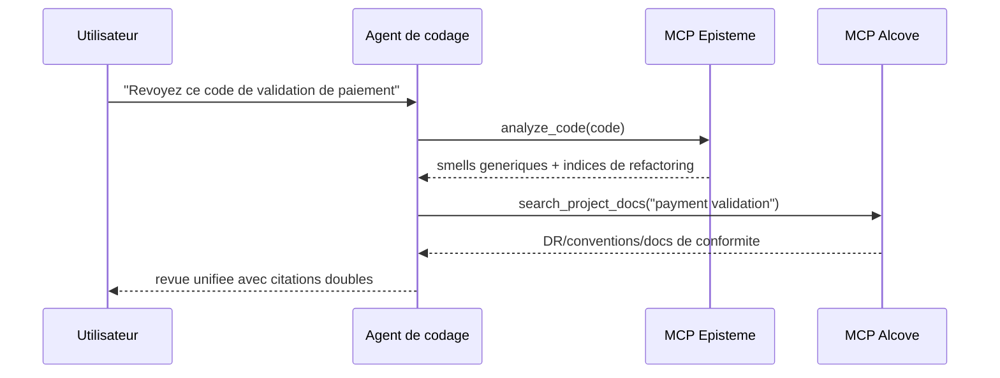
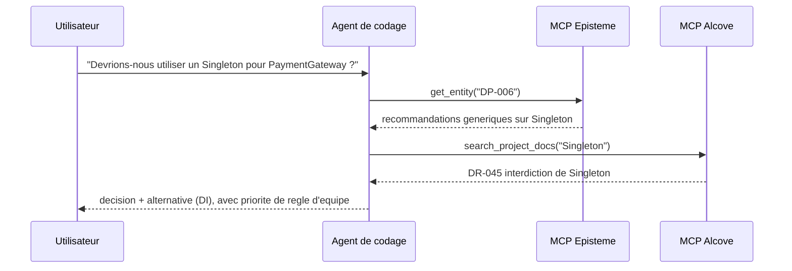
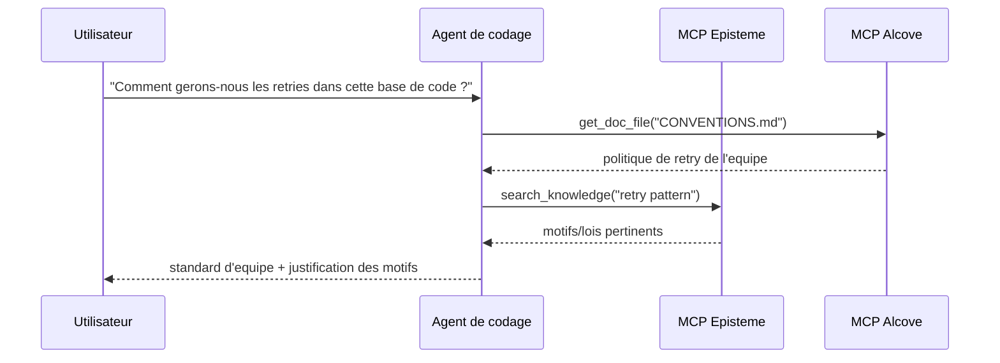

# Guide d'integration Alcove + Episteme

> Guide oriente agent : combiner les connaissances generiques en ingenierie logicielle (Episteme) avec les connaissances specifiques au domaine de l'equipe (Alcove) via MCP et des flux en langage naturel.

## Vue d'ensemble

**Episteme** fournit des connaissances universelles (motifs GoF, refactoring, lois) sous forme de graphe de connaissances en lecture seule.
**Alcove** indexe la documentation vivante de votre equipe (decisions, architecture, standards de codage).

Utilises ensemble via MCP, les agents de codage peuvent :
- Appliquer les meilleures pratiques generiques (Episteme)
- Respecter les contraintes specifiques de l'equipe (Alcove)
- Citer les deux sources dans leurs recommandations

### Priorite de decision

En cas de conflit entre Episteme et Alcove, **Alcove l'emporte** pour les recommandations finales d'implementation.
- **Episteme** : connaissances de reference (motifs/lois/smells generaux)
- **Alcove** : mandat d'equipe (contraintes specifiques au projet/organisation)

---

## Architecture (vue Agent de codage)



L'agent ne doit **pas** precharger tous les documents. Il doit recuperer uniquement les documents/entites requis pour le prompt actif.

---

## Utilisation orientee agent (Langage naturel -> MCP -> Reponse)

Ces motifs sont le defaut recommande pour les agents de codage de type Cursor/Codex/Claude.

1. L'utilisateur pose une question en langage naturel.
2. L'agent recupere le contexte d'equipe depuis Alcove (`search_project_docs`, `get_doc_file`).
3. L'agent recupere les recommandations d'ingenierie generiques depuis Episteme.
4. L'agent resout les conflits (les regles d'equipe prevaulent sur les conseils generiques).
5. L'agent retourne une reponse avec des citations doubles.

---

## Concepts des vaults Alcove

### Vault de projet
**Emplacement** : `<docs_root>/<project>/` (par exemple `~/.alcove/docs/payment-api/`)
**Portee** : Base de code unique
**Contenu** : Decisions d'architecture, pile technologique, glossaire de domaine

**Exemple** (`~/.alcove/docs/payment-api/DECISION.md`) :
```markdown
# DECISION.md
## DR-001: Strategie de validation des paiements (2024-04-15)
- Tous les numeros de carte DOIVENT etre valides avec CardValidator
- Raison : La reglementation FSS §12.3 exige la conformite PCI DSS Niveau 1
- Lie : Episteme DP-023 (Pattern Strategy)

## DR-002: Pas d'appels LLM directs en production
- Les API IA externes sont interdites dans le flux de traitement des paiements
- Approuve : Outils internes uniquement (Claude Code, modeles locaux)
```

### Vault partage
**Emplacement** : `<vaults_root>/<org-name>/` (generalement `~/.alcove/vaults/<org-name>/`)
**Portee** : Ensemble de l'organisation
**Contenu** : Preoccupations transversales, exigences reglementaires, motifs partages

**Exemple** (`~/.alcove/vaults/finance/FSS_COMPLIANCE.md`) :
```markdown
# FSS_COMPLIANCE.md
## Gestion des numeros de carte
- TOUJOURS masquer dans les journaux : `****-****-****-1234`
- JAMAIS stocker le PAN brut dans les journaux d'application
- Reference Episteme : SMELL-42 (Information Exposure)

## Tests
- Utiliser uniquement des cartes synthetiques : `4111-1111-1111-1111`
- Donnees clientes reelles dans les tests = violation FSS
```

---

## Motifs d'utilisation

### Motif 1 : Revue de code avec contexte double (Principal)

**Requete utilisateur** :
```
"Revoyez ce code de validation de paiement"
```

**Flux de l'agent** :
```python
# Etape 1 : Detecter les smells generiques (Episteme)
smells = await episteme.analyze_code(code)
# → SMELL-01: Long Method (15+ lignes)
# → SMELL-08: Missing Error Handling

# Etape 2 : Verifier les regles d'equipe (Alcove)
decisions = await alcove.search_project_docs("payment validation")
# → DR-001: Doit utiliser CardValidator
# → FSS_COMPLIANCE.md: Masquer les numeros de carte

# Etape 3 : Syntheser les retours
return f"""
Problemes trouves :
1. Long Method (Episteme SMELL-01)
   → Extraire la validation de carte dans une methode separee

2. CardValidator manquant (Equipe DR-001)
   → Utiliser le Pattern Strategy (Episteme DP-023)

3. Numero de carte journalise sans masquage (FSS_COMPLIANCE.md)
   → Appliquer l'utilitaire de masquage (voir CONVENTIONS.md)
"""
```



### Motif 2 : Support a la decision d'architecture

**Requete utilisateur** :
```
"Devrions-nous utiliser un Singleton pour PaymentGateway ?"
```

**Flux de l'agent** :
```python
# Episteme : Connaissances generiques sur les motifs
pattern = await episteme.get_entity("DP-006")  # Singleton
# → "Utiliser pour les ressources globalement uniques, mais attention aux problemes de testabilite"

# Alcove : Historique de l'equipe
past_decisions = await alcove.search_project_docs("Singleton")
# → DR-045: "Singleton interdit dans la couche de service (cauchemar de test)"

# Reponse synthetisee :
return f"""
Episteme dit : Singleton fonctionne pour les ressources globales (DP-006)
Historique de l'equipe : DR-045 l'a interdit dans les services (2023-08)

Recommandation : Utiliser l'Injection de Dependances a la place
- Episteme DP-018 (Injection de Dependances) explique comment
- Voir ARCHITECTURE.md §3.2 pour la configuration du conteneur DI de l'equipe
"""
```



### Motif 3 : Onboarding / « Comment fait-on X ici ? »

**Requete utilisateur** :
```
"Comment gerons-nous les retries dans cette base de code ?"
```

**Flux de l'agent** :
```python
# Alcove : Conventions de l'equipe
conventions = await alcove.get_doc_file("CONVENTIONS.md")
# → "Utiliser le backoff exponentiel avec max 3 retries (voir utilitaire RetryPolicy)"

# Episteme : Motifs lies
patterns = await episteme.search_knowledge("retry pattern")
# → DP-023: Pattern Strategy
# → LAW-012: Principe Fail Fast

return f"""
Standard de l'equipe (CONVENTIONS.md) :
- Utiliser l'utilitaire RetryPolicy (src/common/retry.py)
- Max 3 tentatives avec backoff exponentiel

Concepts lies :
- Episteme DP-023: Pattern Strategy (logique de retry enfichable)
- Episteme LAW-012: Fail Fast (ne pas reessayer sur une entree invalide)

Exemple :
  policy = RetryPolicy(max_attempts=3, backoff="exponential")
  result = await policy.execute(api_call)
"""
```



---

## Instructions de configuration (Minimal, pour activation de l'agent)

### 1. Initialiser Alcove pour votre projet

```bash
cd /chemin/vers/votre/projet
alcove setup

# Creer les documents principaux
cat > .alcove/DECISION.md <<EOF
# Registre de decisions d'architecture

## Modele
- **ID** : DR-XXX
- **Date** : AAAA-MM-JJ
- **Contexte** : Quel probleme resolvons-nous ?
- **Decision** : Qu'avons-nous decide ?
- **Consequences** : Compromis
- **Refs Episteme** : Entites liees (optionnel)
EOF

cat > .alcove/ARCHITECTURE.md <<EOF
# Architecture systeme

## Modele de domaine
- Payment : Validation de carte, detection de fraude
- Settlement : Traitement par lots, reconciliation

## Motifs cles (lien vers Episteme)
- Validation de paiement : Strategy (DP-023)
- Passerelle API : Facade (DP-007)
EOF
```

### 2. Creer un Vault partage (Optionnel)

Pour les standards organisationnels :

```bash
mkdir -p ~/.alcove/vaults/mon-org
cat > ~/.alcove/vaults/mon-org/SECURITY.md <<EOF
# Standards de securite

## Gestion des PII
- Ne jamais journaliser les numeros de carte de credit (Episteme SMELL-42)
- Utiliser l'utilitaire DataMasker pour tous les PII

## Bibliotheques approuvees
- cryptography >= 41.0
- bcrypt >= 4.0
EOF

# Enregistrer un repertoire externe comme vault (ex : vault Obsidian)
alcove vault link mon-org ~/.alcove/vaults/mon-org
```

### 3. Configurer les serveurs MCP (Requis pour les agents de codage)

Dans `~/.claude/claude_desktop_config.json` :

```json
{
  "mcpServers": {
    "episteme": {
      "command": "epis",
      "args": ["mcp"]
    },
    "alcove": {
      "command": "alcove",
      "args": []
    }
  }
}
```

Pour Cursor/Codex/autres agents de codage compatibles MCP, enregistrez les deux serveurs MCP dans la configuration MCP de chaque outil et conservez les mêmes noms de serveurs (`episteme`, `alcove`) afin que les prompts et skills restent portables.

### 4. Convention de liaison de documentation

Referencer les entites Episteme dans les documents Alcove :

```markdown
## DR-042: Utiliser le Pattern Repository pour l'acces aux donnees

**Decision** : Tout acces a la base de donnees passe par l'interface Repository

**Justification** :
- Testabilite : Simuler les repositories dans les tests unitaires
- Episteme DP-018 (Injection de Dependances) + DP-007 (Facade)

**Implementation** :
Voir `src/repositories/` pour des exemples
```

---

## Bonnes pratiques

### 0. Preferer la recuperation par l'agent aux etapes manuelles en CLI

Utilisez la CLI principalement pour la configuration initiale et la maintenance. Pendant le travail de codage, preferer les prompts en langage naturel qui declenchent des appels MCP.

**Prefere**
- "Revoyez ce module avec nos conventions d'equipe"
- "Refactorisez ce service en suivant DR-112 et les lois Episteme liees"
- "Verifiez si cette implementation est en conflit avec les decisions Alcove"

**A eviter comme flux par defaut**
- Grep/copy-paste manuel de gros documents dans le prompt
- Re-expliquer les contraintes d'architecture a chaque session

### 1. **Citations explicites**

Toujours lier les decisions Alcove aux entites Episteme lorsque c'est applicable :

```markdown
Mauvais :
"Utiliser le Pattern Strategy pour la validation de paiement"

Bon :
"Utiliser le Pattern Strategy (Episteme DP-023) pour la validation de paiement.
Voir DR-001 pour l'implementation specifique de CardValidator de l'equipe."
```

### 2. **Garder les documents Alcove concis**

Ne pas dupliquer le contenu Episteme. Le referencer :

```markdown
Mauvais (duplication d'Episteme) :
## Pattern Observer
Le Pattern Observer definit une dependance un-vers-plusieurs...
[500 mots expliquant Observer]

Bon (reference a Episteme) :
## Implementation Event Bus (DR-078)
- Motif : Observer (Episteme DP-012)
- Notre touche : Utiliser Redis Pub/Sub au lieu de en memoire
- Compromis : Latence reseau pour l'evolutivite horizontale
```

### 3. **Mettre a jour lors de changements cassants**

Quand les conventions d'equipe prevaluent sur les conseils d'Episteme :

```markdown
## DR-091: Exception a l'interdiction de Singleton (2024-04-20)

**Contexte** : Episteme DP-006 dit que Singleton est OK pour la config

**Notre regle** : JAMAIS utiliser Singleton, meme pour la config

**Raison** : Exigence de hot-reload de config (DR-015)

**Alternative** : Utiliser ConfigProvider avec DI (voir src/config/)
```

### 4. **Organisation des vaults**

```
Documents de projet (<docs_root>/<project>/)
├── DECISION.md        # ADR avec refs Episteme
├── ARCHITECTURE.md    # Conception systeme, utilisation des motifs
├── CONVENTIONS.md     # Standards de codage
├── DOMAIN.md          # Glossaire metier
└── DEPLOYMENT.md      # Runbooks ops

Vault partage (<vaults_root>/<org>/)
├── SECURITY.md        # Regles de securite inter-projets
├── COMPLIANCE.md      # Exigences reglementaires (FSS, RGPD)
└── PATTERNS.md        # Sous-ensemble de motifs approuves par l'organisation
```

---

## Avance : Boucle de retroaction Episteme → Alcove

### Suivre l'utilisation des motifs avec les metriques Prometheus

Instrumenter votre code pour exposer l'utilisation des entites Episteme comme metriques Prometheus :

```python
# Dans votre base de code
from prometheus_client import Counter

pattern_usage = Counter(
    'episteme_pattern_applied_total',
    'Nombre d\'applications de motifs Episteme',
    ['entity_id', 'entity_type', 'context']
)

def apply_retry_logic():
    # Suivre l'utilisation du Pattern Strategy
    pattern_usage.labels(
        entity_id='DP-023',
        entity_type='pattern',
        context='payment_retry'
    ).inc()

    # Votre logique de retry utilisant le Pattern Strategy
    pass
```

### Visualiser dans Grafana

Creer un tableau de bord pour surveiller l'adoption des motifs :

```promql
# Motifs les plus utilises (30 derniers jours)
topk(10,
  increase(episteme_pattern_applied_total[30d])
)

# Utilisation des motifs par contexte
sum by (entity_id, context) (
  rate(episteme_pattern_applied_total[7d])
)

# Alerte sur l'utilisation de motifs deprecies
sum(rate(episteme_pattern_applied_total{entity_id="DP-006"}[5m])) > 0
# Alerte : "Pattern Singleton utilise (interdit selon DR-091)"
```

### Generer des rapports d'utilisation

Revue trimestrielle via requête Prometheus :

```bash
# Requêter Prometheus
curl -G 'http://localhost:9090/api/v1/query' \
  --data-urlencode 'query=topk(10, increase(episteme_pattern_applied_total[90d]))' \
  | jq -r '.data.result[] | "\(.metric.entity_id): \(.value[1])"'

# Sortie :
# DP-023: 847
# DP-018: 612
# DP-007: 301
```

Mettre a jour les documents Alcove en fonction de l'utilisation reelle :

```markdown
## Motifs les plus utilises (2024 T2) - via Grafana

1. **Strategy (DP-023)** : 847 utilisations
   - Principal : payment_retry (412), discount_calc (201)
   - Voir : DECISION.md DR-001 (validation de paiement)

2. **Injection de Dependances (DP-018)** : 612 utilisations
   - Standard dans tous les services
   - Voir : ARCHITECTURE.md §3 pour la configuration du conteneur

3. **Facade (DP-007)** : 301 utilisations
   - Contexte : external_api (289), legacy_adapter (12)
```

---

## Depannage

### Probleme : L'agent cite un document Alcove obsolet

**Cause** : Index Alcove non rafraichi apres mise a jour du document

**Solution** :
```bash
alcove rebuild
```

### Probleme : Conflit entre Episteme et Alcove

**Exemple** : Episteme dit « Singleton OK », le document d'equipe dit « Singleton interdit »

**Modele de resolution** :
1. L'agent presente les deux sources
2. Explique la contradiction
3. S'en remet au document d'equipe (Alcove) pour la reponse finale

```
Agent : "Il y a un conflit ici :
- Episteme DP-006 : Singleton est acceptable pour la config globale
- Votre DR-091 : Singleton interdit (exigence de hot-reload)

Je suivrai votre regle d'equipe (DR-091). Utilisez ConfigProvider a la place."
```

### Probleme : L'agent utilise des explications en CLI uniquement au lieu du flux d'agent de codage

**Symptome** : Les reponses se concentrent sur les commandes shell plutot que sur la façon dont l'agent de codage devrait recuperer et raisonner.

**Solution** :
1. Demander avec intention + cible de contexte :
   - "Utilisez les documents Alcove + les entites Episteme pour revoir ce code"
2. Demander des citations doubles explicites :
   - "Citez le document DR/ARCH et l'ID Episteme dans votre reponse"
3. Demander la politique de resolution des conflits :
   - "En cas de conflit entre sources, prioriser les documents d'equipe"

---

## Exemple : Flux de travail complet

**Scenario** : Un developpeur demande « Comment devrais-je structurer le nouveau gestionnaire de webhook de paiement ? »

### Processus interne de l'agent

```python
# 1. Rechercher dans Episteme les motifs generiques
patterns = await episteme.search_knowledge("webhook handler")
# → DP-007: Facade (simplifier les sous-systemes complexes)
# → DP-023: Strategy (validation enfichable)
# → LAW-045: Single Responsibility

# 2. Verifier l'architecture de l'equipe
arch = await alcove.get_doc_file("ARCHITECTURE.md")
# → "Tous les webhooks passent par WebhookRouter (src/webhooks/router.py)"

# 3. Verifier les decisions de l'equipe
decisions = await alcove.search_project_docs("webhook")
# → DR-112: "Les gestionnaires de webhook doivent etre idempotents (retries de paiement)"

# 4. Verifier les conventions
conv = await alcove.get_doc_file("CONVENTIONS.md")
# → "Utiliser le decorateur @webhook_handler pour la journalisation/retry automatique"
```

### Reponse de l'agent

```markdown
## Structure du gestionnaire de webhook de paiement

### Standards de l'equipe (Alcove)
1. Enregistrer dans WebhookRouter (ARCHITECTURE.md §4.2)
2. Le rendre idempotent (DR-112) - les passerelles de paiement reessayent
3. Utiliser le decorateur @webhook_handler (CONVENTIONS.md)

### Motifs recommandes (Episteme)
- **Facade (DP-007)** : Masquer la complexite du fournisseur de paiement
- **Strategy (DP-023)** : Validation enfichable par fournisseur
- **SRP (LAW-045)** : Un gestionnaire = un type de webhook

### Modele de code
\`\`\`python
from src.webhooks.router import webhook_handler
from src.payments import PaymentFacade  # DP-007

@webhook_handler(provider="stripe", idempotent=True)  # DR-112
async def handle_payment_success(payload: dict):
    # Responsabilite unique : traiter le paiement (LAW-045)
    facade = PaymentFacade()
    return await facade.confirm_payment(payload["payment_id"])
\`\`\`

Voir :
- ARCHITECTURE.md §4.2 pour la configuration de WebhookRouter
- src/webhooks/stripe_handler.py pour l'implementation de reference
- Episteme DP-007 pour les details du Pattern Facade
```

---

## Resume

| Aspect | Episteme | Alcove |
|--------|----------|--------|
| **Portee** | Connaissances universelles en ingenierie logicielle | Regles specifiques a l'equipe/organisation |
| **Contenu** | 22 motifs, 66 refactoring, 56 lois, 14 smells | ADR, architecture, conventions, domaine |
| **Mutabilite** | Lecture seule (mises a jour periodiques) | Documents vivants (mises a jour quotidiennes) |
| **Granularite** | Principes abstraits | Implementations concretes |
| **Autorite** | Reference/suggestion | Mandat d'equipe |

**Priorite de decision** : Alcove > Episteme (les regles d'equipe prevaulent sur les conseils generiques)

**Style de citation** : Toujours lier les deux sources lorsque c'est applicable
- `"Utiliser Strategy (Episteme DP-023) selon DR-001 de l'equipe"`
- Et non : `"Utiliser Strategy"` (contexte manquant)

**Maintenance** :
- Episteme : Aucune action requise (la source gère les mises a jour)
- Alcove : Garder les documents a jour avec les changements de la base de code
