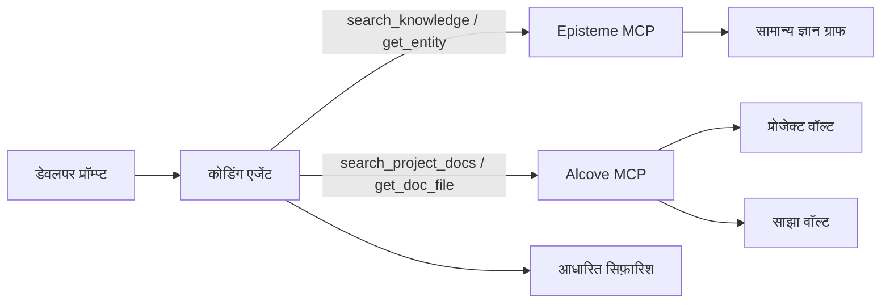
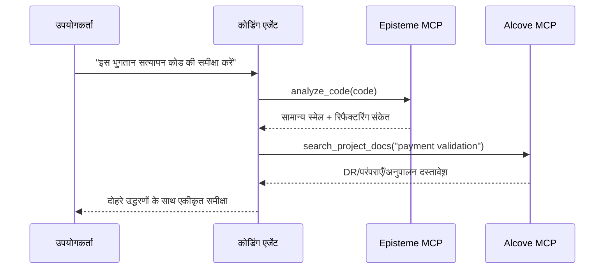

# Alcove + Episteme एकीकरण मार्गदर्शिका

> एजेंट-प्रथम मार्गदर्शिका: MCP और प्राकृतिक-भाषा वर्कफ़्लो के माध्यम से सामान्य सॉफ़्टवेयर इंजीनियरिंग ज्ञान (Episteme) को टीम-विशिष्ट डोमेन ज्ञान (Alcove) के साथ संयोजित करें।

## अवलोकन

**Episteme** सामान्य ज्ञान (GoF पैटर्न, रिफैक्टरिंग, नियम) को केवल-पढ़ने योग्य ज्ञान ग्राफ के रूप में प्रदान करता है।
**Alcove** आपकी टीम के जीवंत दस्तावेशीकरण (निर्णय, आर्किटेक्चर, कोडिंग मानक) को इंडेक्स करता है।

जब दोनों को MCP के माध्यम से एक साथ उपयोग किया जाता है, तो कोडिंग एजेंट कर सकते हैं:
- सामान्य सर्वोत्तम प्रथाएँ लागू करें (Episteme)
- टीम-विशिष्ट बाधाओं का पालन करें (Alcove)
- सिफ़ारिशों में दोनों स्रोतों का हवाला दें

### निर्णय प्राथमिकता

जब Episteme और Alcove टकराते हैं, तो **Alcove को अंतिम कार्यान्वयन मार्गदर्शन में प्राथमिकता** मिलती है।
- **Episteme**: संदर्भ ज्ञान (सामान्य पैटर्न/नियम/स्मेल)
- **Alcove**: टीम अधिदेश (प्रोजेक्ट/संगठन-विशिष्ट बाधाएँ)

---

## आर्किटेक्चर (कोडिंग एजेंट दृश्य)



एजेंट को सभी दस्तावेश़ पहले से लोड नहीं करने चाहिए। इसे केवल सक्रिय प्रॉम्प्ट के लिए आवश्यक दस्तावेश़/एंटिटीज़ पुनर्प्राप्त करने चाहिए।

---

## एजेंट-प्रथम उपयोग (प्राकृतिक भाषा → MCP → उत्तर)

ये पैटर्न Cursor/Codex/Claude-शैली के कोडिंग एजेंटों के लिए अनुशंसित डिफ़ॉल्ट हैं।

1. उपयोगकर्ता प्राकृतिक भाषा में पूछता है।
2. एजेंट Alcove से टीम संदर्भ प्राप्त करता है (`search_project_docs`, `get_doc_file`)।
3. एजेंट Episteme से सामान्य इंजीनियरिंग मार्गदर्शन प्राप्त करता है।
4. एजेंट टकराव का समाधान करता है (टीम नियम सामान्य सलाह को ओवरराइड करते हैं)।
5. एजेंट दोहरे उद्धरणों के साथ प्रतिक्रिया लौटाता है।

---

## Alcove वॉल्ट अवधारणाएँ

### प्रोजेक्ट वॉल्ट
**स्थान**: `<docs_root>/<project>/` (उदा. `~/.alcove/docs/payment-api/`)
**दायरा**: एकल कोडबेस
**सामग्री**: आर्किटेक्चर निर्णय, टेक स्टैक, डोमेन शब्दावली

**उदाहरण** (`~/.alcove/docs/payment-api/DECISION.md`):
```markdown
# DECISION.md
## DR-001: Payment Validation Strategy (2024-04-15)
- All card numbers MUST be validated using CardValidator
- Reason: FSS regulation §12.3 requires PCI DSS Level 1 compliance
- Related: Episteme DP-023 (Strategy Pattern)

## DR-002: No Direct LLM Calls in Production
- External AI APIs prohibited in payment processing flow
- Approved: Internal tools only (Claude Code, local models)
```

### साझा वॉल्ट
**स्थान**: `<vaults_root>/<org-name>/` (सामान्यतः `~/.alcove/vaults/<org-name>/`)
**दायरा**: संगठन-व्यापी
**सामग्री**: क्रॉस-कटिंग चिंताएँ, नियामक आवश्यकताएँ, साझा पैटर्न

**उदाहरण** (`~/.alcove/vaults/osn-finance/FSS_COMPLIANCE.md`):
```markdown
# FSS_COMPLIANCE.md
## Card Number Handling
- ALWAYS mask in logs: `****-****-****-1234`
- NEVER store raw PAN in application logs
- Episteme reference: SMELL-42 (Information Exposure)

## Testing
- Use synthetic cards only: `4111-1111-1111-1111`
- Real customer data in tests = FSS violation
```

---

## उपयोग पैटर्न

### पैटर्न 1: दोहरे संदर्भ के साथ कोड समीक्षा (प्राथमिक)

**उपयोगकर्ता अनुरोध**:
```
"इस भुगतान सत्यापन कोड की समीक्षा करें"
```

**एजेंट वर्कफ़्लो**:
```python
# चरण 1: सामान्य स्मेल पहचानें (Episteme)
smells = await episteme.analyze_code(code)
# → SMELL-01: Long Method (15+ पंक्तियाँ)
# → SMELL-08: Missing Error Handling

# चरण 2: टीम नियम जाँचें (Alcove)
decisions = await alcove.search_project_docs("payment validation")
# → DR-001: CardValidator अनिवार्य
# → FSS_COMPLIANCE.md: कार्ड नंबर मास्क करें

# चरण 3: प्रतिक्रिया संश्लेषित करें
return f"""
पाए गए मुद्दे:
1. Long Method (Episteme SMELL-01)
   → कार्ड सत्यापन को अलग विधि में निकालें

2. CardValidator अनुपस्थित (टीम DR-001)
   → Strategy Pattern का उपयोग करें (Episteme DP-023)

3. कार्ड नंबर मास्किंग के बिना लॉग किया गया (FSS_COMPLIANCE.md)
   → मास्किंग उपयोगिता लागू करें (CONVENTIONS.md देखें)
"""
```



### पैटर्न 2: आर्किटेक्चर निर्णय समर्थन

**उपयोगकर्ता अनुरोध**:
```
"क्या मुझे PaymentGateway के लिए Singleton उपयोग करना चाहिए?"
```

**एजेंट वर्कफ़्लो**:
```python
# Episteme: सामान्य पैटर्न ज्ञान
pattern = await episteme.get_entity("DP-006")  # Singleton
# → "वैश्विक रूप से अद्वितीय संसाधनों के लिए उपयोग करें, लेकिन टेस्टेबिलिटी समस्याओं पर ध्यान दें"

# Alcove: टीम इतिहास
past_decisions = await alcove.search_project_docs("Singleton")
# → DR-045: "सेवा परत में Singleton प्रतिबंधित (टेस्टिंग दुःस्वप्न)"

# संश्लेषित उत्तर:
return f"""
Episteme कहता है: Singleton वैश्विक संसाधनों के लिए काम करता है (DP-006)
टीम इतिहास: DR-045 ने सेवाओं में प्रतिबंधित किया (2023-08)

सिफ़ारिश: Dependency Injection का उपयोग करें
- Episteme DP-018 (Dependency Injection) बताता है कैसे
- टीम के DI कंटेनर सेटअप के लिए ARCHITECTURE.md §3.2 देखें
"""
```

### पैटर्न 3: ऑनबोर्डिंग / "हम यहाँ X कैसे करते हैं?"

**उपयोगकर्ता अनुरोध**:
```
"हम इस कोडबेस में retries कैसे हैंडल करते हैं?"
```

**एजेंट वर्कफ़्लो**:
```python
# Alcove: टीम परंपराएँ
conventions = await alcove.get_doc_file("CONVENTIONS.md")
# → "एक्सपोनेंशियल बैकऑफ़ के साथ अधिकतम 3 retries उपयोग करें (RetryPolicy देखें)"

# Episteme: संबंधित पैटर्न
patterns = await episteme.search_knowledge("retry pattern")
# → DP-023: Strategy Pattern
# → LAW-012: Fail Fast सिद्धांत

return f"""
टीम मानक (CONVENTIONS.md):
- RetryPolicy उपयोगिता का उपयोग करें (src/common/retry.py)
- अधिकतम 3 प्रयास एक्सपोनेंशियल बैकऑफ़ के साथ

संबंधित अवधारणाएँ:
- Episteme DP-023: Strategy Pattern (प्लग करने योग्य retry लॉजिक)
- Episteme LAW-012: Fail Fast (अमान्य इनपुट पर retry न करें)

उदाहरण:
  policy = RetryPolicy(max_attempts=3, backoff="exponential")
  result = await policy.execute(api_call)
"""
```

---

## सेटअप निर्देश (न्यूनतम, एजेंट सक्षमीकरण के लिए)

### 1. अपने प्रोजेक्ट के लिए Alcove प्रारंभ करें

```bash
cd /path/to/your/project
alcove setup

# कोर दस्तावेश़ बनाएँ
cat > .alcove/DECISION.md <<EOF
# Architectural Decision Records

## Template
- **ID**: DR-XXX
- **Date**: YYYY-MM-DD
- **Context**: What problem are we solving?
- **Decision**: What did we decide?
- **Consequences**: Trade-offs
- **Episteme Refs**: Related entities (optional)
EOF

cat > .alcove/ARCHITECTURE.md <<EOF
# System Architecture

## Domain Model
- Payment: Card validation, fraud detection
- Settlement: Batch processing, reconciliation

## Key Patterns (link to Episteme)
- Payment validation: Strategy (DP-023)
- API gateway: Facade (DP-007)
EOF
```

### 2. साझा वॉल्ट बनाएँ (वैकल्पिक)

संगठन-व्यापी मानकों के लिए:

```bash
mkdir -p ~/.alcove/vaults/my-org
cat > ~/.alcove/vaults/my-org/SECURITY.md <<EOF
# Security Standards

## PII Handling
- Never log credit card numbers (Episteme SMELL-42)
- Use DataMasker utility for all PII

## Approved Libraries
- cryptography >= 41.0
- bcrypt >= 4.0
EOF

# बाहरी निर्देशिका को वॉल्ट के रूप में पंजीकृत करें (उदा. Obsidian वॉल्ट)
alcove vault link my-org ~/.alcove/vaults/my-org
```

### 3. MCP सर्वर कॉन्फ़िगर करें (कोडिंग एजेंटों के लिए आवश्यक)

`~/.claude/claude_desktop_config.json` में:

```json
{
  "mcpServers": {
    "episteme": {
      "command": "epis",
      "args": ["mcp"]
    },
    "alcove": {
      "command": "alcove",
      "args": []
    }
  }
}
```

Cursor/Codex/अन्य MCP-सक्षम कोडिंग एजेंटों के लिए, प्रत्येक टूल की MCP कॉन्फ़िग में दोनों MCP सर्वर पंजीकृत करें और समान सर्वर नाम (`episteme`, `alcove`) बनाए रखें ताकि प्रॉम्प्ट्स और स्किल्स पोर्टेबल रहें।

### 4. दस्तावेश़ लिंकिंग परंपरा

Alcove दस्तावेश़ों में Episteme एंटिटीज़ का संदर्भ दें:

```markdown
## DR-042: Use Repository Pattern for Data Access

**Decision**: All database access goes through Repository interface

**Rationale**:
- Testability: Mock repositories in unit tests
- Episteme DP-018 (Dependency Injection) + DP-007 (Facade)

**Implementation**:
See `src/repositories/` for examples
```

---

## सर्वोत्तम प्रथाएँ

### 0. मैन्युअल CLI चरणों की तुलना में एजेंट पुनर्प्राप्ति को प्राथमिकता दें

CLI मुख्य रूप से प्रारंभिक सेटअप/रखरखाव के लिए उपयोग करें। कोडिंग कार्य के दौरान, प्राकृतिक-भाषा प्रॉम्प्टिंग को प्राथमिकता दें जो MCP कॉल को ट्रिगर करती है।

**पसंदीदा**
- "हमारी टीम परंपराओं के साथ इस मॉड्यूल की समीक्षा करें"
- "DR-112 और संबंधित Episteme नियमों के अनुसार इस सेवा को रिफैक्टर करें"
- "जाँचें कि क्या यह कार्यान्वयन Alcove निर्णयों से टकराता है"

**डिफ़ॉल्ट वर्कफ़्लो के रूप में टालें**
- बड़े दस्तावेश़ों का मैन्युअल grep/कॉपी-पेस्ट प्रॉम्प्ट में
- प्रत्येक सत्र में आर्किटेक्चर बाधाओं को पुनः समझाना

### 1. **स्पष्ट उद्धरण**

लागू होने पर हमेशा Alcove निर्णयों को Episteme एंटिटीज़ से लिंक करें:

```markdown
❌ खराब:
"भुगतान सत्यापन के लिए Strategy Pattern उपयोग करें"

✅ अच्छा:
"भुगतान सत्यापन के लिए Strategy Pattern (Episteme DP-023) उपयोग करें।
टीम-विशिष्ट CardValidator कार्यान्वयन के लिए DR-001 देखें।"
```

### 2. **Alcove दस्तावेश़ हल्के रखें**

Episteme सामग्री की नकल न करें। इसका संदर्भ लें:

```markdown
❌ खराब (Episteme की नकल):
## Observer Pattern
Observer Pattern एक-से-अनेक निर्भरता परिभाषित करता है...
[500 शब्द Observer की व्याख्या]

✅ अच्छा (Episteme का संदर्भ):
## Event Bus कार्यान्वयन (DR-078)
- पैटर्न: Observer (Episteme DP-012)
- हमारा बदलाव: इन-मेमोरी के बजाय Redis Pub/Sub उपयोग करें
- ट्रेड-ऑफ़: क्षैतिज स्केलेबिलिटी के लिए नेटवर्क विलंबता
```

### 3. **ब्रेकिंग परिवर्तनों पर अपडेट करें**

जब टीम परंपराएँ Episteme सलाह को ओवरराइड करती हैं:

```markdown
## DR-091: Singleton प्रतिबंध अपवाद (2024-04-20)

**संदर्भ**: Episteme DP-006 कहता है Singleton कॉन्फ़िग के लिए ठीक है

**हमारा नियम**: कभी भी Singleton उपयोग न करें, कॉन्फ़िग के लिए भी नहीं

**कारण**: कॉन्फ़िग हॉट-रीलोड आवश्यकता (DR-015)

**विकल्प**: DI के साथ ConfigProvider उपयोग करें (src/config/ देखें)
```

### 4. **वॉल्ट संगठन**

```
प्रोजेक्ट दस्तावेश़ (<docs_root>/<project>/)
├── DECISION.md        # Episteme संदर्भों के साथ ADR
├── ARCHITECTURE.md    # सिस्टम डिज़ाइन, पैटर्न उपयोग
├── CONVENTIONS.md     # कोडिंग मानक
├── DOMAIN.md          # व्यापार शब्दावली
└── DEPLOYMENT.md      # Ops रनबुक

साझा वॉल्ट (<vaults_root>/<org>/)
├── SECURITY.md        # क्रॉस-प्रोजेक्ट सुरक्षा नियम
├── COMPLIANCE.md      # नियामक आवश्यकताएँ (FSS, GDPR)
└── PATTERNS.md        # संगठन-अनुमोदित पैटर्न सबसेट
```

---

## उन्नत: Episteme → Alcove फ़ीडबैक लूप

### Prometheus मेट्रिक्स के साथ पैटर्न उपयोग ट्रैक करें

अपने कोड को Episteme एंटिटी उपयोग को Prometheus मेट्रिक्स के रूप में उजागर करने के लिए इंस्ट्रुमेंट करें:

```python
# अपने कोडबेस में
from prometheus_client import Counter

pattern_usage = Counter(
    'episteme_pattern_applied_total',
    'Episteme pattern application count',
    ['entity_id', 'entity_type', 'context']
)

def apply_retry_logic():
    # Strategy Pattern उपयोग ट्रैक करें
    pattern_usage.labels(
        entity_id='DP-023',
        entity_type='pattern',
        context='payment_retry'
    ).inc()

    # Strategy Pattern का उपयोग करके आपकी retry लॉजिक
    pass
```

### Grafana में विज़ुअलाइज़ करें

पैटर्न अडॉप्शन मॉनिटर करने के लिए डैशबोर्ड बनाएँ:

```promql
# सबसे अधिक उपयोग किए गए पैटर्न (पिछले 30 दिन)
topk(10,
  increase(episteme_pattern_applied_total[30d])
)

# संदर्भ के अनुसार पैटर्न उपयोग
sum by (entity_id, context) (
  rate(episteme_pattern_applied_total[7d])
)

# अप्रचलित पैटर्न उपयोग पर अलर्ट
sum(rate(episteme_pattern_applied_total{entity_id="DP-006"}[5m])) > 0
# अलर्ट: "Singleton पैटर्न उपयोग किया गया (DR-091 द्वारा प्रतिबंधित)"
```

### उपयोग रिपोर्ट जनरेट करें

Prometheus क्वेरी के माध्यम से त्रैमासिक समीक्षा:

```bash
# Prometheus क्वेरी करें
curl -G 'http://localhost:9090/api/v1/query' \
  --data-urlencode 'query=topk(10, increase(episteme_pattern_applied_total[90d]))' \
  | jq -r '.data.result[] | "\(.metric.entity_id): \(.value[1])"'

# आउटपुट:
# DP-023: 847
# DP-018: 612
# DP-007: 301
```

वास्तविक उपयोग के आधार पर Alcove दस्तावेश़ अपडेट करें:

```markdown
## सबसे अधिक उपयोग किए गए पैटर्न (2024 Q2) - Grafana द्वारा

1. **Strategy (DP-023)**: 847 उपयोग
   - प्राथमिक: payment_retry (412), discount_calc (201)
   - देखें: DECISION.md DR-001 (भुगतान सत्यापन)

2. **Dependency Injection (DP-018)**: 612 उपयोग
   - सभी सेवाओं में मानक
   - देखें: ARCHITECTURE.md §3 कंटेनर सेटअप के लिए

3. **Facade (DP-007)**: 301 उपयोग
   - संदर्भ: external_api (289), legacy_adapter (12)
```

---

## समस्या निवारण

### समस्या: एजेंट पुराने Alcove दस्तावेश़ का हवाला देता है

**कारण**: दस्तावेश़ अपडेट के बाद Alcove इंडेक्स रिफ़्रेश नहीं हुआ

**समाधान**:
```bash
alcove rebuild
```

### समस्या: Episteme और Alcove टकराते हैं

**उदाहरण**: Episteme कहता है "Singleton ठीक है", टीम दस्तावेश़ कहता है "Singleton प्रतिबंधित"

**समाधान पैटर्न**:
1. एजेंट दोनों स्रोत प्रस्तुत करता है
2. विरोधाभास समझाता है
3. अंतिम उत्तर के लिए टीम दस्तावेश़ (Alcove) को संदर्भित करता है

```
एजेंट: "यहाँ एक टकराव है:
- Episteme DP-006: Singleton वैश्विक कॉन्फ़िग के लिए स्वीकार्य है
- आपका DR-091: Singleton प्रतिबंधित (हॉट-रीलोड आवश्यकता)

मैं आपके टीम नियम (DR-091) का पालन करूँगा। इसके बजाय ConfigProvider उपयोग करें।"
```

### समस्या: एजेंट कोडिंग-एजेंट प्रवाह के बजाय केवल-CLI स्पष्टीकरण उपयोग करता है

**लक्षण**: प्रतिक्रियाएँ shell कमांड पर केंद्रित होती हैं बजाय इसके कि कोडिंग एजेंट को कैसे प्राप्त करना और तर्क करना चाहिए।

**समाधान**:
1. इरादा + संदर्भ लक्ष्य के साथ पूछें:
   - "Alcove दस्तावेश़ + Episteme एंटिटीज़ का उपयोग करके इस कोड की समीक्षा करें"
2. स्पष्ट दोहरे उद्धरणों का अनुरोध करें:
   - "अपने उत्तर में DR/ARCH दस्तावेश़ और Episteme ID का हवाला दें"
3. टकराव समाधान नीति का अनुरोध करें:
   - "यदि स्रोत टकराते हैं तो टीम दस्तावेश़ों को प्राथमिकता दें"

---

## उदाहरण: संपूर्ण वर्कफ़्लो

**परिदृश्य**: डेवलपर पूछता है "मुझे नया भुगतान webhook हैंडलर कैसे संरचित करना चाहिए?"

### एजेंट की आंतरिक प्रक्रिया

```python
# 1. सामान्य पैटर्न के लिए Episteme खोजें
patterns = await episteme.search_knowledge("webhook handler")
# → DP-007: Facade (जटिल सबसिस्टम सरल बनाएँ)
# → DP-023: Strategy (प्लग करने योग्य सत्यापन)
# → LAW-045: Single Responsibility

# 2. टीम आर्किटेक्चर जाँचें
arch = await alcove.get_doc_file("ARCHITECTURE.md")
# → "सभी webhooks WebhookRouter से गुज़रते हैं (src/webhooks/router.py)"

# 3. टीम निर्णय जाँचें
decisions = await alcove.search_project_docs("webhook")
# → DR-112: "Webhook हैंडलर idempotent होने चाहिए (भुगतान retries)"

# 4. परंपराएँ जाँचें
conv = await alcove.get_doc_file("CONVENTIONS.md")
# → "स्वचालित लॉगिंग/रीट्री के लिए @webhook_handler डेकोरेटर उपयोग करें"
```

### एजेंट की प्रतिक्रिया

```markdown
## भुगतान Webhook हैंडलर संरचना

### टीम मानक (Alcove)
1. WebhookRouter में पंजीकृत करें (ARCHITECTURE.md §4.2)
2. इसे idempotent बनाएँ (DR-112) - भुगतान गेटवे retry करते हैं
3. @webhook_handler डेकोरेटर उपयोग करें (CONVENTIONS.md)

### अनुशंसित पैटर्न (Episteme)
- **Facade (DP-007)**: भुगतान प्रदाता जटिलता छिपाएँ
- **Strategy (DP-023)**: प्रति-प्रदाता सत्यापन प्लग करने योग्य
- **SRP (LAW-045)**: एक हैंडलर = एक webhook प्रकार

### कोड टेम्पलेट
\`\`\`python
from src.webhooks.router import webhook_handler
from src.payments import PaymentFacade  # DP-007

@webhook_handler(provider="stripe", idempotent=True)  # DR-112
async def handle_payment_success(payload: dict):
    # Single Responsibility: भुगतान प्रोसेस करें (LAW-045)
    facade = PaymentFacade()
    return await facade.confirm_payment(payload["payment_id"])
\`\`\`

देखें:
- WebhookRouter सेटअप के लिए ARCHITECTURE.md §4.2
- संदर्भ कार्यान्वयन के लिए src/webhooks/stripe_handler.py
- Facade Pattern विवरण के लिए Episteme DP-007
```

---

## सारांश

| पहलू | Episteme | Alcove |
|--------|----------|--------|
| **दायरा** | सार्वभौमिक सॉफ़्टवेयर इंजीनियरिंग ज्ञान | टीम/संगठन-विशिष्ट नियम |
| **सामग्री** | 22 पैटर्न, 66 रिफैक्टरिंग, 56 नियम, 14 स्मेल | ADR, आर्किटेक्चर, परंपराएँ, डोमेन |
| **परिवर्तनीयता** | केवल-पढ़ने (आवधिक अपडेट) | जीवंत दस्तावेश़ (दैनिक अपडेट) |
| **ग्रैन्युलैरिटी** | सार सिद्धांत | ठोस कार्यान्वयन |
| **प्राधिकरण** | संदर्भ/सुझाव | टीम अधिदेश |

**निर्णय प्राथमिकता**: Alcove > Episteme (टीम नियम सामान्य सलाह को ओवरराइड करते हैं)

**उद्धरण शैली**: लागू होने पर हमेशा दोनों स्रोतों को लिंक करें
- `"Strategy उपयोग करें (Episteme DP-023) टीम DR-001 के अनुसार"`
- न कि: `"Strategy उपयोग करें"` (संदर्भ अनुपस्थित)

**रखरखाव**:
- Episteme: कोई कार्रवाई आवश्यक नहीं (अपस्ट्रीम अपडेट संभालता है)
- Alcove: कोडबेस परिवर्तनों के साथ दस्तावेश़ अद्यतित रखें
