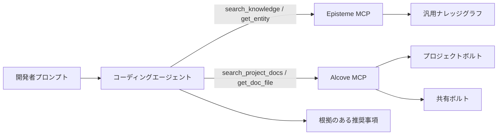
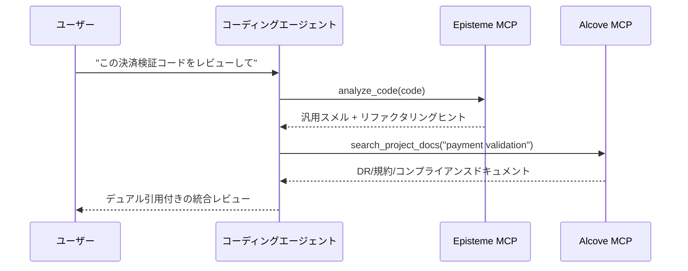
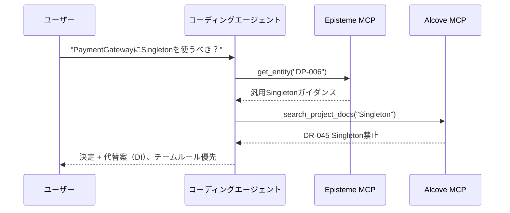
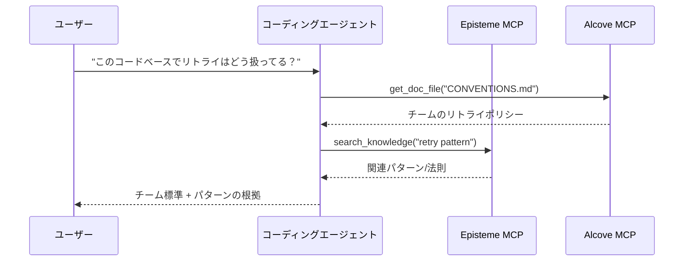

# Alcove + Episteme 統合ガイド

> エージェントファーストガイド: MCPと自然言語ワークフローを通じて、一般的なソフトウェアエンジニアリングのナレッジ（Episteme）とチーム固有のドメインナレッジ（Alcove）を組み合わせます。

## 概要

**Episteme**は、読み取り専用のナレッジグラフとして普遍的なナレッジ（GoFパターン、リファクタリング、法則）を提供します。
**Alcove**はチームの生きたドキュメント（決定、アーキテクチャ、コーディング標準）をインデックスします。

MCP経由で併用することで、コーディングエージェントは以下が可能になります:
- 一般的なベストプラクティスを適用（Episteme）
- チーム固有の制約を尊重（Alcove）
- 推奨事項で両方のソースを引用

### 決定の優先順位

EpistemeとAlcoveが矛盾する場合、**最終的な実装ガイダンスではAlcoveが優先**されます。
- **Episteme**: 参照ナレッジ（一般的なパターン/法則/スメル）
- **Alcove**: チームの決定（プロジェクト/組織固有の制約）

---

## アーキテクチャ（コーディングエージェント視点）



エージェントはすべてのドキュメントを事前読み込みすべきではありません。アクティブなプロンプトに必要なドキュメント/エンティティのみを取得すべきです。

---

## エージェントファーストの使用方法（自然言語 → MCP → 回答）

これらのパターンは、Cursor/Codex/Claudeスタイルのコーディングエージェント向けの推奨デフォルトです。

1. ユーザーが自然言語で質問する。
2. エージェントがAlcoveからチームコンテキストを取得（`search_project_docs`、`get_doc_file`）。
3. エージェントがEpistemeから汎用エンジニアリングガイダンスを取得。
4. エージェントが矛盾を解決（チームルールが一般的アドバイスをオーバーライド）。
5. エージェントがデュアル引用付きの回答を返す。

---

## Alcoveボルトの概念

### プロジェクトボルト
**場所**: `<docs_root>/<project>/`（例: `~/.alcove/docs/payment-api/`）
**スコープ**: 単一のコードベース
**内容**: アーキテクチャの決定、技術スタック、ドメイン用語集

**例**（`~/.alcove/docs/payment-api/DECISION.md`）:
```markdown
# DECISION.md
## DR-001: 決済検証戦略 (2024-04-15)
- すべてのカード番号はCardValidatorを使用して検証しなければならない
- 理由: FSS規則 §12.3がPCI DSSレベル1準拠を要求
- 関連: Episteme DP-023 (Strategyパターン)

## DR-002: 本番環境での直接的なLLM呼び出し禁止
- 決済処理フローでの外部AI APIは禁止
- 承認済み: 内部ツールのみ（Claude Code、ローカルモデル）
```

### 共有ボルト
**場所**: `<vaults_root>/<org-name>/`（通常 `~/.alcove/vaults/<org-name>/`）
**スコープ**: 組織全体
**内容**: 横断的関心事、規制要件、共有パターン

**例**（`~/.alcove/vaults/finance/FSS_COMPLIANCE.md`）:
```markdown
# FSS_COMPLIANCE.md
## カード番号の取り扱い
- ログでは必ずマスク: `****-****-****-1234`
- アプリケーションログに生のPANを保存しない
- Episteme参照: SMELL-42 (情報漏洩)

## テスト
- 合成カードのみ使用: `4111-1111-1111-1111`
- テストでの実際の顧客データ = FSS違反
```

---

## 使用パターン

### パターン1: デュアルコンテキストでのコードレビュー（主要）

**ユーザーリクエスト**:
```
"この決済検証コードをレビューして"
```

**エージェントワークフロー**:
```python
# ステップ1: 汎用スメルを検出（Episteme）
smells = await episteme.analyze_code(code)
# → SMELL-01: Long Method (15+行)
# → SMELL-08: エラーハンドリングの欠落

# ステップ2: チームルールを確認（Alcove）
decisions = await alcove.search_project_docs("payment validation")
# → DR-001: CardValidatorを使用必須
# → FSS_COMPLIANCE.md: カード番号をマスク

# ステップ3: フィードバックを統合
return f"""
発見された問題:
1. Long Method (Episteme SMELL-01)
   → カード検証を別メソッドに抽出

2. CardValidatorの欠落 (チーム DR-001)
   → Strategyパターン（Episteme DP-023）を使用

3. カード番号がマスクされずにログ出力されている (FSS_COMPLIANCE.md)
   → マスキングユーティリティを適用（CONVENTIONS.mdを参照）
"""
```



### パターン2: アーキテクチャ決定のサポート

**ユーザーリクエスト**:
```
"PaymentGatewayにSingletonを使うべき？"
```

**エージェントワークフロー**:
```python
# Episteme: 汎用パターンのナレッジ
pattern = await episteme.get_entity("DP-006")  # Singleton
# → "グローバルに一意なリソースに使用するが、テスト容易性の問題に注意"

# Alcove: チームの履歴
past_decisions = await alcove.search_project_docs("Singleton")
# → DR-045: "サービス層でSingletonを禁止（テストの悪夢）"

# 統合された回答:
return f"""
Episteme: Singletonはグローバルリソースに有効 (DP-006)
チーム履歴: DR-045でサービス層での使用を禁止 (2023-08)

推奨: 代わりに依存性の注入を使用
- Episteme DP-018 (依存性の注入) に方法が説明されている
- チームのDIコンテナ設定はARCHITECTURE.md §3.2を参照
"""
```



### パターン3: オンボーディング / 「ここではどうやるの？」

**ユーザーリクエスト**:
```
"このコードベースでリトライはどう扱ってる？"
```

**エージェントワークフロー**:
```python
# Alcove: チーム規約
conventions = await alcove.get_doc_file("CONVENTIONS.md")
# → "最大3リトライで指数バックオフを使用（RetryPolicyユーティリティを参照）"

# Episteme: 関連パターン
patterns = await episteme.search_knowledge("retry pattern")
# → DP-023: Strategyパターン
# → LAW-012: フェイルファスト原則

return f"""
チーム標準 (CONVENTIONS.md):
- RetryPolicyユーティリティを使用 (src/common/retry.py)
- 指数バックオフで最大3回試行

関連概念:
- Episteme DP-023: Strategyパターン（プラグイン可能なリトライロジック）
- Episteme LAW-012: フェイルファスト（無効な入力ではリトライしない）

例:
  policy = RetryPolicy(max_attempts=3, backoff="exponential")
  result = await policy.execute(api_call)
"""
```



---

## セットアップ手順（最小限、エージェント有効化用）

### 1. プロジェクトにAlcoveを初期化

```bash
cd /path/to/your/project
alcove setup

# コアドキュメントを作成
cat > .alcove/DECISION.md <<EOF
# アーキテクチャ決定記録

## テンプレート
- **ID**: DR-XXX
- **日付**: YYYY-MM-DD
- **コンテキスト**: どのような問題を解決するのか？
- **決定**: 何を決定したのか？
- **結果**: トレードオフ
- **Episteme参照**: 関連エンティティ（オプション）
EOF

cat > .alcove/ARCHITECTURE.md <<EOF
# システムアーキテクチャ

## ドメインモデル
- Payment: カード検証、不正検出
- Settlement: バッチ処理、調整

## 主要パターン（Epistemeへのリンク）
- 決済検証: Strategy (DP-023)
- APIゲートウェイ: Facade (DP-007)
EOF
```

### 2. 共有ボルトの作成（オプション）

組織全体の標準向け:

```bash
mkdir -p ~/.alcove/vaults/my-org
cat > ~/.alcove/vaults/my-org/SECURITY.md <<EOF
# セキュリティ標準

## PIIの取り扱い
- クレジットカード番号をログに出力しない (Episteme SMELL-42)
- すべてのPIIにDataMaskerユーティリティを使用

## 承認済みライブラリ
- cryptography >= 41.0
- bcrypt >= 4.0
EOF

# 外部ディレクトリをボルトとして登録（例: Obsidianボルト）
alcove vault link my-org ~/.alcove/vaults/my-org
```

### 3. MCPサーバーの設定（コーディングエージェントに必須）

`~/.claude/claude_desktop_config.json`:

```json
{
  "mcpServers": {
    "episteme": {
      "command": "epis",
      "args": ["mcp"]
    },
    "alcove": {
      "command": "alcove",
      "args": []
    }
  }
}
```

Cursor/Codex/その他のMCP対応コーディングエージェントの場合、各ツールのMCP設定に両方のMCPサーバーを登録し、同じサーバー名（`episteme`、`alcove`）を維持してください。これにより、プロンプトとスキルが移植可能になります。

### 4. ドキュメントリンク規約

Alcoveドキュメント内でEpistemeエンティティを参照:

```markdown
## DR-042: データアクセスにRepositoryパターンを使用

**決定**: すべてのデータベースアクセスはRepositoryインターフェースを経由する

**根拠**:
- テスト容易性: ユニットテストでリポジトリをモック化
- Episteme DP-018 (依存性の注入) + DP-007 (Facade)

**実装**:
例については`src/repositories/`を参照
```

---

## ベストプラクティス

### 0. 手動CLIステップよりエージェント取得を優先

CLIは主に初期セットアップ/メンテナンスに使用してください。コーディング作業中は、MCP呼び出しをトリガーする自然言語プロンプトを優先してください。

**推奨**
- "チームの規約に従ってこのモジュールをレビューして"
- "DR-112と関連するEpistemeの法則に従ってこのサービスをリファクタリングして"
- "この実装がAlcoveの決定と矛盾していないか確認して"

**デフォルトのワークフローとして避けるべきもの**
- 大きなドキュメントを手動でgrep/コピペしてプロンプトに貼り付け
- セッションごとにアーキテクチャ制約を再説明

### 1. **明示的な引用**

該当する場合、常にAlcoveの決定をEpistemeエンティティにリンク:

```markdown
✗ 悪い例:
"決済検証にStrategyパターンを使用"

○ 良い例:
"決済検証にStrategyパターン（Episteme DP-023）を使用。
チーム固有のCardValidator実装についてはDR-001を参照。"
```

### 2. **Alcoveドキュメントは簡潔に保つ**

Epistemeの内容を複製せず、参照してください:

```markdown
✗ 悪い例（Epistemeの複製）:
## Observerパターン
Observerパターンは1対多の依存関係を定義し...
[Observerを説明する500語]

○ 良い例（Epistemeへの参照）:
## Event Busの実装 (DR-078)
- パターン: Observer（Episteme DP-012）
- 我々の工夫: インメモリの代わりにRedis Pub/Subを使用
- トレードオフ: 水平スケーラビリティのためにネットワークレイテンシ
```

### 3. **破壊的変更時に更新**

チーム規約がEpistemeのアドバイスをオーバーライドする場合:

```markdown
## DR-091: Singleton禁止の例外 (2024-04-20)

**コンテキスト**: Episteme DP-006はSingletonを設定用にOKとしている

**我々のルール**: 設定用でもSingletonは一切使用禁止

**理由**: 設定ホットリロード要件（DR-015）

**代替案**: DI付きConfigProviderを使用（src/config/を参照）
```

### 4. **ボルトの構成**

```
プロジェクトドキュメント (<docs_root>/<project>/)
├── DECISION.md        # Episteme参照付きのADR
├── ARCHITECTURE.md    # システム設計、パターンの使用
├── CONVENTIONS.md     # コーディング標準
├── DOMAIN.md          # ビジネス用語集
└── DEPLOYMENT.md      # 運用手順書

共有ボルト (<vaults_root>/<org>/)
├── SECURITY.md        # クロスプロジェクトのセキュリティルール
├── COMPLIANCE.md      # 規制要件（FSS、GDPR）
└── PATTERNS.md        # 組織承認のパターンサブセット
```

---

## 高度な設定: Episteme → Alcove フィードバックループ

### Prometheusメトリクスでパターン使用状況を追跡

コードに計装を追加し、Epistemeエンティティの使用状況をPrometheusメトリクスとして公開:

```python
# コードベース内
from prometheus_client import Counter

pattern_usage = Counter(
    'episteme_pattern_applied_total',
    'Epistemeパターンの適用回数',
    ['entity_id', 'entity_type', 'context']
)

def apply_retry_logic():
    # Strategyパターンの使用を追跡
    pattern_usage.labels(
        entity_id='DP-023',
        entity_type='pattern',
        context='payment_retry'
    ).inc()

    # Strategyパターンを使用したリトライロジック
    pass
```

### Grafanaで可視化

パターンの採用を監視するダッシュボードを作成:

```promql
# 最も使用されているパターン（過去30日）
topk(10,
  increase(episteme_pattern_applied_total[30d])
)

# コンテキスト別パターン使用状況
sum by (entity_id, context) (
  rate(episteme_pattern_applied_total[7d])
)

# 非推奨パターンの使用でアラート
sum(rate(episteme_pattern_applied_total{entity_id="DP-006"}[5m])) > 0
# アラート: "Singletonパターンが使用された（DR-091で禁止）"
```

### 利用状況レポートの生成

四半期ごとのレビューをPrometheusクエリで:

```bash
# Prometheusにクエリ
curl -G 'http://localhost:9090/api/v1/query' \
  --data-urlencode 'query=topk(10, increase(episteme_pattern_applied_total[90d]))' \
  | jq -r '.data.result[] | "\(.metric.entity_id): \(.value[1])"'

# 出力:
# DP-023: 847
# DP-018: 612
# DP-007: 301
```

実際の使用状況に基づいてAlcoveドキュメントを更新:

```markdown
## 最も使用されているパターン (2024 Q2) - Grafanaより

1. **Strategy (DP-023)**: 847回使用
   - 主な用途: payment_retry (412)、discount_calc (201)
   - 参照: DECISION.md DR-001（決済検証）

2. **依存性の注入 (DP-018)**: 612回使用
   - 全サービスで標準
   - 参照: ARCHITECTURE.md §3のコンテナ設定

3. **Facade (DP-007)**: 301回使用
   - コンテキスト: external_api (289)、legacy_adapter (12)
```

---

## トラブルシューティング

### 問題: エージェントが古いAlcoveドキュメントを引用する

**原因**: ドキュメント更新後にAlcoveのインデックスが更新されていない

**解決策**:
```bash
alcove rebuild
```

### 問題: EpistemeとAlcoveが矛盾する

**例**: Epistemeは「Singleton OK」、チームドキュメントは「Singleton禁止」

**解決パターン**:
1. エージェントが両方のソースを提示
2. 矛盾を説明
3. 最終回答はチームドキュメント（Alcove）を優先

```
エージェント: "ここに矛盾があります:
- Episteme DP-006: グローバル設定にSingletonは許容
- あなたのDR-091: Singletonは禁止（ホットリロード要件）

チームルール（DR-091）に従います。代わりにConfigProviderを使用してください。"
```

### 問題: エージェントがコーディングエージェントフローではなくCLIのみの説明を使用する

**症状**: レスポンスがコーディングエージェントがどう取得して推論すべきかではなく、シェルコマンドに焦点を当てている。

**解決策**:
1. 意図 + コンテキストターゲットを指定して質問:
   - "Alcoveドキュメント + Epistemeエンティティを使用してこのコードをレビューして"
2. 明示的なデュアル引用を要求:
   - "回答でDR/ARCHドキュメントとEpisteme IDを引用して"
3. 矛盾解決ポリシーを要求:
   - "ソースが矛盾する場合、チームドキュメントを優先して"

---

## 例: 完全なワークフロー

**シナリオ**: 開発者が「新しい決済Webhookハンドラーはどう構造化すべき？」と質問

### エージェントの内部プロセス

```python
# 1. Epistemeで汎用パターンを検索
patterns = await episteme.search_knowledge("webhook handler")
# → DP-007: Facade（複雑なサブシステムの簡略化）
# → DP-023: Strategy（プラグイン可能な検証）
# → LAW-045: 単一責任

# 2. チームアーキテクチャを確認
arch = await alcove.get_doc_file("ARCHITECTURE.md")
# → "すべてのWebhookはWebhookRouterを経由 (src/webhooks/router.py)"

# 3. チームの決定を確認
decisions = await alcove.search_project_docs("webhook")
# → DR-112: "Webhookハンドラーはべき等でなければならない（決済のリトライ）"

# 4. 規約を確認
conv = await alcove.get_doc_file("CONVENTIONS.md")
# → "自動ログ/リトライ用に@webhook_handlerデコレータを使用"
```

### エージェントの応答

```markdown
## 決済Webhookハンドラーの構造

### チーム標準 (Alcove)
1. WebhookRouterに登録 (ARCHITECTURE.md §4.2)
2. べき等にする (DR-112) - 決済ゲートウェイはリトライする
3. @webhook_handlerデコレータを使用 (CONVENTIONS.md)

### 推奨パターン (Episteme)
- **Facade (DP-007)**: 決済プロバイダーの複雑さを隠す
- **Strategy (DP-023)**: プロバイダーごとのプラグイン可能な検証
- **SRP (LAW-045)**: 1ハンドラー = 1Webhookタイプ

### コードテンプレート
\`\`\`python
from src.webhooks.router import webhook_handler
from src.payments import PaymentFacade  # DP-007

@webhook_handler(provider="stripe", idempotent=True)  # DR-112
async def handle_payment_success(payload: dict):
    # 単一責任: 決済を処理 (LAW-045)
    facade = PaymentFacade()
    return await facade.confirm_payment(payload["payment_id"])
\`\`\`

参照:
- ARCHITECTURE.md §4.2のWebhookRouter設定
- 参照実装としてのsrc/webhooks/stripe_handler.py
- Facadeパターンの詳細はEpisteme DP-007
```

---

## サマリー

| 側面 | Episteme | Alcove |
|--------|----------|--------|
| **スコープ** | 汎用的なソフトウェアエンジニアリングのナレッジ | チーム/組織固有のルール |
| **内容** | 22パターン、66リファクタリング、56法則、14スメル | ADR、アーキテクチャ、規約、ドメイン |
| **変更可能性** | 読み取り専用（定期更新） | 生きたドキュメント（日常更新） |
| **粒度** | 抽象的な原則 | 具体的な実装 |
| **権威性** | 参照/提案 | チームの決定 |

**決定の優先順位**: Alcove > Episteme（チームルールが一般的アドバイスをオーバーライド）

**引用スタイル**: 該当する場合は常に両方のソースをリンク
- `"チームDR-001に従い、Strategy（Episteme DP-023）を使用"`
- 悪い例: `"Strategyを使用"`（コンテキストが欠落）

**メンテナンス**:
- Episteme: アクション不要（上流が更新を処理）
- Alcove: コードベースの変更に合わせてドキュメントを最新に保つ
