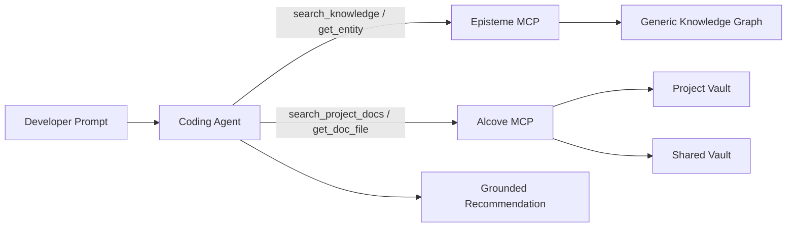
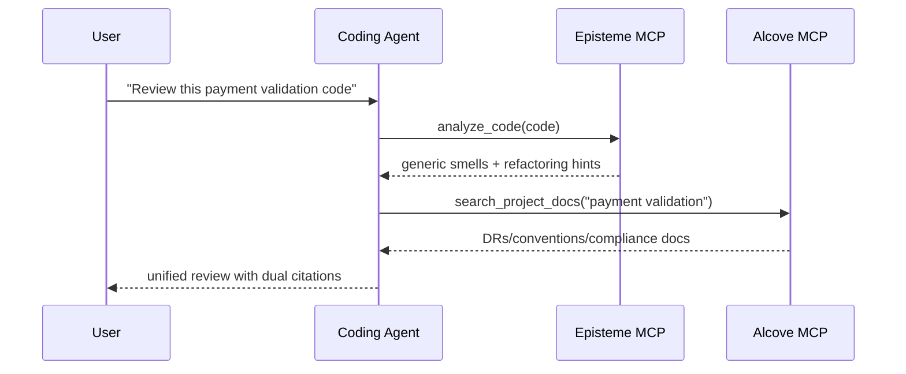
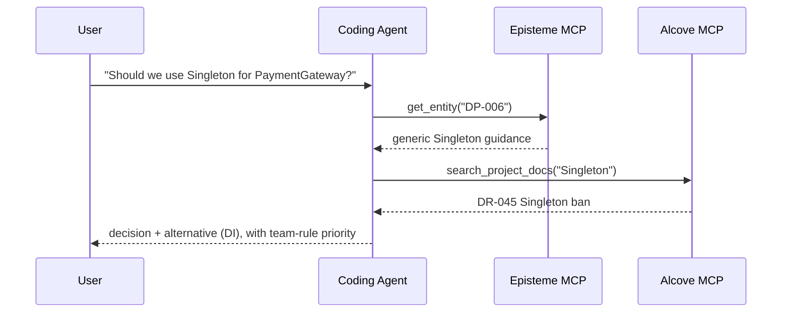
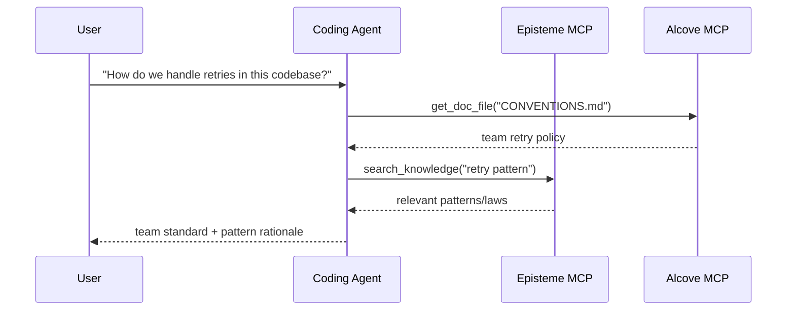

# Alcove + Episteme 통합 가이드

> 에이전트 우선 가이드: MCP와 자연어 워크플로를 통해 범용 소프트웨어 엔지니어링 지식(Episteme)과 팀별 도메인 지식(Alcove)을 함께 활용합니다.

## 개요

**Episteme**는 범용 지식(GoF 패턴, 리팩터링, 법칙)을 읽기 전용 지식 그래프로 제공합니다.  
**Alcove**는 팀의 살아있는 문서(의사결정, 아키텍처, 코딩 표준)를 인덱싱합니다.

MCP를 통해 둘을 함께 사용하면 코딩 에이전트는 다음을 할 수 있습니다.
- 범용 모범 사례 적용(Episteme)
- 팀별 제약 준수(Alcove)
- 추천 사항에 두 출처를 함께 인용

### 의사결정 우선순위

Episteme와 Alcove가 충돌하면, 최종 구현 가이드는 **Alcove가 우선**합니다.
- **Episteme**: 참고 지식(일반 패턴/법칙/스멜)
- **Alcove**: 팀 지침(프로젝트/조직 특화 제약)

---

## 아키텍처 (코딩 에이전트 관점)



에이전트는 모든 문서를 미리 적재하면 안 됩니다. 현재 프롬프트에 필요한 문서/엔터티만 검색해서 가져와야 합니다.

---

## 에이전트 우선 사용법 (자연어 -> MCP -> 답변)

이 패턴은 Cursor/Codex/Claude 스타일 코딩 에이전트의 기본 권장 흐름입니다.

1. 사용자가 자연어로 질문합니다.
2. 에이전트가 Alcove(`search_project_docs`, `get_doc_file`)로 팀 컨텍스트를 가져옵니다.
3. 에이전트가 Episteme로 범용 엔지니어링 가이드를 가져옵니다.
4. 충돌을 해결합니다(팀 규칙이 일반 조언보다 우선).
5. 두 출처를 함께 인용한 답변을 반환합니다.

---

## Alcove 볼트 개념

### 프로젝트 볼트
**위치**: `<docs_root>/<project>/` (예: `~/.alcove/docs/payment-api/`)  
**범위**: 단일 코드베이스  
**내용**: 아키텍처 결정, 기술 스택, 도메인 용어집

**예시** (`~/.alcove/docs/payment-api/DECISION.md`):
```markdown
# DECISION.md
## DR-001: Payment Validation Strategy (2024-04-15)
- All card numbers MUST be validated using CardValidator
- Reason: FSS regulation §12.3 requires PCI DSS Level 1 compliance
- Related: Episteme DP-023 (Strategy Pattern)

## DR-002: No Direct LLM Calls in Production
- External AI APIs prohibited in payment processing flow
- Approved: Internal tools only (Claude Code, local models)
```

### 공유 볼트
**위치**: `<vaults_root>/<org-name>/` (일반적으로 `~/.alcove/vaults/<org-name>/`)  
**범위**: 조직 전반  
**내용**: 횡단 관심사, 규제 요구사항, 공통 패턴

**예시** (`~/.alcove/vaults/osn-finance/FSS_COMPLIANCE.md`):
```markdown
# FSS_COMPLIANCE.md
## Card Number Handling
- ALWAYS mask in logs: `****-****-****-1234`
- NEVER store raw PAN in application logs
- Episteme reference: SMELL-42 (Information Exposure)

## Testing
- Use synthetic cards only: `4111-1111-1111-1111`
- Real customer data in tests = FSS violation
```

---

## 사용 패턴

### 패턴 1: 이중 컨텍스트 기반 코드 리뷰 (기본)

**사용자 요청**:
```
"Review this payment validation code"
```

**에이전트 워크플로**:
```python
# Step 1: Detect generic smells (Episteme)
smells = await episteme.analyze_code(code)
# → SMELL-01: Long Method (15+ lines)
# → SMELL-08: Missing Error Handling

# Step 2: Check team rules (Alcove)
decisions = await alcove.search_project_docs("payment validation")
# → DR-001: Must use CardValidator
# → FSS_COMPLIANCE.md: Mask card numbers

# Step 3: Synthesize feedback
return f"""
Issues found:
1. Long Method (Episteme SMELL-01)
   → Extract card validation to separate method

2. Missing CardValidator (Team DR-001)
   → Use Strategy Pattern (Episteme DP-023)

3. Card number logged without masking (FSS_COMPLIANCE.md)
   → Apply masking utility (see CONVENTIONS.md)
"""
```



### 패턴 2: 아키텍처 의사결정 지원

**사용자 요청**:
```
"Should we use Singleton for PaymentGateway?"
```

**에이전트 워크플로**:
```python
# Episteme: Generic pattern knowledge
pattern = await episteme.get_entity("DP-006")  # Singleton
# → "Use for globally unique resources, but beware of testability issues"

# Alcove: Team history
past_decisions = await alcove.search_project_docs("Singleton")
# → DR-045: "Banned Singleton in service layer (testing nightmare)"

# Synthesized Answer:
return f"""
Episteme says: Singleton works for global resources (DP-006)
Team history: DR-045 banned it in services (2023-08)

Recommendation: Use Dependency Injection instead
- Episteme DP-018 (Dependency Injection) explains how
- See ARCHITECTURE.md §3.2 for team's DI container setup
"""
```



### 패턴 3: 온보딩 / "여기서는 X를 어떻게 하나요?"

**사용자 요청**:
```
"How do we handle retries in this codebase?"
```

**에이전트 워크플로**:
```python
# Alcove: Team conventions
conventions = await alcove.get_doc_file("CONVENTIONS.md")
# → "Use exponential backoff with max 3 retries (see RetryPolicy util)"

# Episteme: Related patterns
patterns = await episteme.search_knowledge("retry pattern")
# → DP-023: Strategy Pattern
# → LAW-012: Fail Fast principle

return f"""
Team standard (CONVENTIONS.md):
- Use RetryPolicy utility (src/common/retry.py)
- Max 3 attempts with exponential backoff

Related concepts:
- Episteme DP-023: Strategy Pattern (pluggable retry logic)
- Episteme LAW-012: Fail Fast (don't retry on invalid input)

Example:
  policy = RetryPolicy(max_attempts=3, backoff="exponential")
  result = await policy.execute(api_call)
"""
```



---

## 설정 방법 (최소 구성, 에이전트 활성화용)

### 1. 프로젝트에 Alcove 초기화

```bash
cd /path/to/your/project
alcove setup

# Create core documents
cat > .alcove/DECISION.md <<EOF
# Architectural Decision Records

## Template
- **ID**: DR-XXX
- **Date**: YYYY-MM-DD
- **Context**: What problem are we solving?
- **Decision**: What did we decide?
- **Consequences**: Trade-offs
- **Episteme Refs**: Related entities (optional)
EOF

cat > .alcove/ARCHITECTURE.md <<EOF
# System Architecture

## Domain Model
- Payment: Card validation, fraud detection
- Settlement: Batch processing, reconciliation

## Key Patterns (link to Episteme)
- Payment validation: Strategy (DP-023)
- API gateway: Facade (DP-007)
EOF
```

### 2. 공유 볼트 생성 (선택)

조직 전반 표준이 필요하다면:

```bash
mkdir -p ~/.alcove/vaults/my-org
cat > ~/.alcove/vaults/my-org/SECURITY.md <<EOF
# Security Standards

## PII Handling
- Never log credit card numbers (Episteme SMELL-42)
- Use DataMasker utility for all PII

## Approved Libraries
- cryptography >= 41.0
- bcrypt >= 4.0
EOF

# Register external directory as vault (e.g. Obsidian vault)
alcove vault link my-org ~/.alcove/vaults/my-org
```

### 3. MCP 서버 설정 (코딩 에이전트에 필수)

`~/.claude/claude_desktop_config.json`에서:

```json
{
  "mcpServers": {
    "episteme": {
      "command": "epis",
      "args": ["mcp"]
    },
    "alcove": {
      "command": "alcove",
      "args": []
    }
  }
}
```

Cursor/Codex/기타 MCP 지원 코딩 에이전트에서도 두 MCP 서버를 모두 등록하고, 프롬프트와 스킬이 이식 가능하도록 동일한 서버 이름(`episteme`, `alcove`)을 유지하세요.

### 4. 문서 연결 규칙

Alcove 문서 안에서 Episteme 엔터티를 참조합니다.

```markdown
## DR-042: Use Repository Pattern for Data Access

**Decision**: All database access goes through Repository interface

**Rationale**:
- Testability: Mock repositories in unit tests
- Episteme DP-018 (Dependency Injection) + DP-007 (Facade)

**Implementation**:
See `src/repositories/` for examples
```

---

## 모범 사례

### 0. 수동 CLI 단계보다 에이전트 검색을 우선

CLI는 초기 설정/유지보수에 주로 사용하세요. 실제 코딩 작업 중에는 MCP 호출을 유도하는 자연어 프롬프트를 우선하는 것이 좋습니다.

**권장**
- "우리 팀 컨벤션을 기준으로 이 모듈을 리뷰해줘"
- "DR-112와 관련 Episteme 법칙을 따라 이 서비스를 리팩터링해줘"
- "이 구현이 Alcove 결정과 충돌하는지 확인해줘"

**기본 워크플로로는 비권장**
- 큰 문서를 수동으로 grep/copy-paste 해서 프롬프트에 넣기
- 매 세션마다 아키텍처 제약을 다시 설명하기

### 1. **명시적 인용**

가능한 경우 Alcove 결정과 Episteme 엔터티를 항상 함께 연결하세요.

```markdown
❌ Bad:
"Use Strategy Pattern for payment validation"

✅ Good:
"Use Strategy Pattern (Episteme DP-023) for payment validation.
See DR-001 for team-specific CardValidator implementation."
```

### 2. **Alcove 문서는 간결하게 유지**

Episteme 내용을 중복하지 말고 참조하세요.

```markdown
❌ Bad (duplicating Episteme):
## Observer Pattern
The Observer pattern defines a one-to-many dependency...
[500 words explaining Observer]

✅ Good (referencing Episteme):
## Event Bus Implementation (DR-078)
- Pattern: Observer (Episteme DP-012)
- Our twist: Use Redis Pub/Sub instead of in-memory
- Trade-off: Network latency for horizontal scalability
```

### 3. **파괴적 변경 시 업데이트**

팀 컨벤션이 Episteme 조언을 덮어쓰는 경우:

```markdown
## DR-091: Singleton Ban Exception (2024-04-20)

**Context**: Episteme DP-006 says Singleton is OK for config

**Our Rule**: NEVER use Singleton, even for config

**Reason**: Config hot-reload requirement (DR-015)

**Alternative**: Use ConfigProvider with DI (see src/config/)
```

### 4. **볼트 구성**

```
Project Docs (<docs_root>/<project>/)
├── DECISION.md        # Episteme 참조가 포함된 ADR
├── ARCHITECTURE.md    # 시스템 설계, 패턴 사용
├── CONVENTIONS.md     # 코딩 표준
├── DOMAIN.md          # 비즈니스 용어집
└── DEPLOYMENT.md      # 운영 런북

Shared Vault (<vaults_root>/<org>/)
├── SECURITY.md        # 프로젝트 간 공통 보안 규칙
├── COMPLIANCE.md      # 규제 요구사항 (FSS, GDPR)
└── PATTERNS.md        # 조직 승인 패턴 서브셋
```

---

## 고급: Episteme → Alcove 피드백 루프

### Prometheus 메트릭으로 패턴 사용 추적

코드에 계측을 추가해 Episteme 엔터티 사용량을 Prometheus 메트릭으로 노출합니다.

```python
# In your codebase
from prometheus_client import Counter

pattern_usage = Counter(
    'episteme_pattern_applied_total',
    'Episteme pattern application count',
    ['entity_id', 'entity_type', 'context']
)

def apply_retry_logic():
    # Track Strategy pattern usage
    pattern_usage.labels(
        entity_id='DP-023',
        entity_type='pattern',
        context='payment_retry'
    ).inc()

    # Your retry logic using Strategy Pattern
    pass
```

### Grafana에서 시각화

패턴 채택 현황을 모니터링하는 대시보드를 만듭니다.

```promql
# Most used patterns (last 30d)
topk(10,
  increase(episteme_pattern_applied_total[30d])
)

# Pattern usage by context
sum by (entity_id, context) (
  rate(episteme_pattern_applied_total[7d])
)

# Alert on deprecated pattern usage
sum(rate(episteme_pattern_applied_total{entity_id="DP-006"}[5m])) > 0
# Alert: "Singleton pattern used (banned per DR-091)"
```

### 사용 리포트 생성

분기별로 Prometheus 쿼리로 검토합니다.

```bash
# Query Prometheus
curl -G 'http://localhost:9090/api/v1/query' \
  --data-urlencode 'query=topk(10, increase(episteme_pattern_applied_total[90d]))' \
  | jq -r '.data.result[] | "\(.metric.entity_id): \(.value[1])"'

# Output:
# DP-023: 847
# DP-018: 612
# DP-007: 301
```

실제 사용량에 따라 Alcove 문서를 업데이트합니다.

```markdown
## Most Used Patterns (2024 Q2) - via Grafana

1. **Strategy (DP-023)**: 847 uses
   - Primary: payment_retry (412), discount_calc (201)
   - See: DECISION.md DR-001 (payment validation)

2. **Dependency Injection (DP-018)**: 612 uses
   - Standard across all services
   - See: ARCHITECTURE.md §3 for container setup

3. **Facade (DP-007)**: 301 uses
   - Context: external_api (289), legacy_adapter (12)
```

---

## 문제 해결

### 문제: 에이전트가 오래된 Alcove 문서를 인용함

**원인**: 문서 업데이트 후 Alcove 인덱스가 새로고침되지 않음

**해결**:
```bash
alcove rebuild
```

### 문제: Episteme와 Alcove가 충돌함

**예시**: Episteme는 "Singleton 가능"이라고 하고, 팀 문서는 "Singleton 금지"라고 함

**해결 패턴**:
1. 에이전트가 두 출처를 모두 드러냄
2. 충돌 내용을 설명함
3. 최종 답변에서는 팀 문서(Alcove)를 따름

```
Agent: "여기에는 충돌이 있습니다:
- Episteme DP-006: Singleton is acceptable for global config
- Your DR-091: Singleton banned (hot-reload requirement)

I'll follow your team rule (DR-091). Use ConfigProvider instead."
```

### 문제: 에이전트가 코딩 에이전트 흐름 대신 CLI 중심 설명만 사용함

**증상**: 응답이 셸 명령에만 치우치고, 코딩 에이전트가 어떻게 가져오고 추론해야 하는지는 설명하지 않음

**해결**:
1. 의도 + 컨텍스트 대상을 함께 요청
   - "Alcove 문서 + Episteme 엔터티를 사용해 이 코드를 리뷰해줘"
2. 명시적 이중 인용 요청
   - "답변에 DR/ARCH 문서와 Episteme ID를 함께 인용해줘"
3. 충돌 해결 정책 요청
   - "출처가 충돌하면 팀 문서를 우선해줘"

---

## 예시: 전체 워크플로

**시나리오**: 개발자가 "새 결제 웹훅 핸들러를 어떻게 구성해야 할까?"라고 묻습니다.

### 에이전트의 내부 과정

```python
# 1. Search Episteme for generic patterns
patterns = await episteme.search_knowledge("webhook handler")
# → DP-007: Facade (simplify complex subsystems)
# → DP-023: Strategy (pluggable validation)
# → LAW-045: Single Responsibility

# 2. Check team architecture
arch = await alcove.get_doc_file("ARCHITECTURE.md")
# → "All webhooks go through WebhookRouter (src/webhooks/router.py)"

# 3. Check team decisions
decisions = await alcove.search_project_docs("webhook")
# → DR-112: "Webhook handlers must be idempotent (payment retries)"

# 4. Check conventions
conv = await alcove.get_doc_file("CONVENTIONS.md")
# → "Use @webhook_handler decorator for automatic logging/retry"
```

### 에이전트의 응답

```markdown
## Payment Webhook Handler Structure

### Team Standards (Alcove)
1. Register in WebhookRouter (ARCHITECTURE.md §4.2)
2. Make it idempotent (DR-112) - payment gateways retry
3. Use @webhook_handler decorator (CONVENTIONS.md)

### Recommended Patterns (Episteme)
- **Facade (DP-007)**: Hide payment provider complexity
- **Strategy (DP-023)**: Pluggable per-provider validation
- **SRP (LAW-045)**: One handler = one webhook type

### Code Template
\```python
from src.webhooks.router import webhook_handler
from src.payments import PaymentFacade  # DP-007

@webhook_handler(provider="stripe", idempotent=True)  # DR-112
async def handle_payment_success(payload: dict):
    # Single responsibility: process payment (LAW-045)
    facade = PaymentFacade()
    return await facade.confirm_payment(payload["payment_id"])
\```

See:
- ARCHITECTURE.md §4.2 for WebhookRouter setup
- src/webhooks/stripe_handler.py for reference implementation
- Episteme DP-007 for Facade pattern details
```

---

## 요약

| 항목 | Episteme | Alcove |
|--------|----------|--------|
| **범위** | 범용 소프트웨어 엔지니어링 지식 | 팀/조직 특화 규칙 |
| **내용** | 22개 패턴, 66개 리팩터링, 56개 법칙, 14개 스멜 | ADR, 아키텍처, 컨벤션, 도메인 |
| **변경 가능성** | 읽기 전용(주기적 업데이트) | 살아있는 문서(일일 업데이트) |
| **세밀도** | 추상 원칙 | 구체적 구현 |
| **권위** | 참고/제안 | 팀 지침 |

**의사결정 우선순위**: Alcove > Episteme (팀 규칙이 일반 조언보다 우선)

**인용 스타일**: 가능할 때는 항상 두 출처를 함께 연결
- `"Use Strategy (Episteme DP-023) per team DR-001"`
- `"Use Strategy"` 는 문맥이 부족함

**유지보수**:
- Episteme: 별도 조치 불필요(업스트림에서 업데이트 처리)
- Alcove: 코드베이스 변경에 맞춰 문서를 최신 상태로 유지
