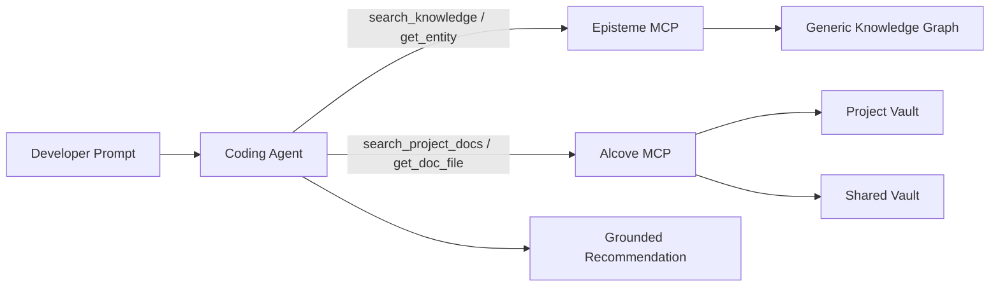
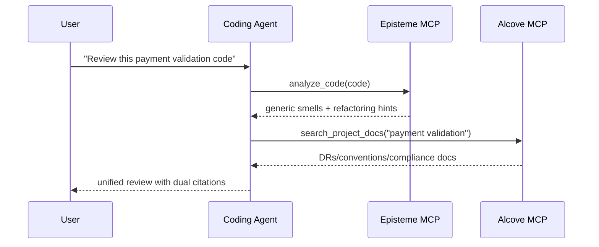
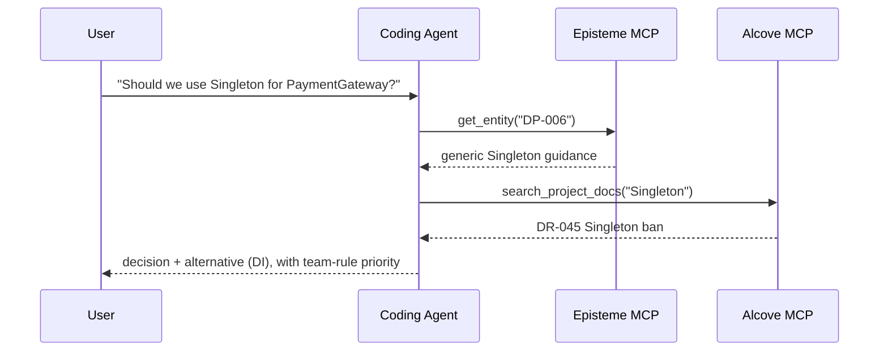
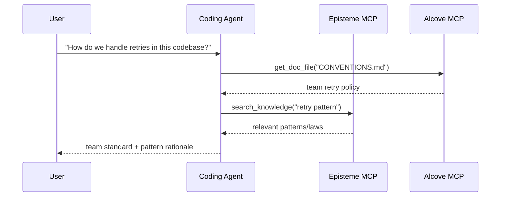

# Guia de integracao Alcove + Episteme

> Guia focado em agentes: combine conhecimento generico de engenharia de software (Episteme) com conhecimento de dominio especifico da equipe (Alcove) atraves de MCP e fluxos de trabalho em linguagem natural.

## Visao geral

O **Episteme** fornece conhecimento universal (padroes GoF, refactorings, leis) como um grafo de conhecimento somente leitura.
O **Alcove** indexa a documentacao viva da sua equipe (decisoes, arquitetura, padroes de codificacao).

Quando usados juntos atraves do MCP, agentes de codificacao podem:
- Aplicar melhores praticas genericas (Episteme)
- Respeitar restricoes especificas da equipe (Alcove)
- Citar ambas as fontes nas recomendacoes

### Prioridade de decisao

Quando o Episteme e o Alcove entram em conflito, **o Alcove vence** para orientacao final de implementacao.
- **Episteme**: conhecimento de referencia (padroes/leis/smells gerais)
- **Alcove**: mandato da equipe (restricoes especificas do projeto/organizacao)

---

## Arquitetura (Visao do Agente de Codificacao)



O agente **nao** deve pre-carregar todos os docs. Deve recuperar apenas os documentos/entidades necessarios para o prompt ativo.

---

## Uso focado em agentes (Linguagem Natural -> MCP -> Resposta)

Esses padroes sao o padrao recomendado para agentes de codificacao do tipo Cursor/Codex/Claude.

1. O usuario pergunta em linguagem natural.
2. O agente recupera o contexto da equipe do Alcove (`search_project_docs`, `get_doc_file`).
3. O agente recupera orientacao generica de engenharia do Episteme.
4. O agente resolve conflitos (regras da equipe sobrepoe conselhos genericos).
5. O agente retorna uma resposta com citacoes duplas.

---

## Conceitos de Vault do Alcove

### Vault de Projeto
**Localizacao**: `<docs_root>/<project>/` (por exemplo `~/.alcove/docs/payment-api/`)
**Escopo**: Base de codigo unica
**Conteudo**: Decisoes de arquitetura, stack tecnologica, glossario de dominio

**Exemplo** (`~/.alcove/docs/payment-api/DECISION.md`):
```markdown
# DECISION.md
## DR-001: Payment Validation Strategy (2024-04-15)
- All card numbers MUST be validated using CardValidator
- Reason: FSS regulation §12.3 requires PCI DSS Level 1 compliance
- Related: Episteme DP-023 (Strategy Pattern)

## DR-002: No Direct LLM Calls in Production
- External AI APIs prohibited in payment processing flow
- Approved: Internal tools only (Claude Code, local models)
```

### Vault Compartilhado
**Localizacao**: `<vaults_root>/<org-name>/` (comummente `~/.alcove/vaults/<org-name>/`)
**Escopo**: Toda a organizacao
**Conteudo**: Preocupacoes transversais, requisitos regulatorios, padroes compartilhados

**Exemplo** (`~/.alcove/vaults/osn-finance/FSS_COMPLIANCE.md`):
```markdown
# FSS_COMPLIANCE.md
## Card Number Handling
- ALWAYS mask in logs: `****-****-****-1234`
- NEVER store raw PAN in application logs
- Episteme reference: SMELL-42 (Information Exposure)

## Testing
- Use synthetic cards only: `4111-1111-1111-1111`
- Real customer data in tests = FSS violation
```

---

## Padroes de uso

### Padrao 1: Revisao de codigo com contexto duplo (Principal)

**Solicitacao do usuario**:
```
"Review this payment validation code"
```

**Fluxo de trabalho do agente**:
```python
# Passo 1: Detectar smells genericos (Episteme)
smells = await episteme.analyze_code(code)
# → SMELL-01: Long Method (15+ lines)
# → SMELL-08: Missing Error Handling

# Passo 2: Verificar regras da equipe (Alcove)
decisions = await alcove.search_project_docs("payment validation")
# → DR-001: Must use CardValidator
# → FSS_COMPLIANCE.md: Mask card numbers

# Passo 3: Sintetizar feedback
return f"""
Issues found:
1. Long Method (Episteme SMELL-01)
   → Extract card validation to separate method
   
2. Missing CardValidator (Team DR-001)
   → Use Strategy Pattern (Episteme DP-023)
   
3. Card number logged without masking (FSS_COMPLIANCE.md)
   → Apply masking utility (see CONVENTIONS.md)
"""
```



### Padrao 2: Suporte a decisao arquitetural

**Solicitacao do usuario**:
```
"Should we use Singleton for PaymentGateway?"
```

**Fluxo de trabalho do agente**:
```python
# Episteme: Conhecimento generico de padroes
pattern = await episteme.get_entity("DP-006")  # Singleton
# → "Use for globally unique resources, but beware of testability issues"

# Alcove: Historico da equipe
past_decisions = await alcove.search_project_docs("Singleton")
# → DR-045: "Banned Singleton in service layer (testing nightmare)"

# Resposta sintetizada:
return f"""
Episteme says: Singleton works for global resources (DP-006)
Team history: DR-045 banned it in services (2023-08)

Recommendation: Use Dependency Injection instead
- Episteme DP-018 (Dependency Injection) explains how
- See ARCHITECTURE.md §3.2 for team's DI container setup
"""
```



### Padrao 3: Onboarding / "Como fazemos X aqui?"

**Solicitacao do usuario**:
```
"How do we handle retries in this codebase?"
```

**Fluxo de trabalho do agente**:
```python
# Alcove: Convencoes da equipe
conventions = await alcove.get_doc_file("CONVENTIONS.md")
# → "Use exponential backoff with max 3 retries (see RetryPolicy util)"

# Episteme: Padroes relacionados
patterns = await episteme.search_knowledge("retry pattern")
# → DP-023: Strategy Pattern
# → LAW-012: Fail Fast principle

return f"""
Team standard (CONVENTIONS.md):
- Use RetryPolicy utility (src/common/retry.py)
- Max 3 attempts with exponential backoff

Related concepts:
- Episteme DP-023: Strategy Pattern (pluggable retry logic)
- Episteme LAW-012: Fail Fast (don't retry on invalid input)

Example:
  policy = RetryPolicy(max_attempts=3, backoff="exponential")
  result = await policy.execute(api_call)
"""
```



---

## Instrucoes de configuracao (Minima, para ativacao de agentes)

### 1. Inicializar o Alcove para seu projeto

```bash
cd /path/to/your/project
alcove setup

# Criar documentos core
cat > .alcove/DECISION.md <<EOF
# Architectural Decision Records

## Template
- **ID**: DR-XXX
- **Date**: YYYY-MM-DD
- **Context**: What problem are we solving?
- **Decision**: What did we decide?
- **Consequences**: Trade-offs
- **Episteme Refs**: Related entities (optional)
EOF

cat > .alcove/ARCHITECTURE.md <<EOF
# System Architecture

## Domain Model
- Payment: Card validation, fraud detection
- Settlement: Batch processing, reconciliation

## Key Patterns (link to Episteme)
- Payment validation: Strategy (DP-023)
- API gateway: Facade (DP-007)
EOF
```

### 2. Criar Vault Compartilhado (Opcional)

Para padroes de toda a organizacao:

```bash
mkdir -p ~/.alcove/vaults/my-org
cat > ~/.alcove/vaults/my-org/SECURITY.md <<EOF
# Security Standards

## PII Handling
- Never log credit card numbers (Episteme SMELL-42)
- Use DataMasker utility for all PII

## Approved Libraries
- cryptography >= 41.0
- bcrypt >= 4.0
EOF

# Registrar diretorio externo como vault (ex: vault Obsidian)
alcove vault link my-org ~/.alcove/vaults/my-org
```

### 3. Configurar servidores MCP (Obrigatorio para agentes de codificacao)

Em `~/.claude/claude_desktop_config.json`:

```json
{
  "mcpServers": {
    "episteme": {
      "command": "epis",
      "args": ["mcp"]
    },
    "alcove": {
      "command": "alcove",
      "args": []
    }
  }
}
```

Para Cursor/Codex/outros agentes de codificacao com suporte a MCP, registre ambos os servidores MCP na configuracao MCP de cada ferramenta e mantenha os mesmos nomes de servidores (`episteme`, `alcove`) para que prompts e skills permanecam portateis.

### 4. Convencao de vinculacao de documentos

Referencie entidades do Episteme nos docs do Alcove:

```markdown
## DR-042: Use Repository Pattern for Data Access

**Decision**: All database access goes through Repository interface

**Rationale**:
- Testability: Mock repositories in unit tests
- Episteme DP-018 (Dependency Injection) + DP-007 (Facade)

**Implementation**:
See `src/repositories/` for examples
```

---

## Melhores praticas

### 0. Preferir recuperacao do agente em vez de etapas manuais de CLI

Use CLI principalmente para configuracao/manutencao inicial. Durante o trabalho de codificacao, prefira prompts em linguagem natural que acionam chamadas MCP.

**Preferido**
- "Revise este modulo com nossas convencoes da equipe"
- "Refatore este servico seguindo DR-112 e leis relacionadas do Episteme"
- "Verifique se esta implementacao entra em conflito com as decisoes do Alcove"

**Evitar como fluxo de trabalho padrao**
- Grep/copia-e-cola manual de docs grandes no prompt
- Re-explicar restricoes de arquitetura toda sessao

### 1. **Citacoes explicitas**

Sempre vincule decisoes do Alcove a entidades do Episteme quando aplicavel:

```markdown
❌ Ruim:
"Use Strategy Pattern for payment validation"

✅ Bom:
"Use Strategy Pattern (Episteme DP-023) for payment validation.
See DR-001 for team-specific CardValidator implementation."
```

### 2. **Mantenha os docs do Alcove enxutos**

Nao duplique conteudo do Episteme. Referencie-o:

```markdown
❌ Ruim (duplicando Episteme):
## Observer Pattern
The Observer pattern defines a one-to-many dependency...
[500 palavras explicando Observer]

✅ Bom (referenciando Episteme):
## Event Bus Implementation (DR-078)
- Pattern: Observer (Episteme DP-012)
- Our twist: Use Redis Pub/Sub instead of in-memory
- Trade-off: Network latency for horizontal scalability
```

### 3. **Atualize em mudancas significativas**

Quando as convencoes da equipe sobrepoe os conselhos do Episteme:

```markdown
## DR-091: Singleton Ban Exception (2024-04-20)

**Context**: Episteme DP-006 says Singleton is OK for config

**Our Rule**: NEVER use Singleton, even for config

**Reason**: Config hot-reload requirement (DR-015)

**Alternative**: Use ConfigProvider with DI (see src/config/)
```

### 4. **Organizacao de vaults**

```
Project Docs (<docs_root>/<project>/)
├── DECISION.md        # ADRs com referencias Episteme
├── ARCHITECTURE.md    # Design do sistema, uso de padroes
├── CONVENTIONS.md     # Padroes de codificacao
├── DOMAIN.md          # Glossario de negocio
└── DEPLOYMENT.md      # Runbooks de operacoes

Shared Vault (<vaults_root>/<org>/)
├── SECURITY.md        # Regras de seguranca entre projetos
├── COMPLIANCE.md      # Requisitos regulatorios (FSS, GDPR)
└── PATTERNS.md        # Subconjunto de padroes aprovados pela organizacao
```

---

## Avancado: Loop de feedback Episteme → Alcove

### Rastrear uso de padroes com metricas Prometheus

Instrumente seu codigo para expor o uso de entidades Episteme como metricas Prometheus:

```python
# Na sua base de codigo
from prometheus_client import Counter

pattern_usage = Counter(
    'episteme_pattern_applied_total',
    'Episteme pattern application count',
    ['entity_id', 'entity_type', 'context']
)

def apply_retry_logic():
    # Rastrear uso do padrao Strategy
    pattern_usage.labels(
        entity_id='DP-023',
        entity_type='pattern',
        context='payment_retry'
    ).inc()
    
    # Sua logica de retry usando Strategy Pattern
    pass
```

### Visualizar no Grafana

Crie um painel para monitorar a adocao de padroes:

```promql
# Padroes mais usados (ultimos 30d)
topk(10, 
  increase(episteme_pattern_applied_total[30d])
)

# Uso de padroes por contexto
sum by (entity_id, context) (
  rate(episteme_pattern_applied_total[7d])
)

# Alertar sobre uso de padrao obsoleto
sum(rate(episteme_pattern_applied_total{entity_id="DP-006"}[5m])) > 0
# Alert: "Singleton pattern used (banned per DR-091)"
```

### Gerar relatorios de uso

Revisao trimestral via consulta Prometheus:

```bash
# Consultar Prometheus
curl -G 'http://localhost:9090/api/v1/query' \
  --data-urlencode 'query=topk(10, increase(episteme_pattern_applied_total[90d]))' \
  | jq -r '.data.result[] | "\(.metric.entity_id): \(.value[1])"'

# Saida:
# DP-023: 847
# DP-018: 612
# DP-007: 301
```

Atualize docs do Alcove com base no uso real:

```markdown
## Most Used Patterns (2024 Q2) - via Grafana

1. **Strategy (DP-023)**: 847 uses
   - Primary: payment_retry (412), discount_calc (201)
   - See: DECISION.md DR-001 (payment validation)

2. **Dependency Injection (DP-018)**: 612 uses
   - Standard across all services
   - See: ARCHITECTURE.md §3 for container setup

3. **Facade (DP-007)**: 301 uses
   - Context: external_api (289), legacy_adapter (12)
```

---

## Solucao de problemas

### Problema: Agente cita doc do Alcove desatualizado

**Causa**: Indice do Alcove nao foi atualizado apos atualizacao do doc

**Solucao**:
```bash
alcove rebuild
```

### Problema: Episteme e Alcove em conflito

**Exemplo**: Episteme diz "Singleton OK", doc da equipe diz "Singleton banido"

**Padrao de resolucao**:
1. O agente apresenta ambas as fontes
2. Explica a contradicao
3. Defere para o doc da equipe (Alcove) para a resposta final

```
Agent: "There's a conflict here:
- Episteme DP-006: Singleton is acceptable for global config
- Your DR-091: Singleton banned (hot-reload requirement)

I'll follow your team rule (DR-091). Use ConfigProvider instead."
```

### Problema: Agente usa explicacao apenas CLI em vez de fluxo de agente de codificacao

**Sintoma**: Respostas focam em comandos shell em vez de como o agente de codificacao deve buscar e raciocinar.

**Solucao**:
1. Pergunte com intencao + alvo de contexto:
   - "Use docs Alcove + entidades Episteme para revisar este codigo"
2. Solicite citacao dupla explicita:
   - "Cite DR/ARCH doc e ID Episteme na sua resposta"
3. Peca politica de resolucao de conflitos:
   - "Se as fontes conflitarem, priorize os docs da equipe"

---

## Exemplo: Fluxo de trabalho completo

**Cenario**: Desenvolvedor pergunta "Como devo estruturar o novo manipulador de webhook de pagamento?"

### Processo interno do agente

```python
# 1. Buscar padroes genericos no Episteme
patterns = await episteme.search_knowledge("webhook handler")
# → DP-007: Facade (simplify complex subsystems)
# → DP-023: Strategy (pluggable validation)
# → LAW-045: Single Responsibility

# 2. Verificar arquitetura da equipe
arch = await alcove.get_doc_file("ARCHITECTURE.md")
# → "All webhooks go through WebhookRouter (src/webhooks/router.py)"

# 3. Verificar decisoes da equipe
decisions = await alcove.search_project_docs("webhook")
# → DR-112: "Webhook handlers must be idempotent (payment retries)"

# 4. Verificar convencoes
conv = await alcove.get_doc_file("CONVENTIONS.md")
# → "Use @webhook_handler decorator for automatic logging/retry"
```

### Resposta do agente

```markdown
## Payment Webhook Handler Structure

### Team Standards (Alcove)
1. Register in WebhookRouter (ARCHITECTURE.md §4.2)
2. Make it idempotent (DR-112) - payment gateways retry
3. Use @webhook_handler decorator (CONVENTIONS.md)

### Recommended Patterns (Episteme)
- **Facade (DP-007)**: Hide payment provider complexity
- **Strategy (DP-023)**: Pluggable per-provider validation
- **SRP (LAW-045)**: One handler = one webhook type

### Code Template
\`\`\`python
from src.webhooks.router import webhook_handler
from src.payments import PaymentFacade  # DP-007

@webhook_handler(provider="stripe", idempotent=True)  # DR-112
async def handle_payment_success(payload: dict):
    # Single responsibility: process payment (LAW-045)
    facade = PaymentFacade()
    return await facade.confirm_payment(payload["payment_id"])
\`\`\`

See:
- ARCHITECTURE.md §4.2 for WebhookRouter setup
- src/webhooks/stripe_handler.py for reference implementation
- Episteme DP-007 for Facade pattern details
```

---

## Resumo

| Aspecto | Episteme | Alcove |
|---------|----------|--------|
| **Escopo** | Conhecimento universal de engenharia de software | Regras especificas da equipe/organizacao |
| **Conteudo** | 22 padroes, 66 refactorings, 56 leis, 14 smells | ADRs, arquitetura, convencoes, dominio |
| **Mutabilidade** | Somente leitura (atualizacoes periodicas) | Documentos vivos (atualizacoes diarias) |
| **Granularidade** | Principios abstratos | Implementacoes concretas |
| **Autoridade** | Referencia/sugestao | Mandato da equipe |

**Prioridade de decisao**: Alcove > Episteme (regras da equipe sobrepoe conselhos genericos)

**Estilo de citacao**: Sempre vincule ambas as fontes quando aplicavel
- `"Use Strategy (Episteme DP-023) per team DR-001"`
- Nao: `"Use Strategy"` (faltando contexto)

**Manutencao**: 
- Episteme: Nenhuma acao necessaria (upstream gerencia atualizacoes)
- Alcove: Mantenha os docs atualizados com as mudancas da base de codigo
