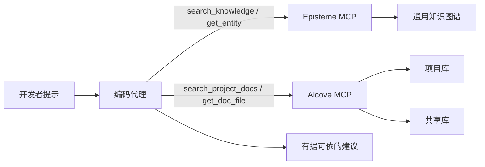
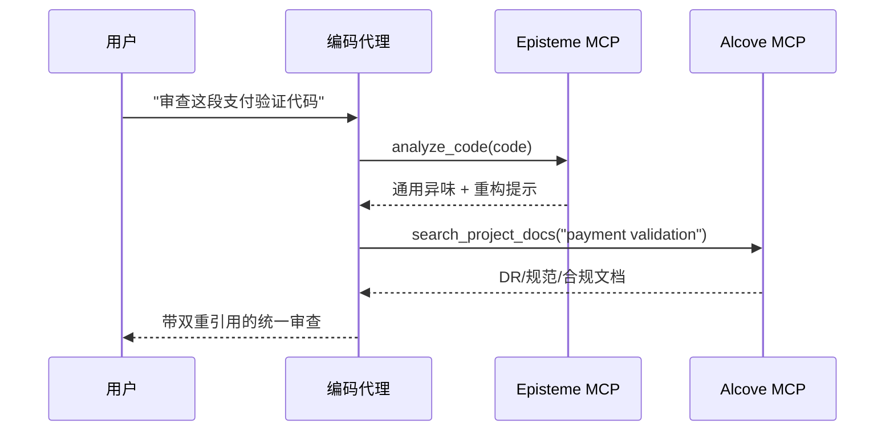
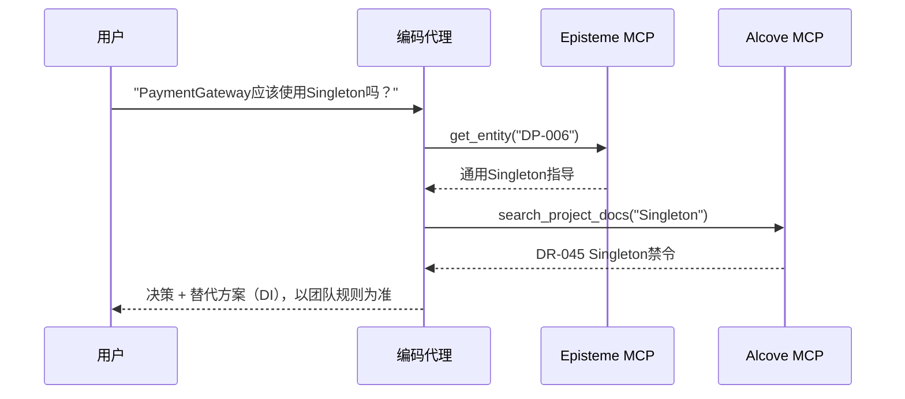
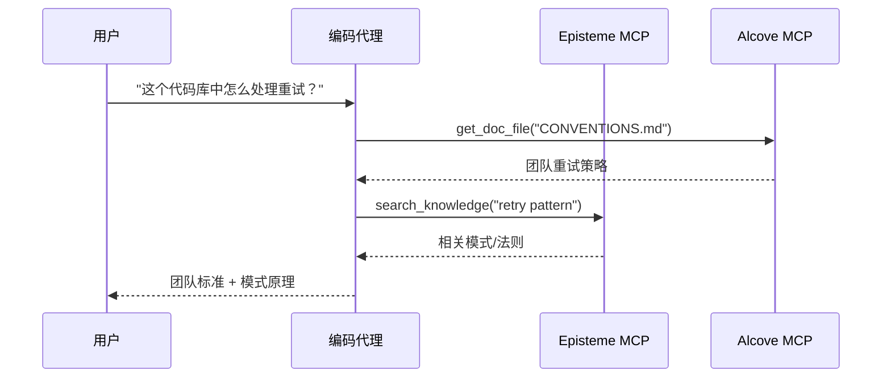

# Alcove + Episteme 集成指南

> 代理优先指南: 通过MCP和自然语言工作流，将通用软件工程知识（Episteme）与团队特定的领域知识（Alcove）结合使用。

## 概述

**Episteme**以只读知识图谱的形式提供通用知识（GoF模式、重构、法则）。
**Alcove**索引团队的活文档（决策、架构、编码标准）。

通过MCP结合使用时，编码代理可以:
- 应用通用最佳实践（Episteme）
- 遵守团队特定的约束（Alcove）
- 在建议中引用两个来源

### 决策优先级

当Episteme与Alcove冲突时，**最终实施指导以Alcove为准**。
- **Episteme**: 参考知识（通用模式/法则/异味）
- **Alcove**: 团队决定（项目/组织特定约束）

---

## 架构（编码代理视角）



代理不应预加载所有文档。它应仅检索当前提示所需的文档/实体。

---

## 代理优先使用方法（自然语言 → MCP → 回答）

这些模式是Cursor/Codex/Claude风格编码代理的推荐默认方式。

1. 用户用自然语言提问。
2. 代理从Alcove获取团队上下文（`search_project_docs`、`get_doc_file`）。
3. 代理从Episteme获取通用工程指导。
4. 代理解决冲突（团队规则覆盖通用建议）。
5. 代理返回带有双重引用的回答。

---

## Alcove库概念

### 项目库
**位置**: `<docs_root>/<project>/`（例如 `~/.alcove/docs/payment-api/`）
**范围**: 单一代码库
**内容**: 架构决策、技术栈、领域术语表

**示例**（`~/.alcove/docs/payment-api/DECISION.md`）:
```markdown
# DECISION.md
## DR-001: 支付验证策略 (2024-04-15)
- 所有卡号必须使用CardValidator进行验证
- 原因: FSS法规 §12.3要求PCI DSS一级合规
- 相关: Episteme DP-023（策略模式）

## DR-002: 生产环境中禁止直接调用LLM
- 支付处理流程中禁止外部AI API
- 已批准: 仅限内部工具（Claude Code、本地模型）
```

### 共享库
**位置**: `<vaults_root>/<org-name>/`（通常为 `~/.alcove/vaults/<org-name>/`）
**范围**: 组织范围
**内容**: 横切关注点、法规要求、共享模式

**示例**（`~/.alcove/vaults/finance/FSS_COMPLIANCE.md`）:
```markdown
# FSS_COMPLIANCE.md
## 卡号处理
- 日志中始终脱敏: `****-****-****-1234`
- 永远不在应用日志中存储原始PAN
- Episteme参考: SMELL-42（信息暴露）

## 测试
- 仅使用合成卡: `4111-1111-1111-1111`
- 测试中使用真实客户数据 = FSS违规
```

---

## 使用模式

### 模式1: 双重上下文代码审查（主要）

**用户请求**:
```
"审查这段支付验证代码"
```

**代理工作流**:
```python
# 步骤1: 检测通用异味（Episteme）
smells = await episteme.analyze_code(code)
# → SMELL-01: Long Method (15+行)
# → SMELL-08: 缺少错误处理

# 步骤2: 检查团队规则（Alcove）
decisions = await alcove.search_project_docs("payment validation")
# → DR-001: 必须使用CardValidator
# → FSS_COMPLIANCE.md: 对卡号进行脱敏

# 步骤3: 综合反馈
return f"""
发现的问题:
1. Long Method (Episteme SMELL-01)
   → 将卡验证提取到独立方法

2. 缺少CardValidator (团队 DR-001)
   → 使用策略模式（Episteme DP-023）

3. 卡号未脱敏即写入日志 (FSS_COMPLIANCE.md)
   → 应用脱敏工具（见CONVENTIONS.md）
"""
```



### 模式2: 架构决策支持

**用户请求**:
```
"PaymentGateway应该使用Singleton吗？"
```

**代理工作流**:
```python
# Episteme: 通用模式知识
pattern = await episteme.get_entity("DP-006")  # Singleton
# → "用于全局唯一资源，但注意可测试性问题"

# Alcove: 团队历史
past_decisions = await alcove.search_project_docs("Singleton")
# → DR-045: "服务层禁止Singleton（测试噩梦）"

# 综合回答:
return f"""
Episteme指出: Singleton适用于全局资源 (DP-006)
团队历史: DR-045在服务层禁止使用 (2023-08)

建议: 改用依赖注入
- Episteme DP-018（依赖注入）说明了如何操作
- 团队的DI容器设置见ARCHITECTURE.md §3.2
"""
```



### 模式3: 入职 / "我们在这里怎么做X？"

**用户请求**:
```
"这个代码库中怎么处理重试？"
```

**代理工作流**:
```python
# Alcove: 团队规范
conventions = await alcove.get_doc_file("CONVENTIONS.md")
# → "使用指数退避，最多3次重试（见RetryPolicy工具）"

# Episteme: 相关模式
patterns = await episteme.search_knowledge("retry pattern")
# → DP-023: 策略模式
# → LAW-012: 快速失败原则

return f"""
团队标准 (CONVENTIONS.md):
- 使用RetryPolicy工具 (src/common/retry.py)
- 最多3次尝试，指数退避

相关概念:
- Episteme DP-023: 策略模式（可插拔的重试逻辑）
- Episteme LAW-012: 快速失败（无效输入不重试）

示例:
  policy = RetryPolicy(max_attempts=3, backoff="exponential")
  result = await policy.execute(api_call)
"""
```



---

## 设置指南（最小化，用于启用代理）

### 1. 为你的项目初始化Alcove

```bash
cd /path/to/your/project
alcove setup

# 创建核心文档
cat > .alcove/DECISION.md <<EOF
# 架构决策记录

## 模板
- **ID**: DR-XXX
- **日期**: YYYY-MM-DD
- **背景**: 我们要解决什么问题？
- **决策**: 我们决定了什么？
- **后果**: 权衡取舍
- **Episteme参考**: 相关实体（可选）
EOF

cat > .alcove/ARCHITECTURE.md <<EOF
# 系统架构

## 领域模型
- Payment: 卡验证、欺诈检测
- Settlement: 批处理、对账

## 核心模式（链接到Episteme）
- 支付验证: Strategy (DP-023)
- API网关: Facade (DP-007)
EOF
```

### 2. 创建共享库（可选）

用于组织范围的标准:

```bash
mkdir -p ~/.alcove/vaults/my-org
cat > ~/.alcove/vaults/my-org/SECURITY.md <<EOF
# 安全标准

## PII处理
- 永远不要在日志中输出信用卡号 (Episteme SMELL-42)
- 所有PII使用DataMasker工具

## 批准的库
- cryptography >= 41.0
- bcrypt >= 4.0
EOF

# 将外部目录注册为库（例如Obsidian库）
alcove vault link my-org ~/.alcove/vaults/my-org
```

### 3. 配置MCP服务器（编码代理必需）

在`~/.claude/claude_desktop_config.json`中:

```json
{
  "mcpServers": {
    "episteme": {
      "command": "epis",
      "args": ["mcp"]
    },
    "alcove": {
      "command": "alcove",
      "args": []
    }
  }
}
```

对于Cursor/Codex/其他支持MCP的编码代理，在每个工具的MCP配置中注册两个MCP服务器，并保持相同的服务器名称（`episteme`、`alcove`），以便提示和技能保持可移植。

### 4. 文档链接规范

在Alcove文档中引用Episteme实体:

```markdown
## DR-042: 使用仓储模式进行数据访问

**决策**: 所有数据库访问通过仓储接口

**理由**:
- 可测试性: 在单元测试中模拟仓储
- Episteme DP-018（依赖注入）+ DP-007（外观）

**实现**:
参见`src/repositories/`中的示例
```

---

## 最佳实践

### 0. 优先使用代理检索而非手动CLI步骤

CLI主要用于初始设置/维护。在编码工作中，优先使用触发MCP调用的自然语言提示。

**推荐方式**
- "按照我们的团队规范审查这个模块"
- "按照DR-112和相关Episteme法则重构这个服务"
- "检查这个实现是否与Alcove的决策冲突"

**避免作为默认工作流**
- 手动grep/复制粘贴大型文档到提示中
- 每次会话重新解释架构约束

### 1. **显式引用**

在适用时，始终将Alcove的决策链接到Episteme实体:

```markdown
✗ 不好的做法:
"使用策略模式进行支付验证"

○ 好的做法:
"使用策略模式（Episteme DP-023）进行支付验证。
团队特定的CardValidator实现见DR-001。"
```

### 2. **保持Alcove文档精简**

不要复制Episteme的内容，而是引用:

```markdown
✗ 不好的做法（复制Episteme）:
## 观察者模式
观察者模式定义了一对多的依赖关系...
[500字解释观察者]

○ 好的做法（引用Episteme）:
## 事件总线实现 (DR-078)
- 模式: 观察者（Episteme DP-012）
- 我们的变体: 使用Redis Pub/Sub而非内存
- 权衡: 以网络延迟换取水平可扩展性
```

### 3. **在破坏性变更时更新**

当团队规范覆盖Episteme建议时:

```markdown
## DR-091: Singleton禁令例外 (2024-04-20)

**背景**: Episteme DP-006说Singleton用于配置是OK的

**我们的规则**: 永远不使用Singleton，即使用于配置

**原因**: 配置热重载需求（DR-015）

**替代方案**: 使用带DI的ConfigProvider（见src/config/）
```

### 4. **库组织**

```
项目文档 (<docs_root>/<project>/)
├── DECISION.md        # 带Episteme引用的ADR
├── ARCHITECTURE.md    # 系统设计、模式使用
├── CONVENTIONS.md     # 编码标准
├── DOMAIN.md          # 业务术语表
└── DEPLOYMENT.md      # 运维手册

共享库 (<vaults_root>/<org>/)
├── SECURITY.md        # 跨项目安全规则
├── COMPLIANCE.md      # 法规要求（FSS、GDPR）
└── PATTERNS.md        # 组织批准的模式子集
```

---

## 高级: Episteme → Alcove 反馈循环

### 使用Prometheus指标追踪模式使用情况

在代码中添加埋点，将Episteme实体使用情况作为Prometheus指标暴露:

```python
# 在你的代码库中
from prometheus_client import Counter

pattern_usage = Counter(
    'episteme_pattern_applied_total',
    'Episteme模式应用计数',
    ['entity_id', 'entity_type', 'context']
)

def apply_retry_logic():
    # 追踪策略模式使用
    pattern_usage.labels(
        entity_id='DP-023',
        entity_type='pattern',
        context='payment_retry'
    ).inc()

    # 使用策略模式的重试逻辑
    pass
```

### 在Grafana中可视化

创建仪表板监控模式采用情况:

```promql
# 最常用模式（过去30天）
topk(10,
  increase(episteme_pattern_applied_total[30d])
)

# 按上下文的模式使用
sum by (entity_id, context) (
  rate(episteme_pattern_applied_total[7d])
)

# 废弃模式使用告警
sum(rate(episteme_pattern_applied_total{entity_id="DP-006"}[5m])) > 0
# 告警: "使用了Singleton模式（根据DR-091已禁止）"
```

### 生成使用报告

通过Prometheus查询进行季度回顾:

```bash
# 查询Prometheus
curl -G 'http://localhost:9090/api/v1/query' \
  --data-urlencode 'query=topk(10, increase(episteme_pattern_applied_total[90d]))' \
  | jq -r '.data.result[] | "\(.metric.entity_id): \(.value[1])"'

# 输出:
# DP-023: 847
# DP-018: 612
# DP-007: 301
```

根据实际使用情况更新Alcove文档:

```markdown
## 最常用模式 (2024 Q2) - 来自Grafana

1. **Strategy (DP-023)**: 847次使用
   - 主要: payment_retry (412)、discount_calc (201)
   - 见: DECISION.md DR-001（支付验证）

2. **依赖注入 (DP-018)**: 612次使用
   - 所有服务中的标准做法
   - 见: ARCHITECTURE.md §3的容器设置

3. **Facade (DP-007)**: 301次使用
   - 上下文: external_api (289)、legacy_adapter (12)
```

---

## 故障排除

### 问题: 代理引用了过时的Alcove文档

**原因**: 文档更新后Alcove索引未刷新

**解决方案**:
```bash
alcove rebuild
```

### 问题: Episteme与Alcove冲突

**示例**: Episteme说"Singleton OK"，团队文档说"Singleton禁止"

**解决模式**:
1. 代理呈现两个来源
2. 解释矛盾
3. 以团队文档（Alcove）为准给出最终回答

```
代理: "这里存在冲突:
- Episteme DP-006: Singleton用于全局配置是可接受的
- 你的DR-091: Singleton已禁止（热重载需求）

我将遵循你的团队规则（DR-091）。请改用ConfigProvider。"
```

### 问题: 代理使用仅CLI的解释而非编码代理流程

**症状**: 回答聚焦于shell命令而非编码代理应如何获取和推理。

**解决方案**:
1. 带意图 + 上下文目标提问:
   - "使用Alcove文档 + Episteme实体来审查这段代码"
2. 请求显式双重引用:
   - "在回答中引用DR/ARCH文档和Episteme ID"
3. 请求冲突解决策略:
   - "如果来源冲突，优先使用团队文档"

---

## 示例: 完整工作流

**场景**: 开发者询问"新的支付webhook处理器应该怎么组织？"

### 代理的内部流程

```python
# 1. 在Episteme中搜索通用模式
patterns = await episteme.search_knowledge("webhook handler")
# → DP-007: Facade（简化复杂子系统）
# → DP-023: Strategy（可插拔验证）
# → LAW-045: 单一职责

# 2. 检查团队架构
arch = await alcove.get_doc_file("ARCHITECTURE.md")
# → "所有webhook通过WebhookRouter (src/webhooks/router.py)"

# 3. 检查团队决策
decisions = await alcove.search_project_docs("webhook")
# → DR-112: "Webhook处理器必须是幂等的（支付重试）"

# 4. 检查规范
conv = await alcove.get_doc_file("CONVENTIONS.md")
# → "使用@webhook_handler装饰器实现自动日志/重试"
```

### 代理的回答

```markdown
## 支付Webhook处理器结构

### 团队标准 (Alcove)
1. 注册到WebhookRouter (ARCHITECTURE.md §4.2)
2. 必须幂等 (DR-112) - 支付网关会重试
3. 使用@webhook_handler装饰器 (CONVENTIONS.md)

### 推荐模式 (Episteme)
- **Facade (DP-007)**: 隐藏支付提供商复杂性
- **Strategy (DP-023)**: 可插拔的按提供商验证
- **SRP (LAW-045)**: 一个处理器 = 一种webhook类型

### 代码模板
\`\`\`python
from src.webhooks.router import webhook_handler
from src.payments import PaymentFacade  # DP-007

@webhook_handler(provider="stripe", idempotent=True)  # DR-112
async def handle_payment_success(payload: dict):
    # 单一职责: 处理支付 (LAW-045)
    facade = PaymentFacade()
    return await facade.confirm_payment(payload["payment_id"])
\`\`\`

参见:
- ARCHITECTURE.md §4.2的WebhookRouter设置
- src/webhooks/stripe_handler.py作为参考实现
- Episteme DP-007了解外观模式详情
```

---

## 总结

| 方面 | Episteme | Alcove |
|--------|----------|--------|
| **范围** | 通用软件工程知识 | 团队/组织特定规则 |
| **内容** | 22个模式、66个重构、56条法则、14个异味 | ADR、架构、规范、领域 |
| **可变性** | 只读（定期更新） | 活文档（日常更新） |
| **粒度** | 抽象原则 | 具体实现 |
| **权威性** | 参考/建议 | 团队决定 |

**决策优先级**: Alcove > Episteme（团队规则覆盖通用建议）

**引用风格**: 适用时始终链接两个来源
- `"按团队DR-001使用策略（Episteme DP-023）"`
- 而不是: `"使用策略"`（缺少上下文）

**维护**:
- Episteme: 无需操作（上游处理更新）
- Alcove: 随代码库变更保持文档最新
