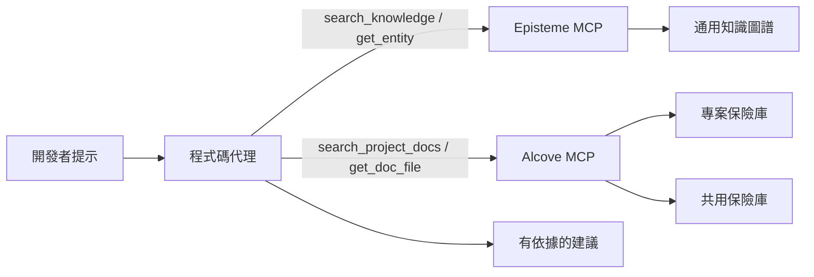
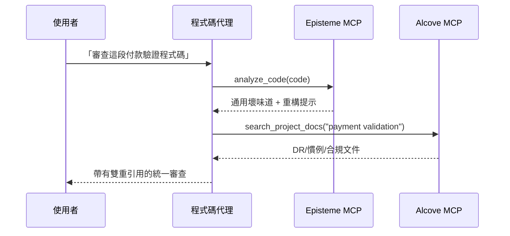
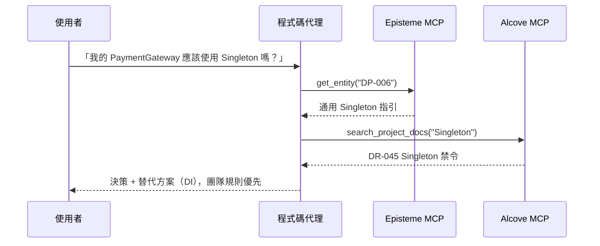
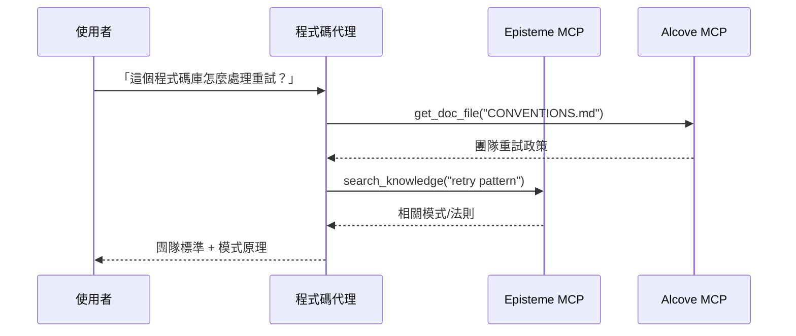

# Alcove + Episteme 整合指南

> 代理優先指南：透過 MCP 和自然語言工作流程，將通用軟體工程知識（Episteme）與團隊特定的領域知識（Alcove）結合。

## 概覽

**Episteme** 以唯讀知識圖譜的形式提供通用知識（GoF 模式、重構手法、法則）。
**Alcove** 為您團隊的活文件建立索引（決策、架構、程式碼標準）。

當兩者透過 MCP 結合使用時，程式碼代理可以：
- 套用通用的最佳實踐（Episteme）
- 遵守團隊特定的限制（Alcove）
- 在建議中同時引用兩個來源

### 決策優先順序

當 Episteme 和 Alcove 衝突時，**Alcove 優先**作為最終實作指引。
- **Episteme**：參考知識（通用模式/法則/壞味道）
- **Alcove**：團隊授權（專案/組織特定的限制）

---

## 架構（程式碼代理視角）



代理**不應**預先載入所有文件。它應僅擷取當前提示所需的文件/實體。

---

## 代理優先用法（自然語言 → MCP → 回答）

這些模式是 Cursor/Codex/Claude 類型程式碼代理的建議預設方式。

1. 使用者以自然語言提問。
2. 代理從 Alcove 擷取團隊情境（`search_project_docs`、`get_doc_file`）。
3. 代理從 Episteme 擷取通用工程指引。
4. 代理解決衝突（團隊規則覆寫通用建議）。
5. 代理回傳帶有雙重引用的回應。

---

## Alcove 保險庫概念

### 專案保險庫
**位置**：`<docs_root>/<project>/`（例如 `~/.alcove/docs/payment-api/`）
**範圍**：單一程式碼庫
**內容**：架構決策、技術棧、領域詞彙表

**範例**（`~/.alcove/docs/payment-api/DECISION.md`）：
```markdown
# DECISION.md
## DR-001: Payment Validation Strategy (2024-04-15)
- All card numbers MUST be validated using CardValidator
- Reason: FSS regulation §12.3 requires PCI DSS Level 1 compliance
- Related: Episteme DP-023 (Strategy Pattern)

## DR-002: No Direct LLM Calls in Production
- External AI APIs prohibited in payment processing flow
- Approved: Internal tools only (Claude Code, local models)
```

### 共用保險庫
**位置**：`<vaults_root>/<org-name>/`（通常為 `~/.alcove/vaults/<org-name>/`）
**範圍**：組織層級
**內容**：跨領域關注、法規要求、共用模式

**範例**（`~/.alcove/vaults/finance/FSS_COMPLIANCE.md`）：
```markdown
# FSS_COMPLIANCE.md
## Card Number Handling
- ALWAYS mask in logs: `****-****-****-1234`
- NEVER store raw PAN in application logs
- Episteme reference: SMELL-42 (Information Exposure)

## Testing
- Use synthetic cards only: `4111-1111-1111-1111`
- Real customer data in tests = FSS violation
```

---

## 使用模式

### 模式 1：雙重情境的程式碼審查（主要）

**使用者請求**：
```
「審查這段付款驗證程式碼」
```

**代理工作流程**：
```python
# 步驟 1：偵測通用壞味道（Episteme）
smells = await episteme.analyze_code(code)
# → SMELL-01: Long Method (15+ 行)
# → SMELL-08: Missing Error Handling

# 步驟 2：檢查團隊規則（Alcove）
decisions = await alcove.search_project_docs("payment validation")
# → DR-001: 必須使用 CardValidator
# → FSS_COMPLIANCE.md: 遮蔽卡號

# 步驟 3：綜合回饋
return f"""
發現的問題：
1. Long Method（Episteme SMELL-01）
   → 將卡號驗證擷取至獨立方法

2. 缺少 CardValidator（團隊 DR-001）
   → 使用 Strategy Pattern（Episteme DP-023）

3. 卡號在日誌中未遮蔽（FSS_COMPLIANCE.md）
   → 套用遮蔽工具（見 CONVENTIONS.md）
"""
```



### 模式 2：架構決策支援

**使用者請求**：
```
「我的 PaymentGateway 應該使用 Singleton 嗎？」
```

**代理工作流程**：
```python
# Episteme：通用模式知識
pattern = await episteme.get_entity("DP-006")  # Singleton
# → 「用於全域唯一資源，但注意可測試性問題」

# Alcove：團隊歷史
past_decisions = await alcove.search_project_docs("Singleton")
# → DR-045：「在服務層禁用 Singleton（測試噩夢）」

# 綜合回答：
return f"""
Episteme 表示：Singleton 適用於全域資源（DP-006）
團隊歷史：DR-045 已在服務中禁用（2023-08）

建議：改用依賴注入
- Episteme DP-018（依賴注入）說明了如何做
- 見 ARCHITECTURE.md §3.2 了解團隊的 DI 容器設定
"""
```



### 模式 3：入門 / 「我們在這裡怎麼處理 X？」

**使用者請求**：
```
「這個程式碼庫怎麼處理重試？」
```

**代理工作流程**：
```python
# Alcove：團隊慣例
conventions = await alcove.get_doc_file("CONVENTIONS.md")
# → 「使用指數退避，最多 3 次重試（見 RetryPolicy 工具）」

# Episteme：相關模式
patterns = await episteme.search_knowledge("retry pattern")
# → DP-023: Strategy Pattern
# → LAW-012: Fail Fast 原則

return f"""
團隊標準（CONVENTIONS.md）：
- 使用 RetryPolicy 工具（src/common/retry.py）
- 最多 3 次嘗試，指數退避

相關概念：
- Episteme DP-023：Strategy Pattern（可插拔的重試邏輯）
- Episteme LAW-012：Fail Fast（不要對無效輸入重試）

範例：
  policy = RetryPolicy(max_attempts=3, backoff="exponential")
  result = await policy.execute(api_call)
"""
```



---

## 設定說明（最小化，供代理啟用）

### 1. 為您的專案初始化 Alcove

```bash
cd /path/to/your/project
alcove setup

# 建立核心文件
cat > .alcove/DECISION.md <<EOF
# Architectural Decision Records

## Template
- **ID**: DR-XXX
- **Date**: YYYY-MM-DD
- **Context**: What problem are we solving?
- **Decision**: What did we decide?
- **Consequences**: Trade-offs
- **Episteme Refs**: Related entities (optional)
EOF

cat > .alcove/ARCHITECTURE.md <<EOF
# System Architecture

## Domain Model
- Payment: Card validation, fraud detection
- Settlement: Batch processing, reconciliation

## Key Patterns (link to Episteme)
- Payment validation: Strategy (DP-023)
- API gateway: Facade (DP-007)
EOF
```

### 2. 建立共用保險庫（選填）

用於組織層級的標準：

```bash
mkdir -p ~/.alcove/vaults/my-org
cat > ~/.alcove/vaults/my-org/SECURITY.md <<EOF
# Security Standards

## PII Handling
- Never log credit card numbers (Episteme SMELL-42)
- Use DataMasker utility for all PII

## Approved Libraries
- cryptography >= 41.0
- bcrypt >= 4.0
EOF

# 將外部目錄註冊為保險庫（例如 Obsidian 保險庫）
alcove vault link my-org ~/.alcove/vaults/my-org
```

### 3. 設定 MCP 伺服器（程式碼代理必要）

在 `~/.claude/claude_desktop_config.json` 中：

```json
{
  "mcpServers": {
    "episteme": {
      "command": "epis",
      "args": ["mcp"]
    },
    "alcove": {
      "command": "alcove",
      "args": []
    }
  }
}
```

對於 Cursor/Codex/其他支援 MCP 的程式碼代理，在每個工具的 MCP 設定中註冊兩個 MCP 伺服器，並保持相同的伺服器名稱（`episteme`、`alcove`），以便提示和技能保持可攜性。

### 4. 文件連結慣例

在 Alcove 文件中引用 Episteme 實體：

```markdown
## DR-042: Use Repository Pattern for Data Access

**Decision**: All database access goes through Repository interface

**Rationale**:
- Testability: Mock repositories in unit tests
- Episteme DP-018 (Dependency Injection) + DP-007 (Facade)

**Implementation**:
See `src/repositories/` for examples
```

---

## 最佳實踐

### 0. 偏好代理擷取而非手動 CLI 步驟

CLI 主要用於初始設定/維護。在程式設計過程中，偏好觸發 MCP 呼叫的自然語言提示。

**建議的做法**
- 「根據我們的團隊慣例審查這個模組」
- 「根據 DR-112 和相關的 Episteme 法則重構這個服務」
- 「檢查這個實作是否與 Alcove 決策衝突」

**避免作為預設工作流程**
- 手動 grep/複製貼上大量文件到提示中
- 每次工作階段重新解釋架構限制

### 1. **明確引用**

適用時，始終將 Alcove 決策連結到 Episteme 實體：

```markdown
❌ 不良做法：
「使用 Strategy Pattern 處理付款驗證」

✅ 良好做法：
「使用 Strategy Pattern（Episteme DP-023）處理付款驗證。
見 DR-001 了解團隊特定的 CardValidator 實作。」
```

### 2. **保持 Alcove 文件精簡**

不要重複 Episteme 的內容。引用它：

```markdown
❌ 不良做法（重複 Episteme 內容）：
## Observer Pattern
Observer Pattern 定義了一對多的依賴關係...
[500 字解釋 Observer]

✅ 良好做法（引用 Episteme）：
## Event Bus 實作（DR-078）
- 模式：Observer（Episteme DP-012）
- 我們的變化：使用 Redis Pub/Sub 而非記憶體內
- 權衡：網路延遲換取水平擴展性
```

### 3. **在重大變更時更新**

當團隊慣例覆寫 Episteme 建議時：

```markdown
## DR-091: Singleton 禁令例外（2024-04-20）

**情境**：Episteme DP-006 表示 Singleton 適用於組態

**我們的規則**：絕不使用 Singleton，即使是組態

**原因**：組態熱重載需求（DR-015）

**替代方案**：使用 ConfigProvider 搭配 DI（見 src/config/）
```

### 4. **保險庫組織**

```
專案文件（<docs_root>/<project>/）
├── DECISION.md        # 帶有 Episteme 引用的 ADR
├── ARCHITECTURE.md    # 系統設計、模式使用
├── CONVENTIONS.md     # 程式碼標準
├── DOMAIN.md          # 業務詞彙表
└── DEPLOYMENT.md      # 維運手冊

共用保險庫（<vaults_root>/<org>/）
├── SECURITY.md        # 跨專案安全規則
├── COMPLIANCE.md      # 法規要求（FSS、GDPR）
└── PATTERNS.md        # 組織認可的模式子集
```

---

## 進階：Episteme → Alcove 回饋迴圈

### 使用 Prometheus 指標追蹤模式使用

在程式碼中加入 Episteme 實體使用情形的 Prometheus 指標：

```python
# 在您的程式碼庫中
from prometheus_client import Counter

pattern_usage = Counter(
    'episteme_pattern_applied_total',
    'Episteme pattern application count',
    ['entity_id', 'entity_type', 'context']
)

def apply_retry_logic():
    # 追蹤 Strategy Pattern 使用
    pattern_usage.labels(
        entity_id='DP-023',
        entity_type='pattern',
        context='payment_retry'
    ).inc()

    # 您使用 Strategy Pattern 的重試邏輯
    pass
```

### 在 Grafana 中視覺化

建立儀表板以監控模式採用情形：

```promql
# 最常使用的模式（最近 30 天）
topk(10,
  increase(episteme_pattern_applied_total[30d])
)

# 依情境區分的模式使用
sum by (entity_id, context) (
  rate(episteme_pattern_applied_total[7d])
)

# 已棄用模式使用警報
sum(rate(episteme_pattern_applied_total{entity_id="DP-006"}[5m])) > 0
# 警報：「使用了 Singleton 模式（依 DR-091 已禁用）」
```

### 產生使用報告

透過 Prometheus 查詢進行季度審查：

```bash
# 查詢 Prometheus
curl -G 'http://localhost:9090/api/v1/query' \
  --data-urlencode 'query=topk(10, increase(episteme_pattern_applied_total[90d]))' \
  | jq -r '.data.result[] | "\(.metric.entity_id): \(.value[1])"'

# 輸出：
# DP-023: 847
# DP-018: 612
# DP-007: 301
```

根據實際使用情形更新 Alcove 文件：

```markdown
## 最常使用的模式（2024 Q2）— 透過 Grafana

1. **Strategy（DP-023）**：847 次使用
   - 主要用途：payment_retry（412）、discount_calc（201）
   - 見：DECISION.md DR-001（付款驗證）

2. **Dependency Injection（DP-018）**：612 次使用
   - 所有服務的標準做法
   - 見：ARCHITECTURE.md §3 了解容器設定

3. **Facade（DP-007）**：301 次使用
   - 情境：external_api（289）、legacy_adapter（12）
```

---

## 疑難排解

### 問題：代理引用了過時的 Alcove 文件

**原因**：文件更新後 Alcove 索引未重新整理

**修復**：
```bash
alcove rebuild
```

### 問題：Episteme 和 Alcove 衝突

**範例**：Episteme 表示「Singleton 可以」，團隊文件表示「Singleton 已禁用」

**解決模式**：
1. 代理呈現兩個來源
2. 解釋矛盾
3. 以團隊文件（Alcove）為最終答案

```
代理：「此處存在衝突：
- Episteme DP-006：Singleton 適用於全域組態
- 您的 DR-091：Singleton 已禁用（熱重載需求）

我將遵循您的團隊規則（DR-091）。改用 ConfigProvider。」
```

### 問題：代理使用僅限 CLI 的說明，而非程式碼代理流程

**症狀**：回應著重於 shell 命令，而非程式碼代理應如何取得和推理。

**修復**：
1. 帶有意图 + 情境目標的提問：
   - 「使用 Alcove 文件 + Episteme 實體審查這段程式碼」
2. 要求明確的雙重引用：
   - 「在您的回答中引用 DR/ARCH 文件和 Episteme ID」
3. 要求衝突解決政策：
   - 「如果來源衝突，優先使用團隊文件」

---

## 範例：完整工作流程

**情境**：開發者詢問「新的付款 webhook 處理器應該怎麼架構？」

### 代理的內部處理

```python
# 1. 搜尋 Episteme 的通用模式
patterns = await episteme.search_knowledge("webhook handler")
# → DP-007: Facade（簡化複雜子系統）
# → DP-023: Strategy（可插拔的驗證）
# → LAW-045: 單一職責

# 2. 檢查團隊架構
arch = await alcove.get_doc_file("ARCHITECTURE.md")
# → 「所有 webhook 都透過 WebhookRouter（src/webhooks/router.py）」

# 3. 檢查團隊決策
decisions = await alcove.search_project_docs("webhook")
# → DR-112：「Webhook 處理器必須是冪等的（付款重試）」

# 4. 檢查慣例
conv = await alcove.get_doc_file("CONVENTIONS.md")
# → 「使用 @webhook_handler 裝飾器進行自動日誌/重試」
```

### 代理的回應

```markdown
## 付款 Webhook 處理器結構

### 團隊標準（Alcove）
1. 在 WebhookRouter 中註冊（ARCHITECTURE.md §4.2）
2. 使其具有冪等性（DR-112）— 付款閘道會重試
3. 使用 @webhook_handler 裝飾器（CONVENTIONS.md）

### 建議的模式（Episteme）
- **Facade（DP-007）**：隱藏付款提供者的複雜性
- **Strategy（DP-023）**：可插拔的依提供者驗證
- **SRP（LAW-045）**：一個處理器 = 一種 webhook 類型

### 程式碼範本
\`\`\`python
from src.webhooks.router import webhook_handler
from src.payments import PaymentFacade  # DP-007

@webhook_handler(provider="stripe", idempotent=True)  # DR-112
async def handle_payment_success(payload: dict):
    # 單一職責：處理付款（LAW-045）
    facade = PaymentFacade()
    return await facade.confirm_payment(payload["payment_id"])
\`\`\`

參見：
- ARCHITECTURE.md §4.2 了解 WebhookRouter 設定
- src/webhooks/stripe_handler.py 了解參考實作
- Episteme DP-007 了解 Facade Pattern 詳細資訊
```

---

## 摘要

| 面向 | Episteme | Alcove |
|------|----------|--------|
| **範圍** | 通用軟體工程知識 | 團隊/組織特定規則 |
| **內容** | 22 個模式、66 個重構手法、56 個法則、14 個壞味道 | ADR、架構、慣例、領域 |
| **可變性** | 唯讀（定期更新） | 活文件（每日更新） |
| **粒度** | 抽象原則 | 具體實作 |
| **權威性** | 參考/建議 | 團隊授權 |

**決策優先順序**：Alcove > Episteme（團隊規則覆寫通用建議）

**引用風格**：適用時始終連結兩個來源
- `"使用 Strategy（Episteme DP-023）依團隊 DR-001"`
- 而非：`"使用 Strategy"`（缺少情境）

**維護**：
- Episteme：不需要操作（上游處理更新）
- Alcove：保持文件與程式碼庫變更同步
